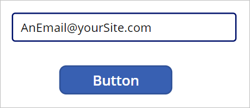

Another way to make your App more dynamic and intuitive to the user is to use validating functions including **IsBlank**, **IsBlankOrError**, **IsEmpty**, **IsNumeric**, **IsToday**, and **IsMatch**. These functions allow for validation of the condition of a field, control, variable, or table. All these functions return Boolean values (*true* or *false*) based on the results of their evaluation. Often these functions are used with the **If** or **Switch** functions to produce messages/options for your users.

For example, you can use these functions where you don't want to allow the user to submit a form if a field is blank or if the field's data doesn't match a particular format.

## Introduction with numeric input validation

Let's consider an example. Suppose we have two controls: a **Text input** control where the **Default** value is blank, and a **Text label** control just below it where we've entered a formula in the **Text** property. We use an **IsNumeric** test with an **If** statement in the **Text** property of the label. By modifying the **Text** property of the label control, we can produce different outputs.

Look carefully at the **If** statement in our **Text** property in the following image. It's instructing our label control to display different text output depending on **IsNumeric** validation of whatever is entered in the text input field.

> [!div class="mx-imgBorder"]
> [](../media/condition.png#lightbox)

If we put the app in *preview* mode, we can enter any text in our input field, and our label below continues to ask for a number:

>

However, if we enter any number, the label's message changes:

>

> [!TIP]
> You can also employ the **Not** (or **!**) operator with any of these functions. For example, **IsBlank** tests for a *blank* condition, whereas **!IsBlank** test for a *non-blank* condition.

Using validating functions in your app can help you influence your user's input and overall interaction with the app.

## Available validating functions

Here's an overview of some of the validating functions that can be used in Power Apps (reminder that the output is always *true* or *false*):

- **IsBlank** - Checks a field, property, or variable to see if the result is *blank* or an empty string.

- **IsBlankOrError** - Checks whether an expression is blank or results in an error.

- **IsEmpty** - Checks a table of data to see if it contains any records.

- **IsError** - Tests for an error value.

- **IsMatch** - Checks a text string to determine if the result matches the specified pattern. For example, you could use this function to test entries for valid email or phone numbers.

- **IsNumeric** - Checks a field, property, or variable to determine if the value is numeric (as in our previous example).

- **IsToday** - Checks a date or time value to see if it is between midnight today and midnight tomorrow in local time.

- **IsUTCToday** - Similar to **IsToday**, however, it uses Coordinated Universal Time (UTC) instead of local time and is independent of time zones.

- The **Not()** or **!** function can be used before any of these validations to validate the opposite. For example, `!IsBlank` checks to ensure that the value isn't blank. (**Not** returns **true** if its argument is *false*.)

## IsMatch example

Let's take a look at one more example regarding the **IsMatch** function. We use this functionality to *disable* a button if the **Text input** control doesn't have a valid email address entered in. *Email* is a pre-defined pattern that we can easily use. However, remember that it's looking for a *pattern* only; it *doesn't* validate whether or not the email address actually works. So, using your demo app let's do the following:

1. Insert a **Text input** control to your canvas. Make the **Default** property blank by deleting *"Text Input"*. Rename your control: *tiEmailEntry*

1. Add a **Button** control just below the text input field.

1. Modify the **DisplayMode** property of the **Button** control to the following formula:

    ```Power Apps
    If(IsMatch(tiEmailEntry.Text, Match.Email), DisplayMode.Edit, DisplayMode.Disabled)
    ```

    Using the *Email* matching formula, Power Apps tests for a text value in the input field with this pattern: an alpha-numeric string, followed by the **@** symbol, followed by another alpha-numeric string, followed by a period (.), and ending with a multi-letter string. If the input string doesn't match the specified pattern, the button stays in "disabled" mode, and the user is unable to interact with it. Let's test the functionality.

1. Preview the app by selecting the **Play** button in the upper-right corner.

1. If the field is blank or has an incomplete email address, the button is disabled and displays in a gray color. Try some different examples without the **@** or missing the period (.).

    >

    When you enter a properly formatted email address, the button turns blue and become selectable.

    >

The data validating functions are helpful tools for shaping the data entered by your users. Employing them can help eliminate data-entry errors and further enhance the user experience.
