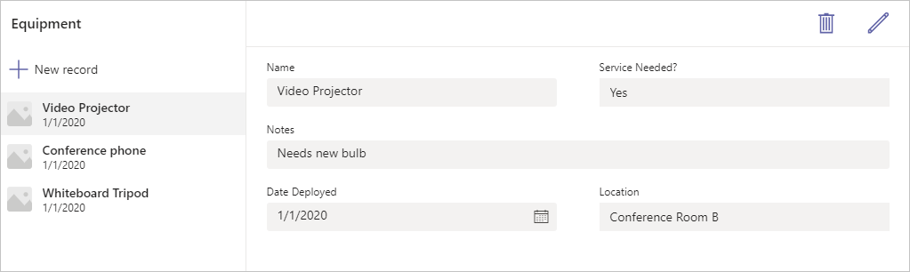

With the significant number of enterprise employees working remotely, and millions of them meeting and collaborating through Microsoft Teams, there's significant interest in building low-code and no-code applications that can make remote work easier and more productive. Microsoft Dataverse for Teams empowers you to build custom apps and associated workflows within Teams with Microsoft Dataverse as the backend.

A Power Apps app in Teams provides an integrated experience for app makers to create and edit apps and workflows within Teams, and quickly publish and share them with team members, without having to switch between multiple apps and services. With Power Apps Studio embedded in the Power Apps app in Teams and the built-in data platform providing an easy-to-use, editable data table, you can quickly build apps based on custom data tables that are Teams-specific and scenario-specific.

This module explains how to use Dataverse for Teams to build an app.
