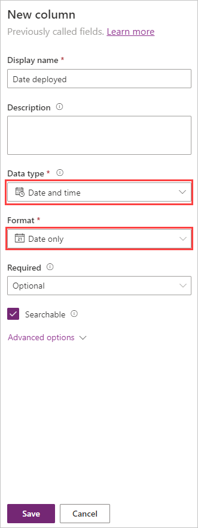
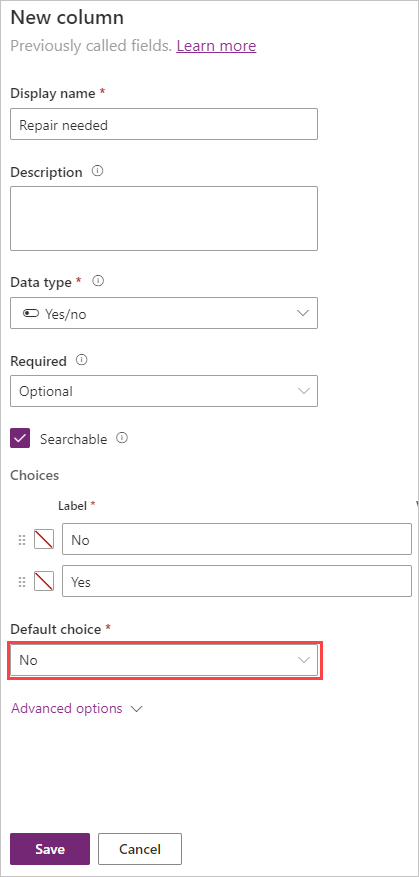

Follow the instructions below to create your first app in Microsoft Teams. If you're creating an app by using Power Apps in a Teams team for the first time, a new Dataverse for Teams environment will be created for you. Once you have installed Power Apps in Teams, you'll create your app, then create a table, then you can customize and publish your app.

## Install Power Apps in Microsoft Teams

Power Apps is an available *personal app* for Teams, meaning that it has a personal scope. Here's how you add it to Teams.

1. Open Microsoft Teams and select **More added apps (...)** from the left-side menu.

1. Search for **Power Apps**.

   

1. Select **Add**. This adds Power Apps to Teams. It will show in the left rail. You can pin it by right clicking on the icon in the rail and selecting **Pin**.

   

## Create your app

1. With Power Apps selected from the side rail, select **Start now** from the *Home* tab.

   

1. You'll be prompted to select a team where you want the app to reside. Until you publish the app, team members won't be able to see it.

   

1. Select **Create**. If this is the first app being created in the selected team, you'll see a confirmation about the Dataverse for Teams environment being created, which might take some time. You'll be notified when the environment is available for you to create your first app with an email and a Teams notification.

    > [!NOTE]
    > Environment creation will fail if the Teams team that you selected has *Hiddenmembership* enabled. If this happens, try creating the app in a different team.

1. Enter an app name, then select **Save**.

   

## Create your first table

Now we're going to build some data within Dataverse for Teams. We do this by creating a table. You'll notice as you add data, it's immediately rendered in your app.

1. Select the option to start this screen **With data**.

   

1. In the *Select a data source* popup, select **Create a new table**.

    > [!NOTE]
    > You will not be able to create a new table if you don't have permissions to add data in the selected Teams channel. To practice this step, create your app in a Teams channel where you have the right permissions.

   

1. In the **Create a table** dialog box, type a meaningful name for your new table that describes this dataset, and then select **Create**.

1. After the table is created, you can add columns of different types, add rows, and work with data in the visual editor.

   

## Add new columns to the table

1. Select **+ New column** from the Edit table header ribbon or the **New column (+)** symbol on the right of the table column.

   

1. In the New column pane, enter a name that describes the column and select a data type. Notice that changing the data type affects the format options.

1. Let's try adding a few columns to your table, which in our example is for rental picnic tables.

   Let's say that you need to track the date that the picnic table was deployed, the location where it was deployed, the seating capacity, whether service is needed, and relevant notes.

   - For tracking the deployment date, let's add a **Date** column with the format as **Date only**. Select **Save** to continue.

     

   - Add a single line of text column for the **Location** and select **Save** to continue.

   - Add a **Number** column called "Seating capacity". Leave the **Data type** as *Whole number*. Select **Save** to continue.

     

   - To indicate if a repair is needed let's add a column called **Repair needed** and the type will be **Yes/no**. To find **Yes/no**, first hover over **Choice** and you'll see the option to select it.

     

   - Don't forget to select your **Default choice** as **No**. Save the column.

     

   - Finally, use the **Single line of text** data type for the **Notes** column.

1. When your table columns are saved, it should resemble this:

     

      The following list of data types is available by using the visual table editor. For a complete list of all available data types and how they work, see the links in the Summary unit at the end of this module.

      |     Data Type    |     Description    |
      |-|-|
      |     Text    |     A single line   of text    |
      |     Email    |     Text in email   format; will be selectable for the user    |
      |     URL    |     A hyperlink   in URL format; will be selectable for the user    |
      |     Phone     |     Text Click-enabled phone numbers to initiate calls     |
      |     Auto Number    |     Defines an   autogenerated number sequence    |
      |     Number    |     An integer   (for example, 10 or -10)    |
      |     Date    |     Allows users   to enter or search for a date    |
      |     Formula     |     Enables Power Fx formula logic for the column     |
      |     Decimal    |     A number with   a decimal point (for example, 1.5 or -1.5)    |
      |     Lookup    |     References a primary column in another table    |
      |     Choice    |     Allows people to select one choice from a list    |
      |     Yes/No    |     Allows people to pick between two choices    |

## Add rows to the table

1. To add rows, select the empty row where it says *Enter text* and begin typing, or select **+ New row**. We want some sample data in our app so we can see how it looks in our app. Go ahead and fill in a few rows of data.

    Notice how the hint text for the new row prompts the user for what type of data must be entered. Also notice that the data saves as soon as you make an entry.

   

1. Try selecting one of the rows you have already entered. Your table menu now gives you the option to insert a new row above or below the selected row. It also allows you the option to delete that row.

   

   >[!TIP]
   >It is possible to paste up to 50 rows of data into your table from your clipboard. Look at [Paste the copied data into the table](/power-apps/teams/create-first-app#paste-the-copied-data-into-the-table) to learn how to do this.

1. Close your table.

After you close the table, the app template that was added to the app screen by default is automatically refreshed and connected to your table.

In the next unit, we'll customize our app.
