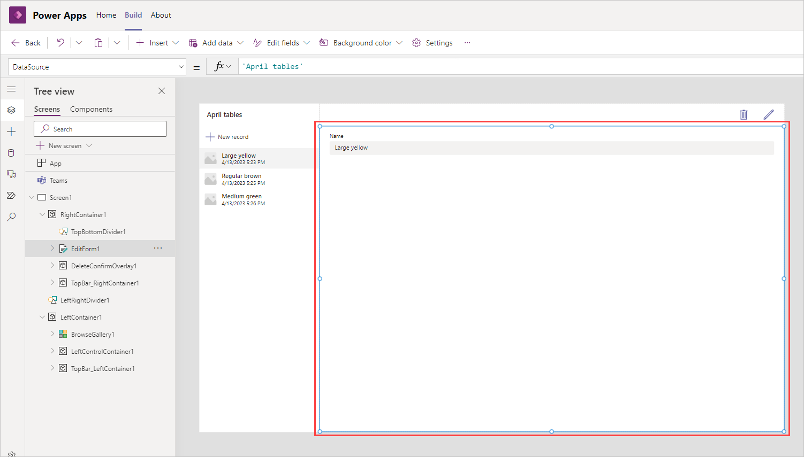
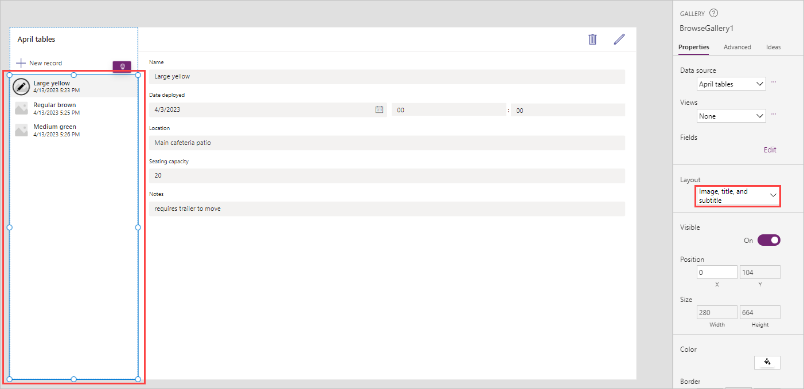

In the previous lesson, you created a new app by using your data that was loaded into Dataverse for Teams. Power Apps for Teams can quickly make a useful app, but you will often want to customize the app to suit your needs.

For this lesson, you will update fields on the form and change their order, update the fields in the gallery, and change the title of the app.

To start, open Teams by using the desktop client or by browsing [Teams](https://teams.microsoft.com/?azure-portal=true), and then open the app for Power Apps. From the **Home** tab, you can look for your app under **Recent apps**, but if you don't see it, you can select **See more** below to find/select your app.

Your app will open in Teams for editing.

Power Apps applications are built by using various UI elements that are referred to as **Controls**. Use controls to help create a better experience when your users are navigating and interacting with the app.

Common controls include the following:

- **Label** - Displays information to the user as text, numbers, dates, or currency.

- **Edit form** - Allows the user to create and edit records and then save them.

- **Text box** - A box where a user can enter data such as text and numbers.

- **Vertical gallery** - Displays multiple records from a data source in a vertical orientation. This control can show multiple types of data for each record.

- **Add icon** - Select from a library of graphical symbols. This control can be configured to respond when a user selects them.

- **Rectangle** - A border shape that can be placed anywhere on the app.

- **Date picker** - Allows the user to select a date by using a calendar pop-up window.

- **Button** - A way for the user to interact with the app.

When you are editing the app, select between the following options in the left side rail:

- **Tree view** - Displays a visual hierarchy of all controls in the app.

- **Insert** - Insert new controls such as labels, buttons, icons, and forms.

- **Data** - Add more tables from Dataverse for Teams or add a connector to other data services.

- **Media** - Add images, videos, and audio.

- **Power Automate** - Allows you to connect with or create a flow directly in Power Apps for Teams, without exiting the app.

- **Search** - Allows the developer to search for media, text, data sources, formulas and more. Includes a find and replace functionality.

The center of the screen, or app canvas, is where you add, move and edit the components that make up your app. When a control is selected from the tree view or in the app view, the **Properties** pane displays the properties. At the top of the screen is the formula bar, which allows for more editing capabilities.

Using the app we created in the previous unit let's continue by customizing our app.

### Update the form

1. Select the form *EditForm1*.

   

1. Select **Edit fields** from the Properties pane on the right.

   

1. Select **+ Add field** and then check the boxes next to columns you want to include in the form. In our example, we're going to add the fields that we added to our data table including: *Date deployed*, *Location*, *Notes*, *Repair needed* and *Seating Capacity*. Notice how your fields are arrayed alphabetically in the list.

   

1. Select **Add** to add them to the form and notice how they are now included in your **Fields** dialog box and how they appear on your app's canvas.

   

1. Though not required, you can adjust the order of the fields by simply dragging and dropping the fields to the desired position within the **Fields** dialog box. In our example, we're rearranging the fields to be in this order:

   

1. Close the fields pane.

### Update the gallery

1. Our gallery shows three items from our data table and since we don't have images, the image isn't showing. Also, it is showing when the item was created, and that's not useful information. We'll update our gallery to show more meaningful information to us.  To do this, select the gallery and then select dropdown under **Layout** button from the Properties pane on the right of your screen, where it currently has *Image, title, and subtitle* as the value.

   

1. Select **Title, subtitle, and body**.

   

1. That gets us a little closer, but now we'll refine the fields used in our gallery. In the gallery properties pane, look for the **Fields** property and select **Edit**.

   

1. In the **Data** dialog box, change the value for subtitle to **Location**, and notice how your gallery on the canvas changes immediately.

   

1. Close the **Data** dialog box.

### Change the app title

1. You can update the app title by first selecting the label on the screen currently showing the name of your table in the upper left corner of the canvas.

   

1. Change the *Text* property of the label to a more meaningful title for your app. You can do this in the formula bar just above the selected control or in the properties panel on the right side of the screen.

   

1. Type in the new name for your title. In our example, we'll change it to "Picnic table locations and capacity".

   > [!NOTE]
   > Your title will change immediately when you enter the change in the formula bar. If you use the properties pane, changes take effect when you select *Enter* from your keyboard. Also, notice how you need quotes around the text when you use the formula bar, but the properties pane field does not require them.

In the next unit, we're going to publish the app to make it available for our team to use.
