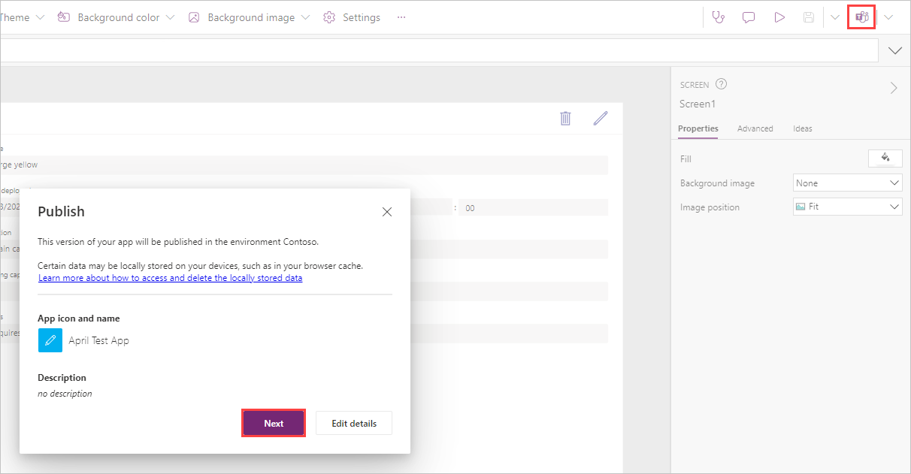
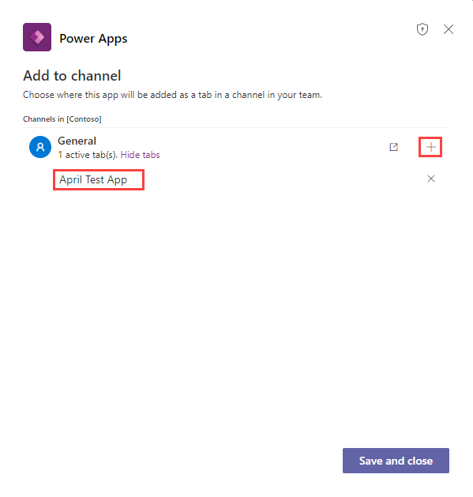
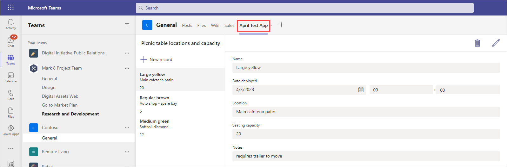
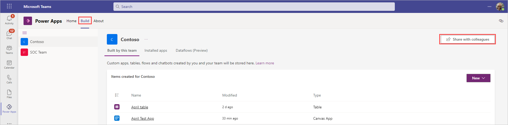
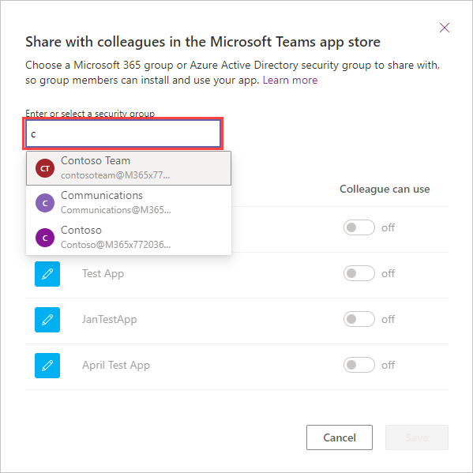
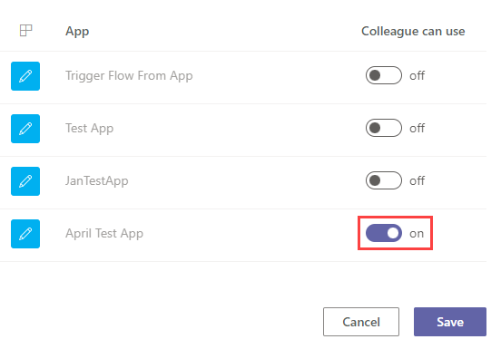

Now that you have built an app, you will want to share it with your team. You can accomplish this task by publishing the app to Teams. After the app has been published, it will be accessible for your team to start taking advantage of it.

1. Open your app for editing in Power Apps Studio.

1. Select the  **Publish to Teams** button from the right of the command ribbon. A **Publish** dialog popup will appear over the app canvas. Select **Next** to continue.

    

1. For each channel where you want the app to appear in a tab, select the **Add app as a tab (+)** button. You can only publish to channels for the team that you created the app in. Once you add the app to a channel, the app name appears immediately below the Channel name.

    

1. Select **Save and close**.

Your app will now appear on a tab in the channel that you selected. You can open the app by selecting the tab.

By default, your Dataverse for Teams app is only available to the team that you created the app in. Occasionally, you will want to share your application with others in your organization.

To share your app with others outside of the current team:

1. Verify that you are a team owner where the app is currently published.

1. Open the **Build** tab in the Power Apps for Teams app and then select the **Share with colleagues** button from the top right.

    

1. In the dialog popup for share with colleagues, enter the Microsoft 365 group or Microsoft Entra ID security group to share with in the **Enter or select a security group** field.

    

1. Find the name of your app on the list and toggle the **Colleague can use** for your app. Then select **Save**.

    

1. After a few moments, the dialog box will close and a success message appears letting you know that the selected team can install and use the apps selected.

    

Afterward, the app will appear in the **Built by your colleagues** page when users select **Apps** in Teams. To learn more about publishing your apps, see the links in the Summary unit at the end of this module.
