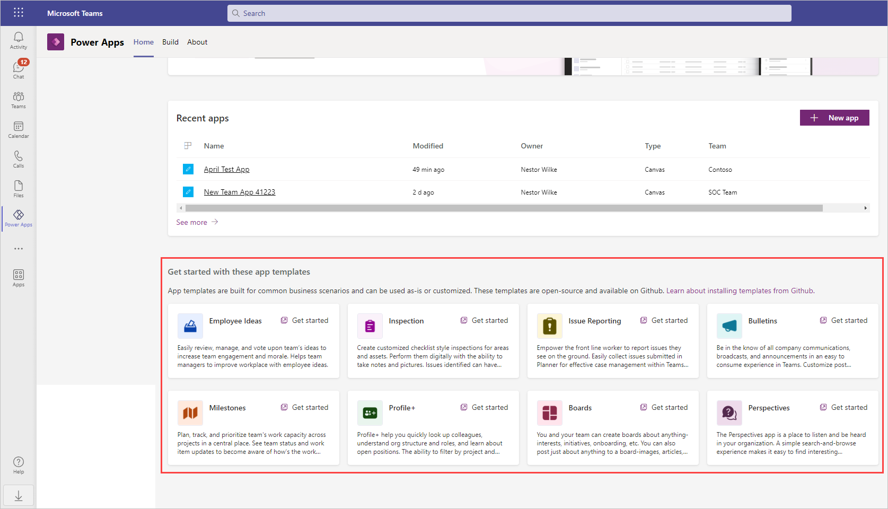
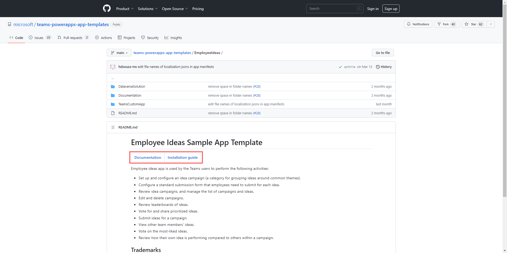
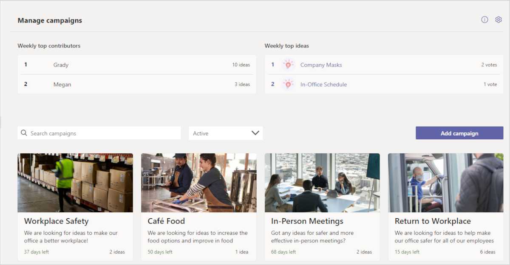
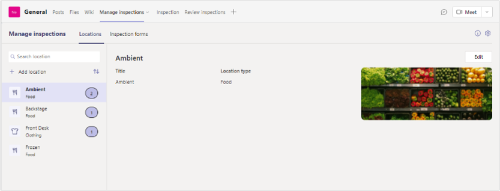
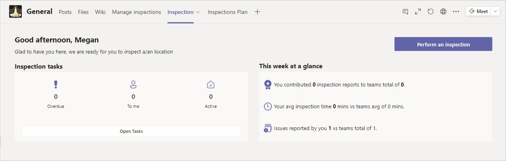
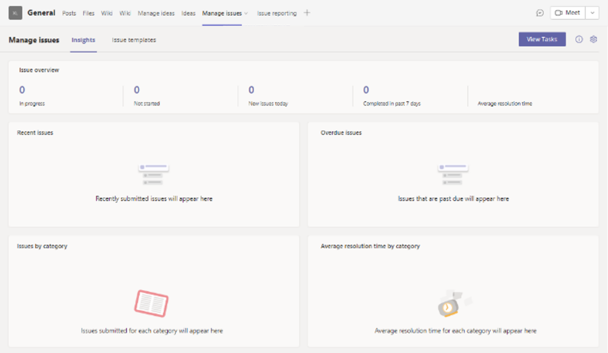
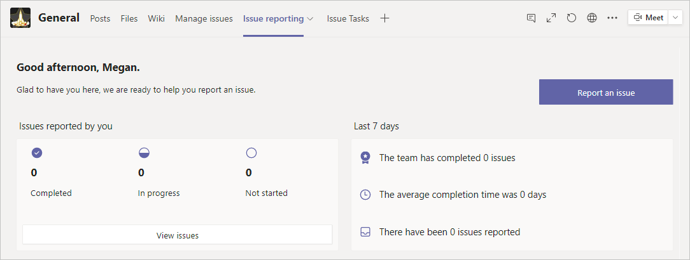

Microsoft has created sample apps that can be used as-is or customized to suit your specific business needs. From the Power Apps for Teams Home screen, scroll down to the section titled **Get started with these app templates**.

These templates are stored on GitHub where you can download them at no charge. Selecting any of the app templates listed in this section takes you to the GitHub link for that template. Each template has unique requirements and uses various Office 365 services, but the templates typically consist of apps, flows, and tables. The install process might be slightly different depending on what is needed, but each app includes linked sections including *Documentation* and *Installation Guide*. Below is an example of what to expect when you select the link to Employee Ideas:

Again, notice that there are links on the GitHub page that give you instructions on how to install the app and provide you with the documentation for the app. Below is a summary of some of the templates available.

## Employee ideas

With **Employee ideas**, you can collect ideas from your team and then review, manage, and vote on them to see which ones are worth exploring. Additionally, you can use campaigns to organize the team's ideas. The app will post each idea to a Team channel as they're submitted.

## Inspection

The **Inspection** solution for Microsoft Teams is a general inspection app that can be used to inspect anything from a location—such as a retail store or manufacturing plant—to assets and equipment, such as vehicles and machines. There are two apps in this solution, each intended for different kinds of users.

### Key features

- **Inspection**: Enables front line workers to inspect an asset or area to manage quality of products and services or maintain safety at workplace
- **Communication**: Facilitates communication between team members to address issues found during inspection
- **Reporting**: Provides simple reports for managers to expedite issue resolution and highlight trends

Each team member uses the Inspection app to view and update inspections that are assigned to them. Team members can start an inspection, review status, and track their own progress.

## Issue reporting

This template helps you create a place for your team to report issues, assign tickets, and track progress with the **Issue reporting** app. This app uses Planner as a ticket system. Two apps are installed: **Manage issues** and **Issue reporting**.

The **Manage issues** app gives an overview of all tracked tasks. Manager can create, review, edit, or delete issue template forms to collect information when a user reports an issue. Managers can review team issues, report on issue history, and efficiently manage issue resolution.

The **Issue reporting** app provides a personalized view for each team member, where they can view, edit, and create new items. They can modify existing issues and assist with resolution of those issues. The app allows them a high-level view of the issues and team issues.

## Other templates

Here's a summary of some other installable templates available on GitHub include the following:

- **Boards** - A simple way to connect and share with people in your organization with similar interests. With the Boards app, you and your team can create boards about anything — interests, initiatives, onboarding, etc. You can also post just about anything to a board—images, articles, websites, and even direct links to teams, channels, and specific discussion threads within Microsoft Teams. This flexibility makes sharing ideas and content discovery efficient and seamless.

- **Bulletins** - Allows you to keep your team informed of all company communications, broadcasts and announcements in an easy-to-consume experience. Includes manager and user apps.

- **How to** - Provides a simple way to learn how to be a Power Apps maker by walking you step-by-step through designing data model, screens, and connecting screens together to build a complete Power Apps asset checkout solution. Benefits of using the How-to app:

  - Understand the basics of Power Apps
  - Learn how to build apps in Teams
  - Share the asset checkout app you build with colleagues in Teams
  - Become a Maker

- **Milestones** - Provides the team the ability to plan, track and prioritize work capacity across projects in a central place. The app allows managers to:

  - Easily set up projects, and work items
  - Assign work items to employees
  - Classify work items by milestones
  - Configure work item categories, priorities, and status options

- **Perspectives** - Provides a simple way to add topics and extend the topics with Q&A where anyone in the organization can have a perspective about the topics and have a discussion about them in Teams.

- **Profile+** - Helps users quickly look up colleagues, understand org structure and roles, and learn about open positions. The ability to filter by project and expertise creates new opportunities for like-minded people to find one another and connect. Users can update their profile right from within Teams and express their personality by adding a video. Once users find someone they would like to meet or collaborate with, the app provides an easy way to introduce themselves in chat, give that person a call, or schedule a Teams meeting.

- **Get connected** - Allows users to connect with people in your organization with similar skills.

If you are interested in learning more please see documentation on [using sample apps in Microsoft Teams](/power-apps/teams/use-sample-apps).
