In this exercise, you’ll create a mobile application by using data from an Excel table. Download the [RealEstateProperties.xlsx](https://github.com/MicrosoftDocs/mslearn-developer-tools-power-platform/raw/master/power-apps/copilot/RealEstateProperties.zip) for use in this exercise.

> [!NOTE]
>
> Microsoft Power Apps requires a Microsoft 365 license or a free trial. Learn more about your licensing options. [Microsoft products include Power Apps and Power Automate](/power-platform/admin/pricing-billing-skus/?azure-portal=true).

1. Go to [make.powerapps.com](https://make.powerapps.com/?azure-portal=true) and sign in with your Power Apps credentials.

1. From the Power Apps home screen, select **Start with data**.

	> [!div class="mx-imgBorder"]
	> [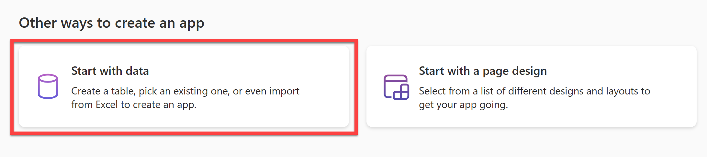](../media/start-with-data.png#lightbox)

1. Select **Upload an Excel file**.

	> [!div class="mx-imgBorder"]
	> [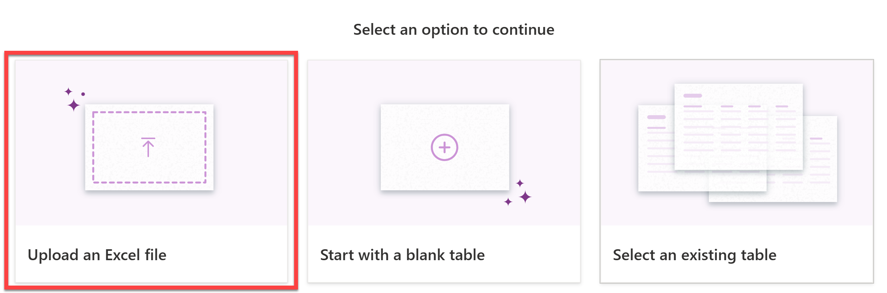](../media/upload-excel-file.png#lightbox)

1. Select the **Select from device** option. Go to the location where the **RealEstateProperties.xlsx** Excel file is saved and then upload it. The maximum file size limit is 5 GB.

	> [!div class="mx-imgBorder"]
	> [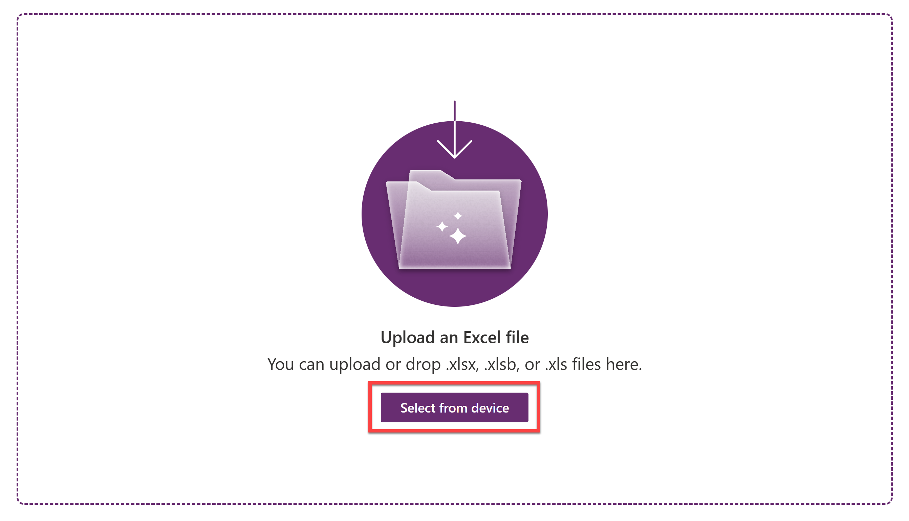](../media/select-from-device.png#lightbox)

1. A table that's based on the data from the RealEstateProperties.xlsx Excel file is generated. Select the pencil edit icon next to the table name to change it.

	> [!div class="mx-imgBorder"]
	> [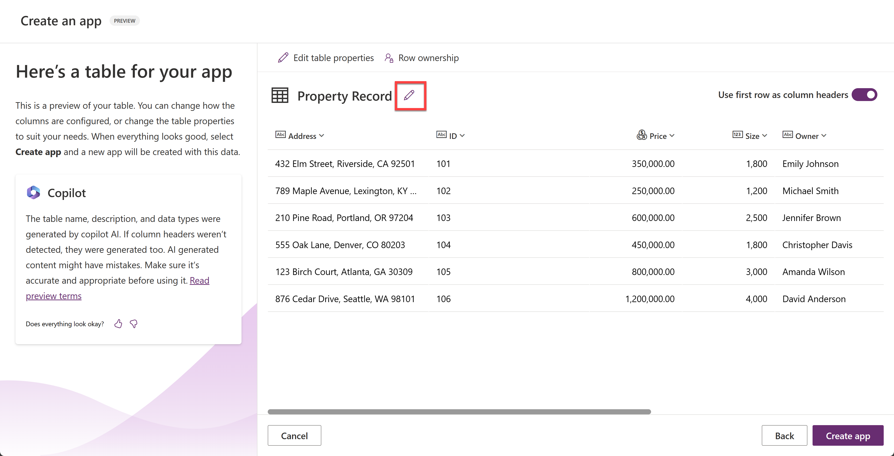](../media/change-generated-table-name.png#lightbox)

1. On the **Edit table** dialog, enter **Real Estate Property** as the **Display name**, enter **Real Estate Properties** as the **Plural name**, and then make sure that **Address** is selected as the **Primary column**. Select **Save**.

	> [!div class="mx-imgBorder"]
	> [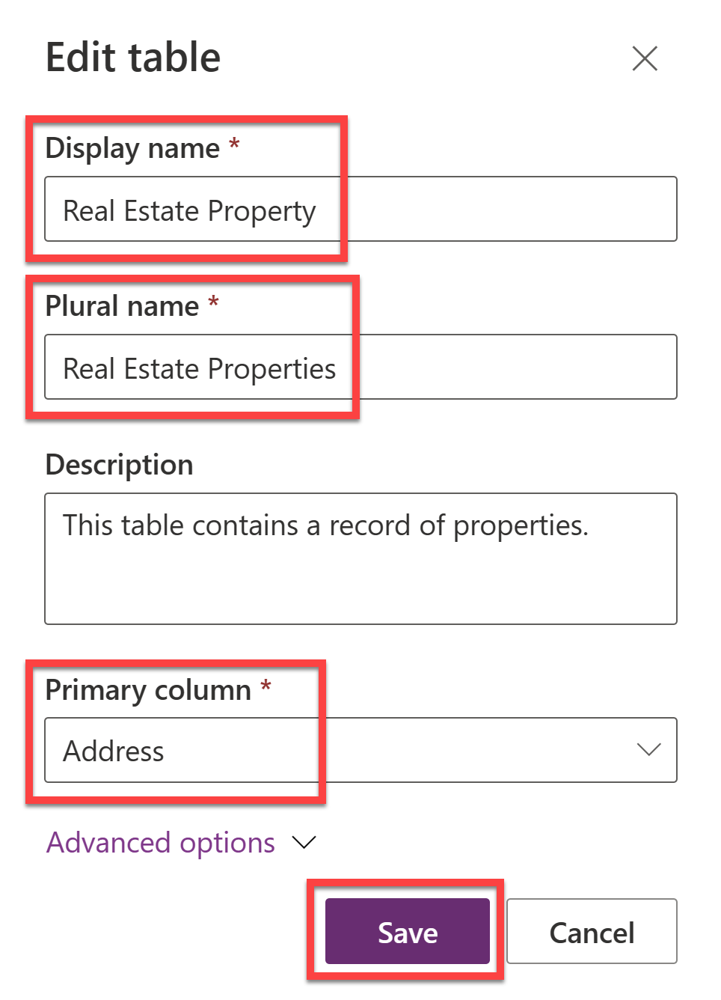](../media/edit-table-pop-up.png#lightbox)

1. Select the **Create app** button in the lower-right corner of the screen.

	> [!div class="mx-imgBorder"]
	> [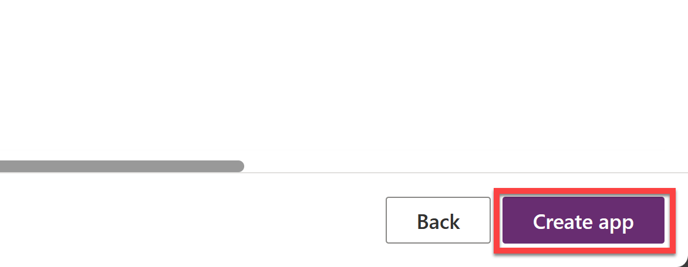](../media/create-app.png#lightbox)

1. When the app first loads, a dialog might appear stating **Welcome to Power Apps Studio**. If so, select the **Skip** button.

   The generated app should display in Edit mode.

	> [!div class="mx-imgBorder"]
	> [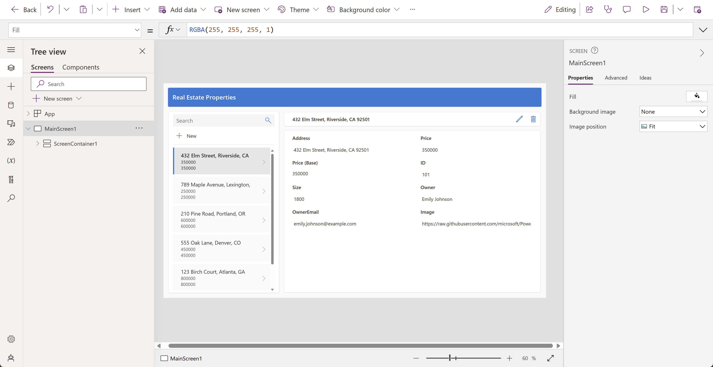](../media/generated-app.png#lightbox)

1. Select the **Data** icon from the left navigation bar. A Dataverse table is created based on the **RealEstateProperties.xlsx** Excel file.

	> [!div class="mx-imgBorder"]
	> [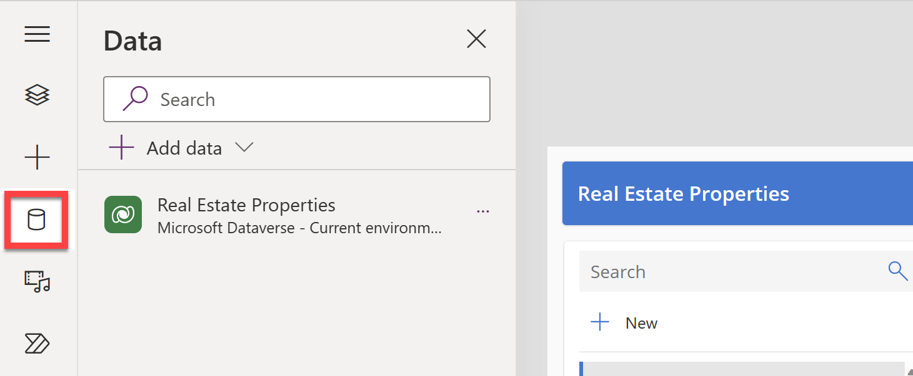](../media/dataverse-table-from-excel.png#lightbox)

1. Select the **Tree view** icon to return to the Tree view.

	> [!div class="mx-imgBorder"]
	> [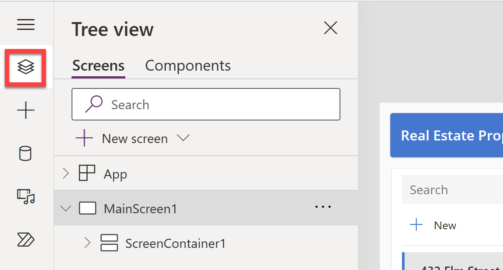](../media/tree-view.png#lightbox)

1. On the app's main screen, select the gallery that's displaying the **Real Estate Properties** details and then select **RecordsGallery1** in the Tree view to expand it.

	> [!div class="mx-imgBorder"]
	> [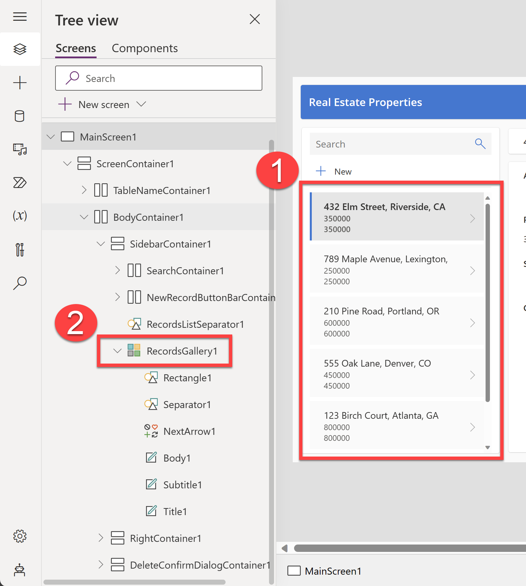](../media/properties-gallery-expand.png#lightbox)

1. Select the ellipsis (**...**) next to the **NextArrow** option and then delete it.

	> [!div class="mx-imgBorder"]
	> [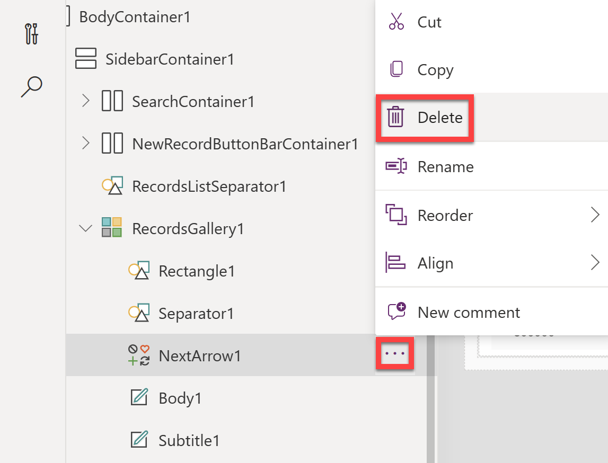](../media/delete-next-arrow.png#lightbox)

1. Select **RecordsGallery1** and then select the edit button to put the gallery in edit mode.

	> [!div class="mx-imgBorder"]
	> [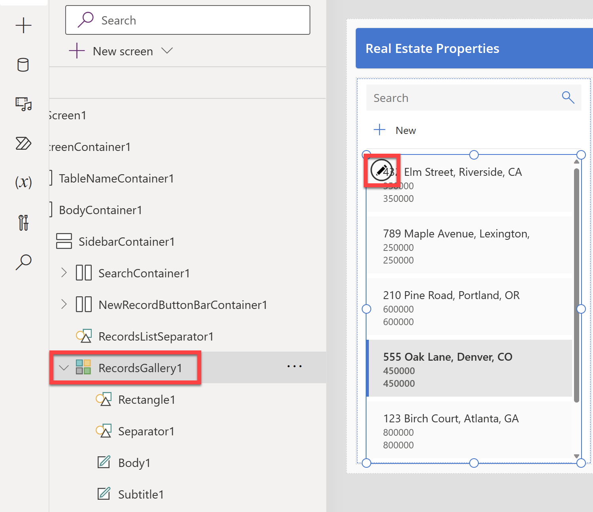](../media/gallery-edit.png#lightbox)

1. Reduce the width and move the position of the **Title** component so that it's toward the right side of the template cell.

	> [!div class="mx-imgBorder"]
	> [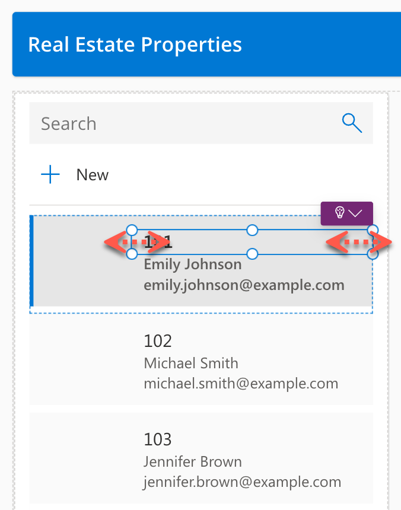](../media/address-title-reduced.png#lightbox)

    Other components should reposition alongside the Title component. If not, move them until they resemble the preceding screenshot.

1. Make sure that the gallery is still in edit mode. Select the **Title**.

1. Verify that the **Text** value of the **Title** component is set to the following formula:

    `ThisItem.Address`

	> [!div class="mx-imgBorder"]
	> [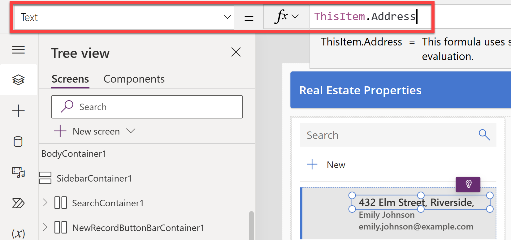](../media/set-title-address.png#lightbox)

1. Select the **Subtitle** component in the gallery.

1. Set the **Text** value of the **Subtitle** to the following formula:

    `ThisItem.Size`

1. Using the tool bar in the upper part of the page, change the **Size** to **13**.

	> [!div class="mx-imgBorder"]
	> [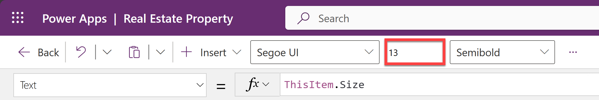](../media/change-font-size.png#lightbox)

1. Select the **Body** component in the gallery.

1. Set the **Text** value of the **Body** to the following formula:

    `ThisItem.Price`

   Your gallery should now resemble the following screenshot.

	> [!div class="mx-imgBorder"]
	> [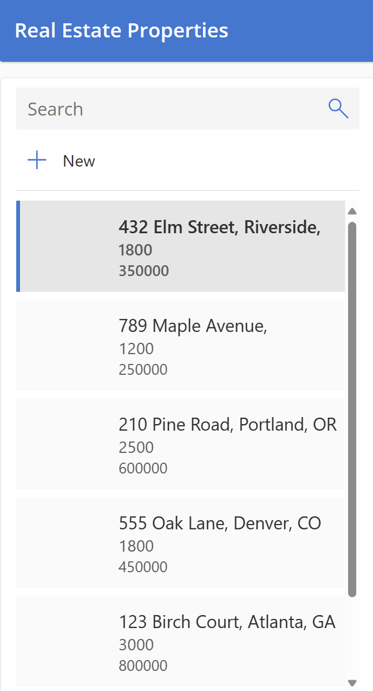](../media/gallery-check-after-edits.png#lightbox)

1. Select **RecordsGallery1** and then select the edit button to put the gallery in edit mode. Select **Insert**, search for **Image**, and then select the **Image** component.

	> [!div class="mx-imgBorder"]
	> [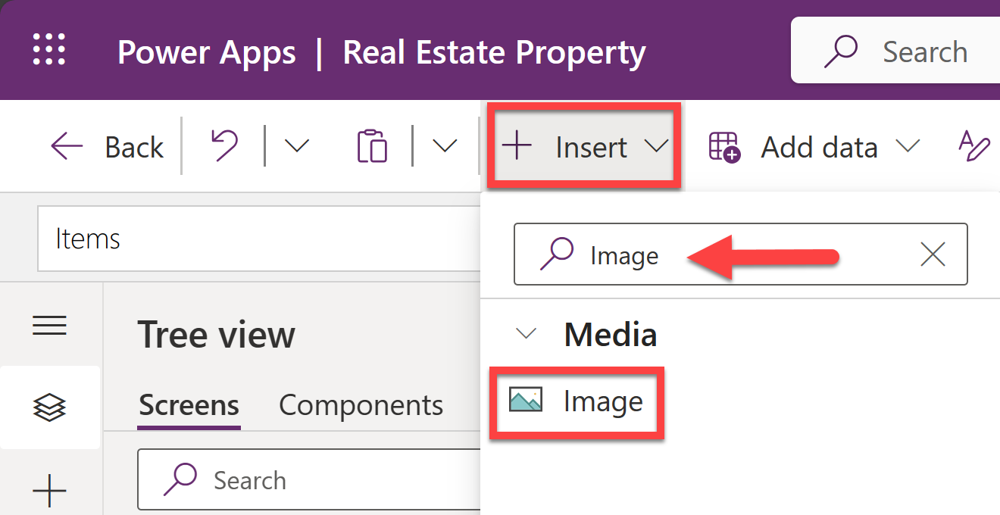](../media/insert-image.png#lightbox)

1. The image should show as being added to your gallery. Reposition and resize the image so that it's in the center of each gallery cell.

	> [!div class="mx-imgBorder"]
	> [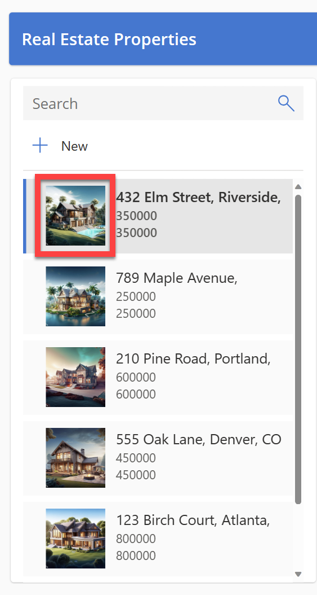](../media/center-image.png#lightbox)

1. To use Microsoft Power Apps Ideas, make sure that the gallery is still in edit mode. Select the gallery body that contains the price. Select the arrow next to the light bulb icon that appears above the price component. Select **Text formatting**.

	> [!div class="mx-imgBorder"]
	> [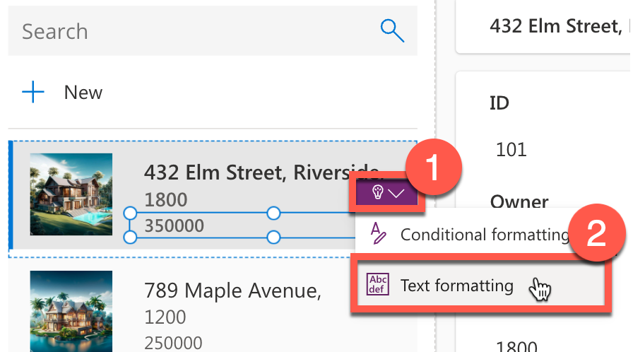](../media/click-lightbulb.png#lightbox)

1. Enter the following value for **Desired format**:

    `$350,000`

    Press the **Enter** key on your keyboard.

	> [!div class="mx-imgBorder"]
	> [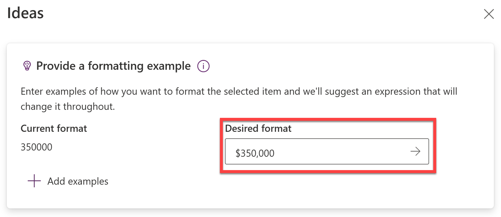](../media/ideas-format.png#lightbox)

1. Select the generated formula and then select **Apply**.

	> [!div class="mx-imgBorder"]
	> [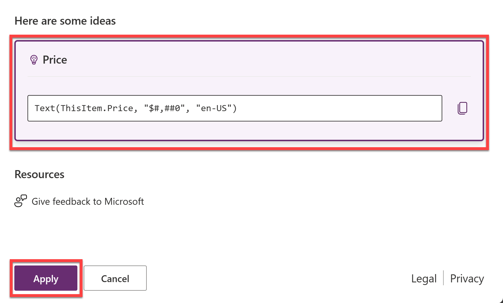](../media/select-formula-then-click-apply.png#lightbox)

    > [!NOTE]
    >
    > With Power Apps Ideas, the example \($350,000\) value that you entered generated the following formula, which shows as updated in the formula bar for the price gallery control:
    >
    > `(Text(ThisItem.Price, "$#,##0", "en-US"))` 

1. Complete the same steps for the **Size** control in the gallery subtitle. Make sure that the gallery is in edit mode. Select the subtitle that contains the size. Select the arrow next to the light bulb icon that appears above the size component. Select **Text formatting**.

1. Enter the following value for **Desired format**:

    `Size: 1,800 sq ft`

    Press the **Enter** key on your keyboard.

    You might notice that the ideas section is empty. The cause might be a lack of information or context that's required for generating a formula.

	> [!div class="mx-imgBorder"]
	> [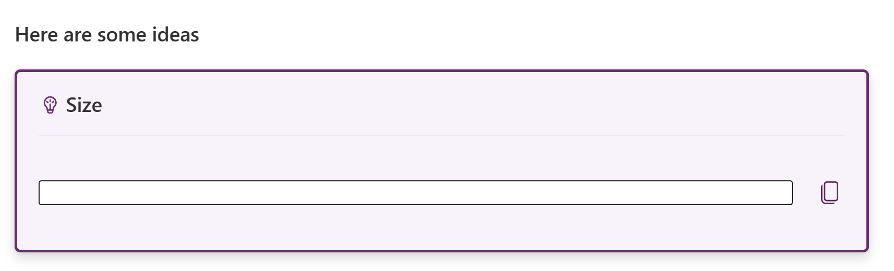](../media/no-ideas.png#lightbox)

1. Because the ideas section is empty, you'll add more examples. Select **+ Add examples** at least two more times.

	> [!div class="mx-imgBorder"]
	> [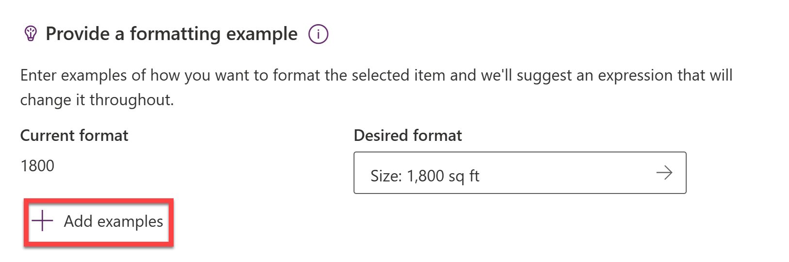](../media/add-examples.png#lightbox)

1. Select two current formats and then provide two corresponding desired formats.

	> [!div class="mx-imgBorder"]
	> [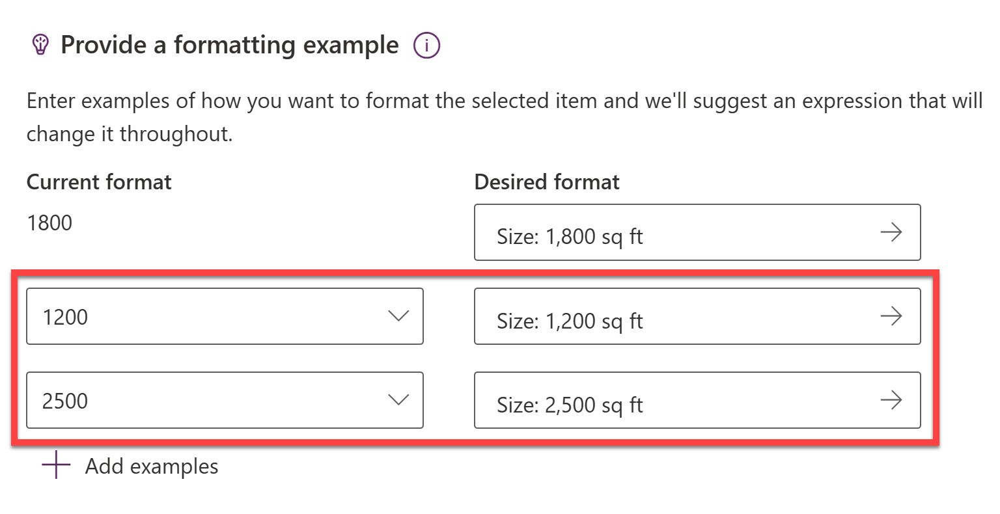](../media/more-examples.png#lightbox)

1. With the added context, Power Apps Ideas generates a suitable formula for you, as shown in the following image.

	> [!div class="mx-imgBorder"]
	> [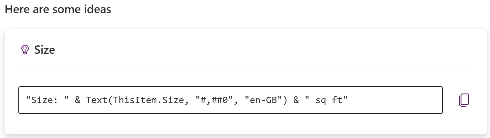](../media/correct-generated-formula.png#lightbox)

1. Select the generated formula and then select **Apply**.

    Your gallery should resemble the following image.

	> [!div class="mx-imgBorder"]
	> [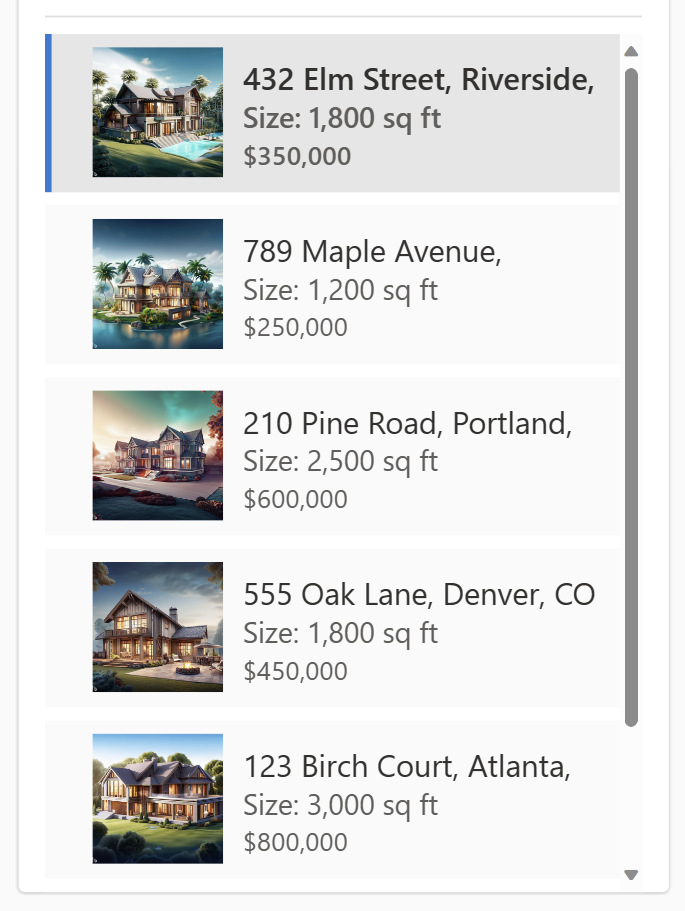](../media/updated-gallery.png#lightbox)

1. **Save** the app.

1. **Exit** the app to return to the Power Apps home page.

	> [!div class="mx-imgBorder"]
	> [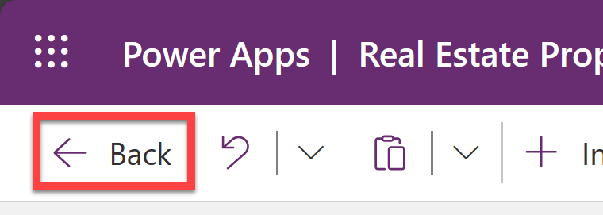](../media/exit-app.png#lightbox)
