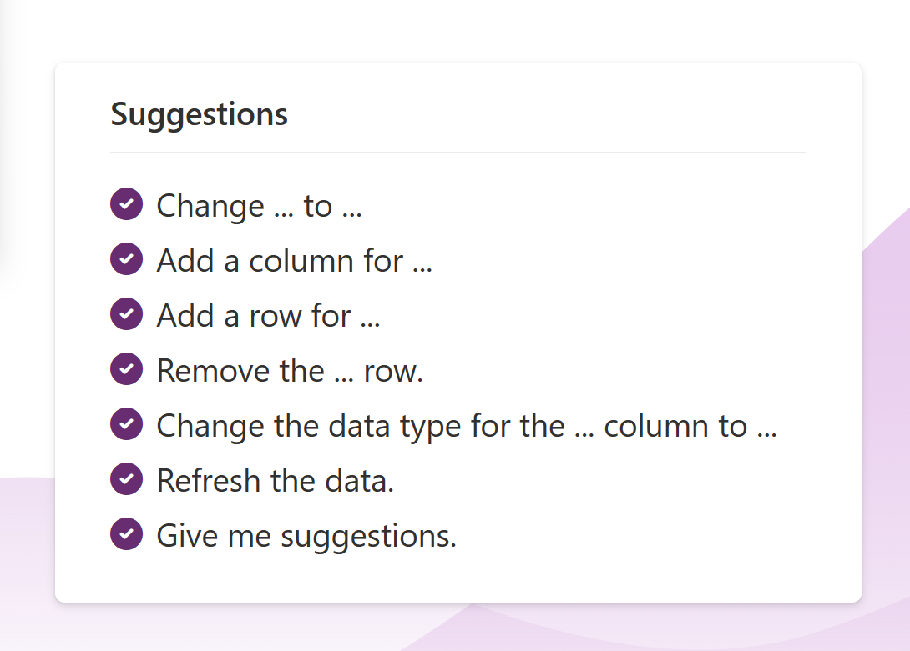
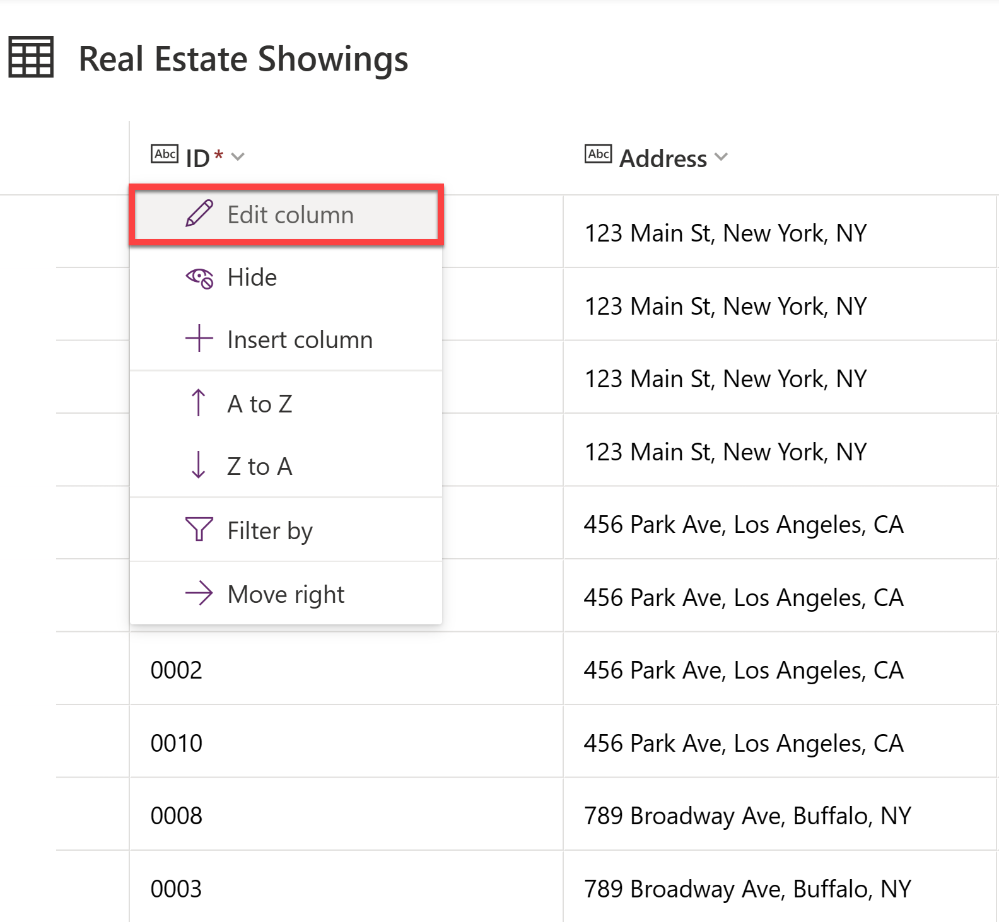
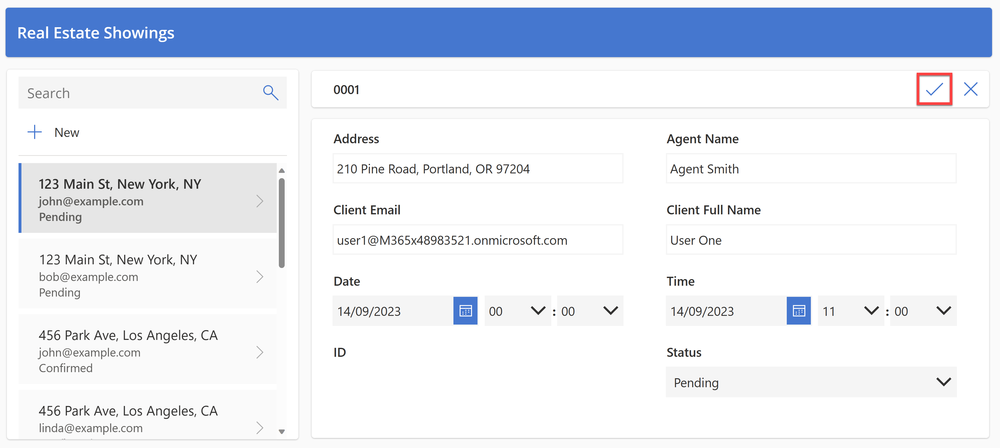

In this exercise, you’ll create a mobile application by using Copilot in Power Apps. Field agents will use this app to browse real estate inventory and manage appointments for showings, and the data will be stored in Dataverse.

> [!NOTE]
>
> Power Apps requires a Microsoft 365 license or a free trial. Learn more about your licensing options. [Microsoft products include Power Apps and Power Automate](/power-platform/admin/pricing-billing-skus/?azure-portal=true).

> [!NOTE]
>
> In this lab, your results for data might vary from those shown in the screenshots and images. The reason is because Power Apps uses OpenAI to generate data for the lab and the data changes daily.

1. On the Home page in Power Apps, in the center text field, enter the following prompt to search for an AI-generated table:

    `build an app to manage real estate showings`

    Select the **Send** button.

	> [!div class="mx-imgBorder"]
	> 

1. After Copilot AI generates a table based on your prompt, look through the table to view the columns that are created for the start of your table.

	> [!div class="mx-imgBorder"]
	> 

    Your next steps are to modify and add to the already generated table.

1. In the text box, in the lower part of the **Copilot** pane to the right of the screen, enter the following text:

    `add a column to track client full name`

    Select the **Send** button.

    Copilot notifies you that the table is updated, and the new column should show as being added to the table.

	> [!div class="mx-imgBorder"]
	> 

1. Enter the following text into the chat:

    `add a column to track client email`

    Select the **Send** button.

    A new column is added to the table and displays the client’s email.

	> [!div class="mx-imgBorder"]
	> 

    > [!NOTE]
    >
    > The data that's generated in your table might vary from the data that's shown in the table in the screenshots for this lab.

    > [!NOTE]
    >
    > The **Suggestions** section in the lower-left corner of the screen provides you with different suggestions on how you can add to and modify your table.

	> [!div class="mx-imgBorder"]
	> 

    On the right of the screen, it appears as if you're having a conversation with a Copilot AI bot while adding to and modifying your table. This area is where you can scroll through and view the changes or additions that you've made to your table.

	> [!div class="mx-imgBorder"]
	> 

1. Edit the **Status** column within the table. In the text box within the **Copilot** pane, enter the following text and then send it:

    `add an option for “Completed” to the Status column`

    The system might take a minute to load. When it does, the **Status** column shows as updated and includes the option for **Completed**.

1. Select the **Status** column name dropdown menu and then select **View column** where you can view the columns’ properties and the current status details and data.

	> [!div class="mx-imgBorder"]
	> 

    > [!NOTE]
    >
    > If your column choices aren't the same as the ones that are shown in the screenshot, enter the following command into the **Copilot** pane text box and then send it:
    >
    > `the status choices should be Pending, Confirmed, Cancelled, and Completed`

    Select the **X** in the upper-right corner of the pane to close it.

    Next, you'll add more data to your table and the existing columns. 

1. In the **Copilot** pane text box, enter and send the following text:

    `add 5 more rows of data`

    Five more rows of data are added for each existing column in the table.

	> [!div class="mx-imgBorder"]
	> 

    Your table should have several columns. However, to continue following the modules in this learning path, try to remove some columns that you won't use.

    The list of columns that you need are:

    - ID

    - Address

    - Date

    - Time

    - Status

    - Agent Name

    - Client Full Name

    - Client Email

    Use what you've learned with the **Copilot Chat** window to adjust your table to match the preceding list. Make sure that you refer to the **Suggestions** section if you need to remove a column, change a column name, or add a column.

1. To create the app, select the **Create app** button in the lower-right corner of the screen.

	> [!div class="mx-imgBorder"]
	> 

1. When the app first loads, a dialog might appear stating **Welcome to Power Apps Studio**. If so, select the **Skip** button.

    The app that has been built for you should show in **Edit** mode.

	> [!div class="mx-imgBorder"]
	> 

1. Select the **Data** icon from the left navigation bar. Copilot has created a **Dataverse** table that's now displaying in the **Environments** section.

	> [!div class="mx-imgBorder"]
	> 

    > [!NOTE]
    >
    > Currently, Copilot is only supported for Dataverse. You can't use any other data access point at this time.

    Next, you'll edit the table now that the app has been created.

1. Within the **Data** pane, hover your mouse cursor over the table. To the right of the table, select the ellipsis (**...**).

1. From the menu, select **Edit data**.

	> [!div class="mx-imgBorder"]
	> 

1. In the **Edit table** dialog, you can add your own columns to the table or modify existing columns.

	> [!div class="mx-imgBorder"]
	> 

1. Select the **ID** column header from the table.

1. From the dropdown menu, select the **Edit column** option.

	> [!div class="mx-imgBorder"]
	> 

1. In this example, you don't want the **Data type** to be a **Single line of text**. To change that value, go to the **Edit column** pane, and then from the **Date type** dropdown menu, select **# Autonumber**.

1. Select **Save**.

	> [!div class="mx-imgBorder"]
	> 

1. Select the **Close** button in the lower-right corner of the **Edit table** dialog.

   The table should now show as **Refreshed** in the **Data** pane.

	> [!div class="mx-imgBorder"]
	> 

1. Modify the gallery in the application so that it displays the relevant data. Select the **Tree view** icon to return to the Tree view.

1. On the app's main screen, select **RecordsGallery1** to display **Real Estate Showings** and then select the edit button to put the gallery in edit mode.

1. Select the **Title** and then set the **Text** value to the following formula:

    `ThisItem.Address`

1. Select the **Subtitle** and then set the **Text** value to the following formula:

    `ThisItem.'Client Email'`

1. Select the **Body** and then set the **Text** value to the following formula:

    `ThisItem.Status`

    A single record in the gallery should now resemble the following image.

	> [!div class="mx-imgBorder"]
	> 

1. On the app's main screen, select the **Form** control.

	> [!div class="mx-imgBorder"]
	> 

1. On the **Properties** pane on the right, under the **Fields** property, select **Edit fields**.

	> [!div class="mx-imgBorder"]
	> 

1. In the **Fields** pane, expand the **ID** field.

1. From the **Control type** dropdown menu, change the type to **View text**.

	> [!div class="mx-imgBorder"]
	> 

    Because you previously changed the **ID** field to **Autonumber**, you don’t want users entering their own number; Dataverse automatically enters the numbers for you.

1. In the **Fields** pane, select the **X** in the upper-right corner to close the pane.

1. Make a new request for a property that shows in the app by selecting the **Play** button from the upper part of the screen.

	> [!div class="mx-imgBorder"]
	> 

1. In the left pane, select the **+New** button.

	> [!div class="mx-imgBorder"]
	> 

1. Though you could modify the form to automatically fill in the fields for you, for this lab, you'll complete this step manually to observe how the app works.

   Fill in the fields with the following information:

    - Agent Name - < Your name >

    - Client Full Name - < Your name >

    - Client Email - < Your email >

    - Date - < Any future date >

    - Time - < Any future time >

    - Status - `Pending`

    - Address - `210 Pine Road, Portland, OR 97204`

    > [!NOTE]
    >
    > This address is one of the addresses from the Microsoft Excel file in Module 1, and it's the same file that you uploaded and turned into the **Real Estate Properties** table.
    >
    > Though you'd usually have a lookup field to the **Real Estate Properties** table, this lab doesn't provide one to keep it simple.

1. Select the check mark in the upper-right corner of the screen.

	> [!div class="mx-imgBorder"]
	> 

1. Select the **X** in the upper-right corner to close out of the app.

    If a dialog appears saying **Did you know?**, select **OK**.

    The new request is added to the left of the list of requests.

1. From the upper part of your screen, select the **Save** button to save the new app that you created.

	> [!div class="mx-imgBorder"]
	> 

    If the system prompts you, save the app name as **Real Estate Showings**.

1. Exit the app to return to the Power Apps home page.
