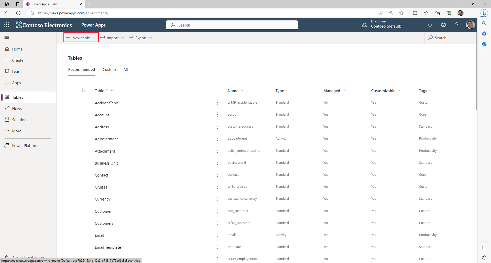

By default, all full Dataverse environments have a set of standard tables that you can use to build business applications. It's a best practice to use those existing tables to build solutions. Sometimes, your app may require you to create custom tables to store the data. For this module's scenario, none of the existing tables have the metadata to support your app. So, we create some custom tables to hold our data.

Scan these sections for an introduction to the tables that you create in this module.

>[!NOTE]
> If you haven't completed the previous modules within this learning path, download the [packaging files](https://github.com/MicrosoftDocs/mslearn-developer-tools-power-platform/tree/master/power-apps/create-dataverse-table). These files contain the completed work on the Accident Tracking app thus far.

### EmployeeTable

You use the **EmployeeTable** to track details about employees of your company. For simplicity in this scenario, you create only the following columns to track the employees:

- **EmployeeId** - *Autonumber* column to identify the employee number. It's common to identify employees by using a number ID because it's easier to find or filter by a number rather than text. In this case, having a number ID also helps identify employees who, in some cases, have the same name (last name and first name).

- **EmployeeName** - *Single line of text* column. In this scenario, you use one column to store the employee's full name. Most databases use separate columns to store the first, middle, and last names. For simplicity, you use only one column.

- **EmployeeDOB** - *Date-only* column to track the date of birth of the employees.

- **EmployeeEmail** - *Single line of text* column in *Email* format to track the email address of each employee. You can use this column later to send emails to employees when an accident has been logged automatically.

- **EmployeePicture** - *Image* column type, which you use to store employee pictures and display the images in your app.

### LocationTable

You use the **LocationTable** to track details about the different work locations for your company. For simplicity purposes, you only track a few details about your work locations:

- **LocationId** - *Autonumber* column to identify the work location. As with the **EmployeeId** field, it's a good practice to track locations by a number identifier. Some organizations prefer to use location numbers because it's more efficient to identify and is commonly used in accounting systems.

- **LocationName** - *Single line of text* column to track the actual name of the work location.

- **LocationCountry** - *Choice* column. For this scenario, you use a custom choice column to track the country/region locations. Choice columns are excellent for limiting data entry errors, which helps make the task of entering data easier for users, and it's a good practice for data consistency.

- **TypeofAccidentID** - Use this table to track information about the types of accidents that usually occur at the workplace. For example, you add a column in this table to rank an accident from one to five to define the severity of the accident. You can use this column later for more reporting based on the number of accidents by severity ranking.

### TypeOfAccidentTable

The **TypeOfAccidentTable** provides quick categorization of the accident. The advantage of using a separate table is that it can be added to without modifying the main **AccidentTable**. Again, we only have a few fields:

- **TypeofAccidentId** - *Autonumber* column to identify the type of accident. Similar to the other IDs, it's common practice to have numbers identifying data.

- **AccidentName** - *Single line of text* column to describe the type of accident.

- **AccidentSeverity** - A simple *Choice* column allowing the user to pick a number between one to five, one being of minor severity and five being a catastrophic accident.

### AccidentTable

The **AccidentTable** is the *main table* that stores the details about all logged accidents. Consider this table as the one that holds details about each occurrence. Tables like this are commonly known as transactional tables because they contain details about transactions. Here are the fields we include:

- **AccidentId** - *Autonumber* column to identify the specific accident.

- **LocationId** - *Lookup* column that links the main table back to your **LocationTable**. Table relationships are discussed later in this module.

- **AccidentTypeId** - *Lookup* column that links to **TypeofAccidentTable**.

- **AccidentDescription** - *Single line of text* column that allows users to enter details about the accident.

- **AccidentDate** - *Date and time* column that allows users to enter the exact time in which the accident took place.

- **ManagerComments** - *Single line of text* column where managers can enter their comments about the accident.

- **ManagerReviewed** - *Choice* column that is yes/no so that managers can denote which cases have been reviewed by management.

### Create a custom table

Follow these steps to create the **EmployeeTable**:

1. Go to [make.powerapps.com](https://make.powerapps.com/?azure-portal=true) and sign in with your Microsoft credentials, as required.

1. In the left navigation pane, select **Tables**, and then select **New table**.

    > [!div class="mx-imgBorder"]
    > 

1. Under the **New table** menu, ensure that you're on the *Properties* tab and enter the following:

    - **Display name** - EmployeeTable

       > [!NOTE]
       > The *Table* suffix is not required; it's a preference, and you will use it when creating tables throughout this scenario.

    - The **Plural name** field auto-populates, so we leave that one as-is.

1. Switch from the *Properties* tab to the *Primary column* tab by selecting **Primary column** (it's just to the right of **Properties**), and enter the following:

    - **Display name** - EmployeeId

       > [!NOTE]
       > The default of the Display name of the Primary column is "Name"; you will need to change it.
       > The primary name is the column that is shown to users when they select records from this table. Also, it's the column that's shown on the **many** side when a lookup column is used.

1. Select **Save** to create the table.

    Your next step will be to set the **EmployeeId** field as an *autonumber* type.

1. In the **Tables** viewer for your new *EmployeeTable*, find and select the **EmployeeId** field in the **columns and data** section in the lower part of the screen. Then select **Edit column** from the dropdown to bring up the **Edit column** panel on the right of the screen.

1. Under **Data type** select the dropdown and then select **Autonumber**. Leave the defaults as they are. Your *EmployeeID* column settings should resemble this image:

    > [!div class="mx-imgBorder"]
    > 

1. Select **Save**.

### Create custom table columns

Now that you have created your table, you can create the columns that you use to store your employee data. You can do so by using the + (New column) button in the **columns and data** pane in the lower section of the screen.

1. Select the **+ (New column)** button to the right of your **EmployeeID** columns, and then in the **New column** pane, enter the following information:

    - **Display name** - EmployeeName

    - **Data type** - Single line of text (default)

    - **Required** - Change from Optional to **Business required** (you want to prevent users from entering an employee record without a name)

    - Ensure the box next to **Searchable** is checked (default is checked)

    > [!div class="mx-imgBorder"]
    > 

1. Select **Save**.

     Repeat the same process to create the remaining columns that you need for **EmployeeTable**. You create a column for **EmployeeDOB**, **EmployeeEmail**, and **EmployeePicture**.

1. Create the **EmployeeDOB** column:

    - **Display name** - EmployeeDOB

    - **Data type** - Date and time

    - **Format** - Date only

    - **Required** - Business required (we want to prevent users from entering an employee record without a date of birth)

    - Ensure the **Searchable** box is checked (default). Then **Save**.

    > [!div class="mx-imgBorder"]
    > 

1. Create the **EmployeeEmail** column:

    - **Display name** - EmployeeEmail

    - **Data type** - Single line of text (default)

    - **Format** - Email (a Dataverse data type that prevents users from entering data that's not formatted in proper email format)

    - **Required** - Business required (we want an email address for the employee)

    - Again, ensure that this one is **Searchable** and select **Save**.

    > [!div class="mx-imgBorder"]
    > 

1. Create the **EmployeePicture** column:

    - **Display name** - EmployeePicture

    - **Data type** - File > Image

    - **Primary image** - select the checkbox (this image is used as the main employee picture) and then select **Save**.

    > [!div class="mx-imgBorder"]
    > 

The first table is complete, let's continue to the next table.
