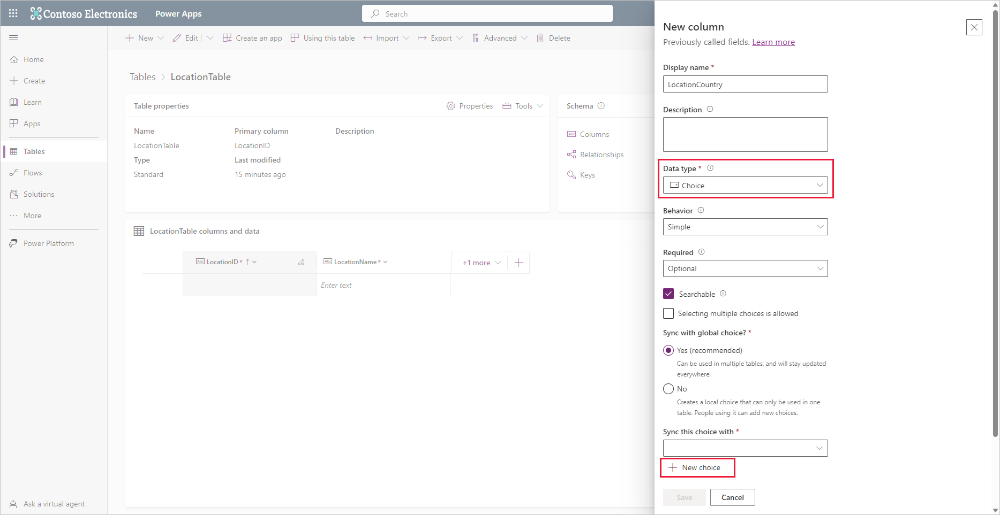
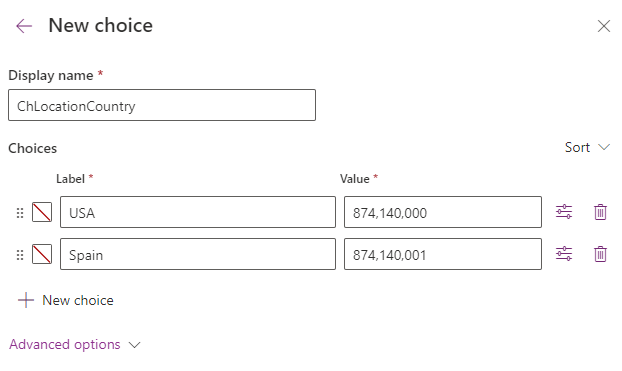
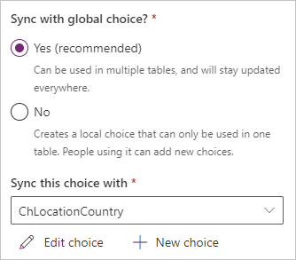

In this exercise, you create two more custom tables to store more data for your employee accident tracking application.

>[!NOTE]
> If you haven't completed the previous modules within this learning path, download the [packaging files](https://github.com/MicrosoftDocs/mslearn-developer-tools-power-platform/tree/master/power-apps/create-dataverse-table). These files contain the completed work on the Accident Tracking app thus far.

### Create a custom LocationTable

Follow these steps to create a custom **LocationTable**:

1. On the main menu, expand **Dataverse** and then select **Tables**.

1. Select **New table** > **New table**.

1. In the **New table** pane under *Properties*, enter this for the **Display name**: `LocationTable`.

1. Switch to the *Primary column* tab in the **New table** pane and enter this for the **Display name**: `LocationID`.

1. Select **Save**. Your table is created and the **Tables** screen appears for your *LocationTable*.

1. Look at the lower part of the screen and see **LocationTable columns and data**. Select the **LocationId** field and select **Edit column**.

1. In the **Edit column** pane on the right side of the screen, change the **Data type** dropdown menu from **Single line of text** to **Autonumber**. Leave the defaults for the other values as they are.

1. Select **Save**.

1. To the right of the **LocationID** column, select **+ (New column)**.

1. In the **New column** pane, enter the following information:

    - **Display name** - `LocationName`

    - **Data type** - Single line of text (default)

    - **Required** - Business required (you want to prevent users from entering a location record without a name)

    - Ensure the box is checked next to **Searchable** (default)

1. Select **Save**.

1. Select **+ (New column)**, as before to create a **LocationCountry** column.

1. Enter these values for the new column:

    - **Display name** - `LocationCountry`

    - **Data type** - Choice

    - Under **Synch this choice with** (you may need to scroll down the pane), select the **New choice** button to create a new set of choices to store some countries/regions that Contoso has locations in.

        > [!div class="mx-imgBorder"]
        > 

1. In the **New choice** pane that slides in from the right, in the **Display name** field enter: `ChLocationCountry`

    > [!TIP]
    >As a good practice, name your custom choice with a prefix to help identify it as a choice object later. In this case we used the prefix "Ch" to designate it as a choice option set.

1. Under **Choices** in the first **Label** entry field, input `USA`. Notice that the **Value** field has a numeric entry in it. This is an autonumber field, assigned by Dataverse, but you can change it to whatever value you wish. In this case, we don't need to change it so we'll leave it alone.

1. Select **New choice** and enter `Spain`.

    > [!NOTE]
    > You can add more choices for countries, but for this example we will only need USA and SPAIN.
    >
    > [!div class="mx-imgBorder"]
    > 

1. Select **Save** to record your **ChLocationCountry** choice.

1. Next we assign the choice we created to our *LocationCountry* column. Under **Sync this choice with**, input `ChLocationCountry` in the search field. Notice how the list of choices filters as you type your choice name. Select **ChLocationCountry** to lock it in as the choice set for this column.

1. Select **Save**.

1. Ensure that, under **Sync with global choice?**, you have **Yes** selected.

    > [!NOTE]
    > With the **Global choice** option, you can use the custom choice in different tables within the same Dataverse environment.
    >
    > With the **Local choice** option (**No** selected under **Synch with global choice?**), you can only use the custom choice in this table only.
    > [!div class="mx-imgBorder"]
    > 
    >
    > [!NOTE]
    > Choice fields are beneficial when the number of options is limited and when items change infrequently or not at all.

1. Scroll down under **Synch this choice with** and you can see the **Default choice** field. This option allows you to define which choice (if any) is the default when a new item is created. In this case leave it as **None** (default).

1. Select **Save**.

    Another table is complete, let's move on to the **TypeofAccident** table.

### Create a custom TypeofAccident table

To create the **TypeofAccident** table, follow these steps:

1. Return to the **Tables** screen (select **Tables** from the left-hand navigation panel).

1. Select **New table** > **New table**.

1. In the **New table** pane under **Properties**, enter the following for the **Display name**: `TypeofAccidentTable`.

1. Switch to the **Primary column** tab and for the **Display name** enter `TypeofAccidentId`

1. Select **Save**.

1. Once your table has been created, go to the **columns and data** pane in the lower half of the screen, and select the **TypeofAccidentId** field and **Edit column**.

1. Change the **Data type** to **Autonumber** and leave the other items as the defaults.

1. Select **Save**.

1. Select **+ (new column)** to create a new column with the following settings:

    - **Display name** - `AccidentName`

    - **Data type** - Single line of text (default)

    - **Required** - Business required

    - **Searchable** - checkbox selected (default).

    **Save** the column.

1. In the same manner, add the new column **AccidentSeverity** with these inputs:

    - **Display name** - `AccidentSeverity`

    - **Data type** - Choice

    - **Sync with global choice?** - Yes (default)

    - Create a new choice option with the display name: `ChAccidentSeverity` and then add five new items. Enter 1, 2, 3, 4, and 5, respectively, in the **Label** field.

    - **Save** the new choice

    - Under **Sync this choice with**, enter `ChAccidentSeverity` and select **ChAccidentSeverity** from the filtered results.

    - Ensure that the **Default choice** is *None*

    **Save** the column.

We have now added supporting tables to Dataverse, including LocationTable and TypeofAccident. To view all of the tables you have created, you can select the **Custom** filter tab under the **Tables** screen.
