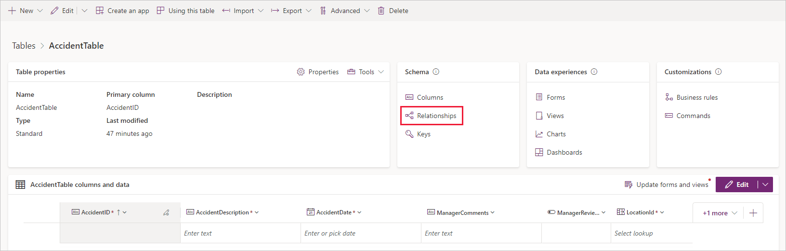

In this exercise, you build the main **AccidentTable** and build out the relationships with the other tables that you created previously.

1. On the main menu, select **Tables**.
    <!--July 2023 updates throughout steps below -->
1. Select **New table** > **New table**.

1. In the **Properties** section under **Display name** enter: `AccidentTable`.

1. Switch to the **Primary column** tab and under **Display name** enter: `AccidentId`.

1. Select **Save**.

1. Under the **columns and data** pane, find and select the **AccidentId** field and select **Edit column**.

1. Change **Data type** to **Autonumber**.

1. Select **Save**.

1. Create the *AccidentDescription* column. Select **+ (New column)** in the **columns and data** pane.

1. In the **New column** pane on the right of the screen, enter/check the following information:

     - **Display name** - `AccidentDescription`
     - **Data type** - Single line of text (default)
     - **Required** - Business required

     - **Searchable** - checked (default)

    Select **Save**.

1. Add another new column with this information:

     - **Display name** - `AccidentDate`
     - **Data type** - Date and time
     - **Format** - Date and time
     - **Required** - Business required

     - **Searchable** - checked (default)

    Select **Save**.

1. Add another new column with the following information:

     - **Display name** - `ManagerComments`
     - **Data type** - Single line of text (default)
     - **Required** - Optional (default)

     - **Searchable** - checked (default)

    **Save** it to continue.

1. Create a *yes/no* choice column with this data:

     - **Display name** - `ManagerReviewed`
     - **Data type** - Choice > Yes/no
     - **Required** - Optional (default)
     - **Searchable** - checked (default)
     - **Choices** - **No** or **Yes** (defaults)

     - **Default choice** - No

     **Save** it. Now for the lookup columns.

1. Create the **LocationId** lookup column.

     - **Display name** - `LocationId`
     - **Data type** - Lookup
     - **Required** - Business required
     - **Searchable** - checked (default)

     - **Related table** - LocationTable (enter `LocationTable` in the search field and select it from the narrowed search list)

        > [!NOTE]
        > In the **Related table** dropdown menu, you select which table to look up values from. Selecting **LocationTable** that you created in the previous exercise will create a many-to-one relationship: **many** in the **AccidentTable** to **one** in the **LocationTable**.

    > [!div class="mx-imgBorder"]
    > 

    After you have saved all changes, the relationships that you created in the table will be visible. **Save** the new column.

1. Create the **AccidentTypeId** lookup column.

    - **Display name** - `AccidentTypeId`
    - **Data type** - Lookup
    - **Required** - Business required
    - **Searchable** - checked (default)

    - **Related table** - TypeofAccidentTable (begin typing `TypeofAccidentTable` and select it).

    **Save** your new column.

    > [!NOTE]
    > This selection will create a many-to-one relationship: **many** in the **AccidentTable** to **one** in the **AccidentTypeTable**.

    Next, we create the many-to-many relationship:

1. In the **Schema** pane in the top middle of the Tables screen, select **Relationships**.

    > [!div class="mx-imgBorder"]
    > 

1. Select **New relationship** from the command bar and then select **+ Many-to-many**.

    > [!div class="mx-imgBorder"]
    > 

1. The **Many-to-many** pane appears on the right side of your screen. In the **Related (Many)** search field, enter `EmployeeTable` and select the **EmployeeTable** that you created in the previous exercise.

    By default, Dataverse provides a **Relationship name** and a **Relationship table name**. You can choose to update and rename those default names. For this exercise, you can keep the default names.

    > [!div class="mx-imgBorder"]
    > 

1. When you're finished, select **Done**.

Your **Relationships** list shows the other relationships (Many-to-one) that were created when you added the lookup columns in the previous steps. You can filter the list by relationship type to change the view.

> [!div class="mx-imgBorder"]
> 

We've now created several tables and have related them together. As we continue to build our **Accident Tracking app**, in the next learning module, we'll work on **Views** and **Forms** for the tables we created in this module. Let's do a quick knowledge check before we continue!
