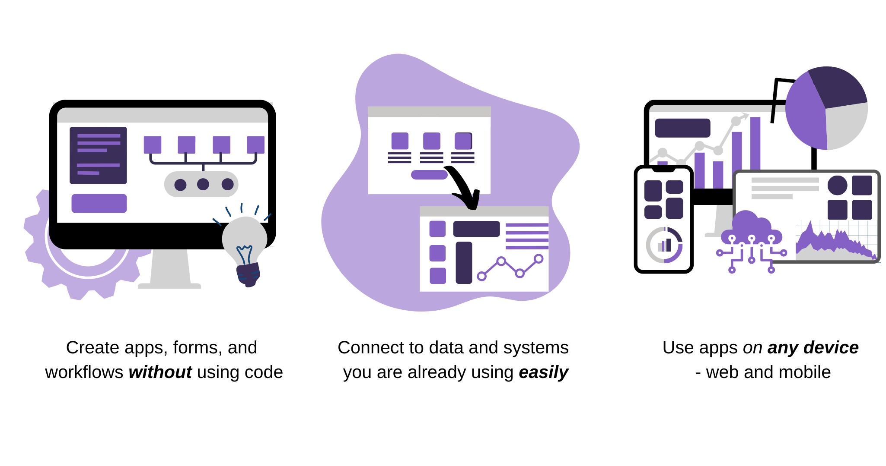
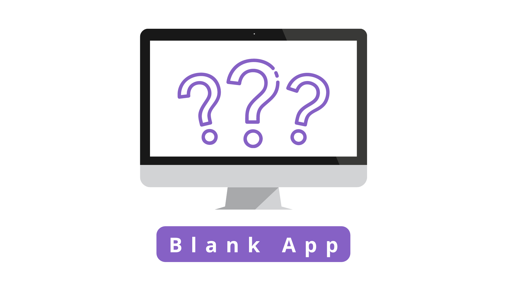
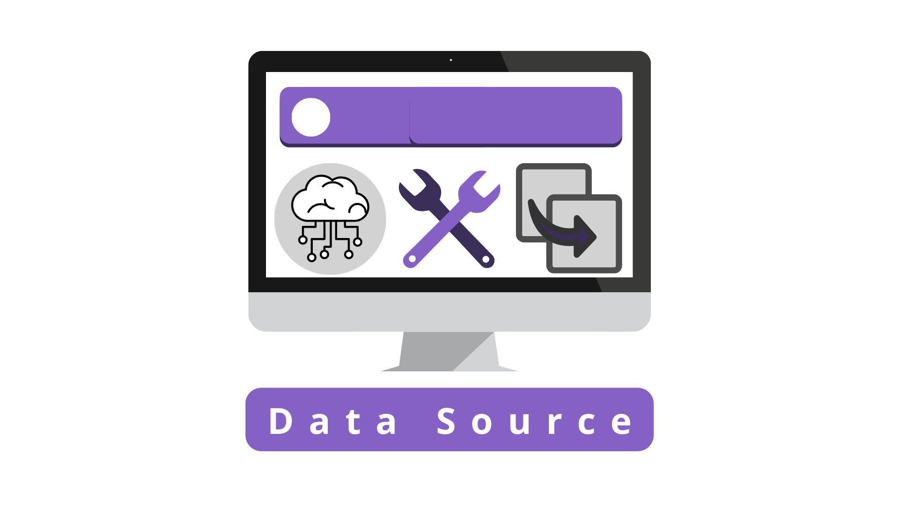
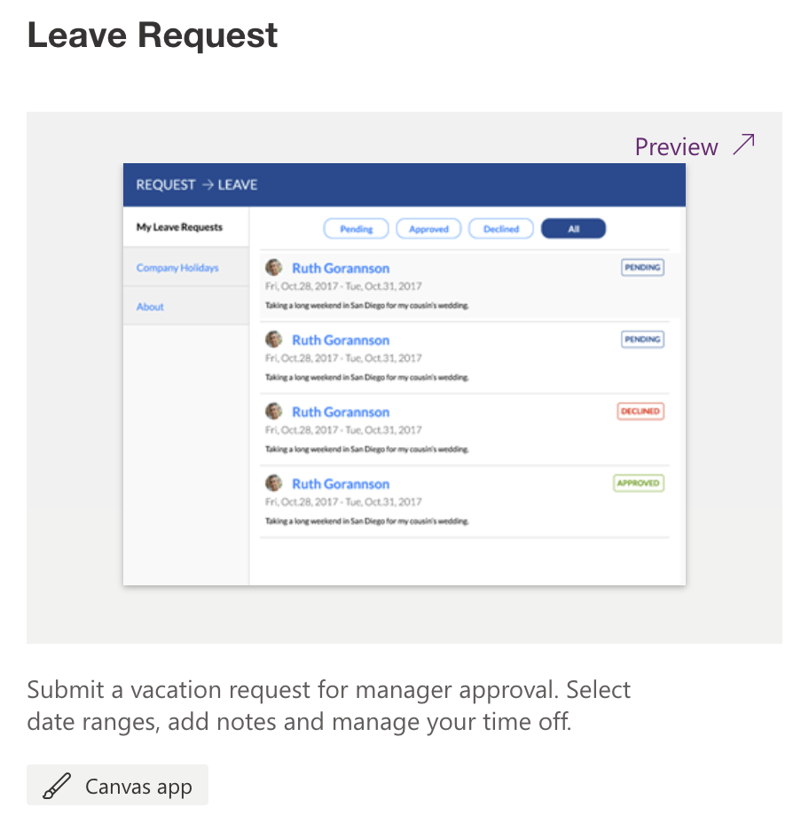
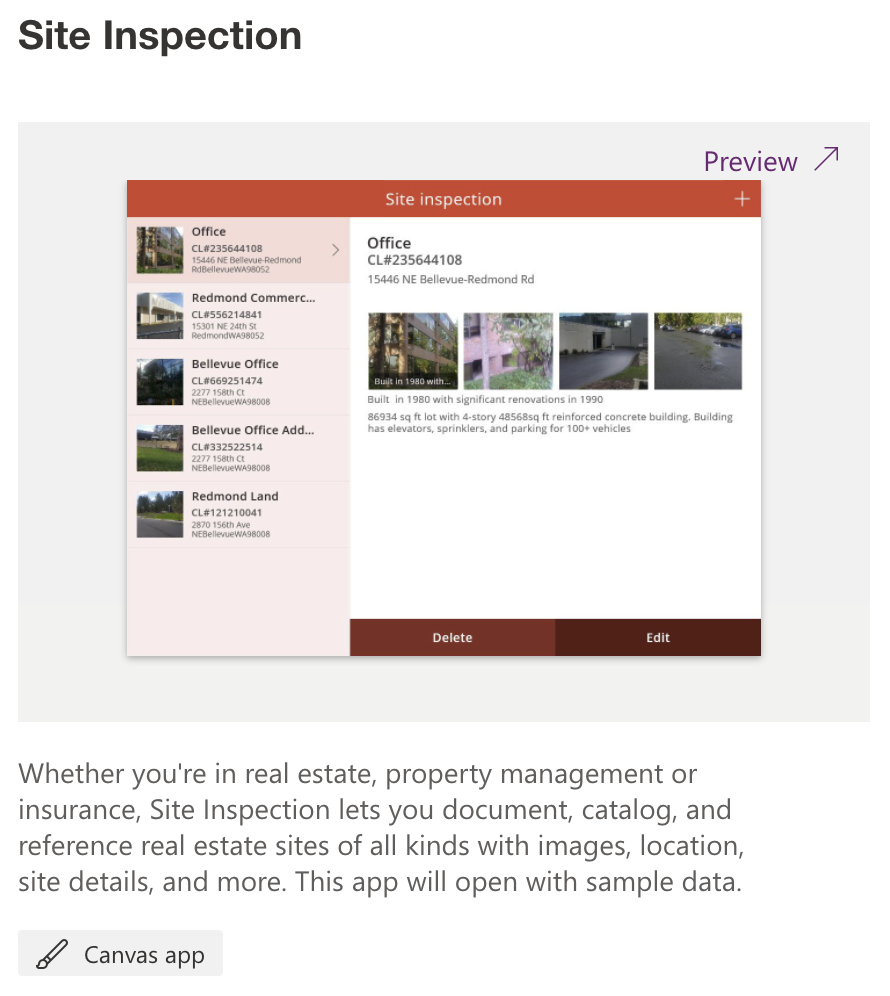

> [!VIDEO https://www.microsoft.com/videoplayer/embed/RE4XQss]

Microsoft Power Apps is a low-code development platform with a suite of apps, services, and connectors that you can use to build apps. Previously, to build custom applications, you would have needed to be highly technical and proficient in the various coding languages, but not with Power Apps.

> [!div class="mx-imgBorder"]
> 

## User-friendly interface

Power Apps simplifies the custom app building experience by providing you with the ability to build feature-rich apps without writing thousands of lines of custom code. With Power Apps, you can drag and drop controls where you want in the app, and then you'll be ready to start.

> [!div class="mx-imgBorder"]
> 

## Multiple ways to create an app

When creating apps, you have the flexibility and power of choice to decide what's best for your solution.

### Blank app

You can choose to build an app from the beginning by adding all screens, controls, and functionality. You have complete control of everything, from start to finish, by starting from blank.

> [!div class="mx-imgBorder"]
> 

### Data source

With Power Apps, you can connect directly to your business data from multiple sources, such as Microsoft Dataverse, SharePoint, Microsoft Excel, Microsoft SQL Server, and more. When you're connected, Power Apps will automatically build a three-screen app for you that lets you display, edit, delete, and create new records.

> [!div class="mx-imgBorder"]
> 

### Template

Templates use sample data to help you determine possibilities. By opening templates in Microsoft Power Apps Studio, you can learn, hands-on, how an app is built.

> [!div class="mx-imgBorder"]
> 

## Share your app with others

When your app is ready to be rolled out, make sure that you publish the latest version. Then, you can share it with anyone who's properly licensed in your tenant. Users will be able to access the app through desktop, tablet, or on a mobile device.

For more information, see [Share a canvas app with your organization](/power-apps/maker/canvas-apps/share-app/?azure-portal=true).

> [!div class="mx-imgBorder"]
> 

## Professional developers

Power Apps also provides an expandable platform that lets professional developers programmatically interact with data and metadata, apply business logic, create custom connectors, and integrate with external data.

## Improve outdated business processes 

With all the possibilities of Power Apps, you could improve several outdated business processes with an app. One benefit of using a custom app is the ability to keep everyone up to date and informed when data is added, modified, or removed.

The following examples describe how to use an app, instead of traditional paper notes, to run your business.

### Restaurant employee management

Employees of a large restaurant might fill out work schedules and vacation requests on a piece of paper that's affixed to a wall. With Power Apps running on everyone's smartphones, employees can open the app to record the same information, anywhere, anytime. The app can even send reminders for the start of the next day's shift.

Explore the **Leave Request** app template to discover other ideas that Power Apps can give you.

> [!div class="mx-imgBorder"]
> 

### Home/site inspections

Often, company representatives who visit homes/sites/rental properties in the field will carry clipboards as they walk the property. During this process, they're checking for damage and taking photos, as needed. By switching from a clipboard to a custom app, these representatives can complete their inspections on site, and they can even take and upload pictures. Then, the information will be written back to the data source and made accessible to anyone who has the proper permissions.

Explore the **Site Inspection** template app if you're interested in this type of custom app solution.

> [!div class="mx-imgBorder"]
> 

For more information, see [Microsoft Power Platform Stories](https://powerapps.microsoft.com/en-us/blog/power-platform-stories/?azure-portal=true).
