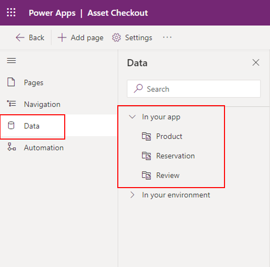
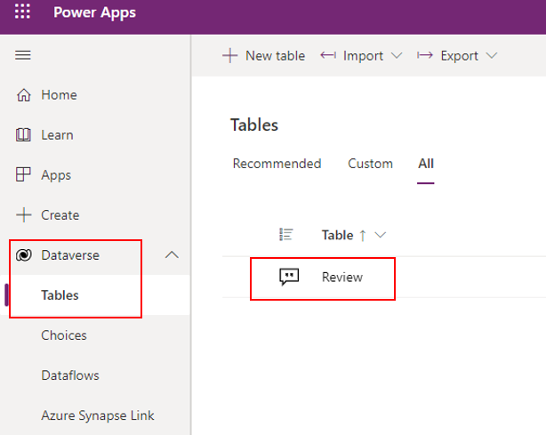
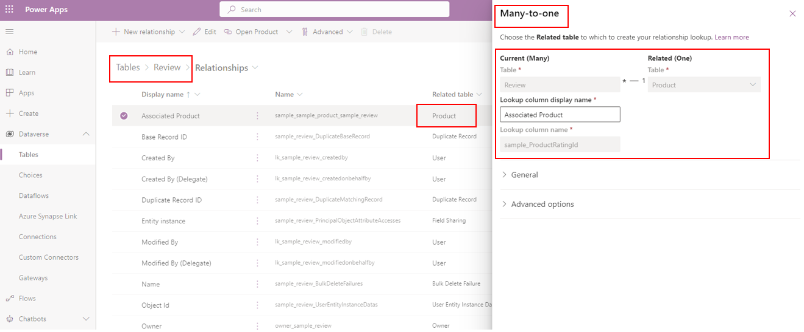
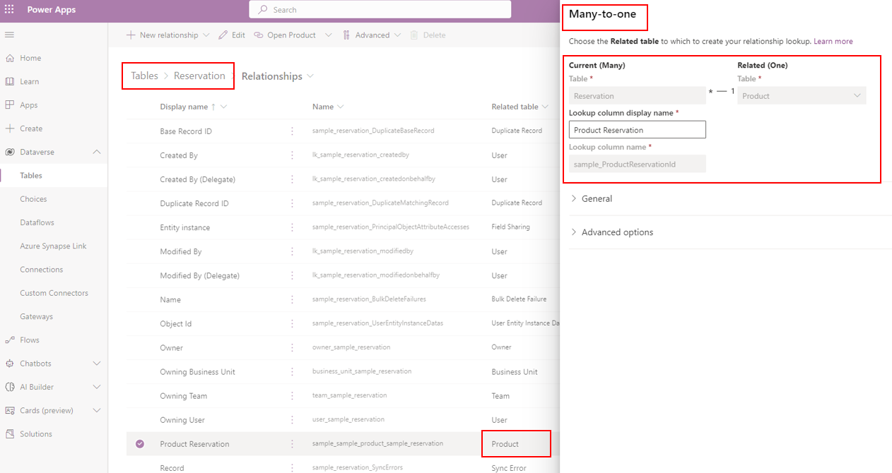
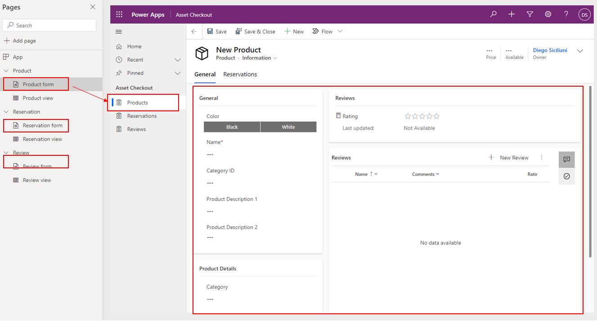

When creating a model-driven app, you use tables from Microsoft Dataverse as your building blocks. Model-driven apps start with your data model, building up from the shape of your core business data and processes in Dataverse to model forms, views, and other components.

It's important to ensure that your business data and business processes at the data level are structured properly before you compose your app. Model-driven apps will automatically generate a UI that is responsive across devices; however, this outcome relies heavily on how your data is modeled in Dataverse.

> [!div class="mx-imgBorder"]
> 

## Approach to model-driven app making

When creating model-driven apps, it's important to focus on three areas:

-   Modeling business data

-   Defining business processes

-   Composing the app

More information on creating model-driven apps is included in the [Create relationships, business rules, calculations, and rollups in Dataverse](/training/paths/create-relationships-common-data-service/?azure-portal=true) Learning Path and in [Overview of building model-driven apps](/power-apps/maker/model-driven-apps/model-driven-app-overview/?azure-portal=true).

Consider the Asset Checkout app, which has three data tables, Product, Reservation and Review. These tables can be viewed under Dataverse and Tables as well.

> [!div class="mx-imgBorder"]
> 

> [!div class="mx-imgBorder"]
> 

In addition, the tables have a relationship established. For example, there's a many-to-one relation setup using the **Associated Product** column between the **Review** table and **Product** table.

> [!div class="mx-imgBorder"]
> 

Similarly, a many-to-one relationship is setup using the **Product Reservation** column between the **Reservation** and **Product** table.

> [!div class="mx-imgBorder"]
> 

In the app designer, you can see each table has its own form.

> [!div class="mx-imgBorder"]
> 
