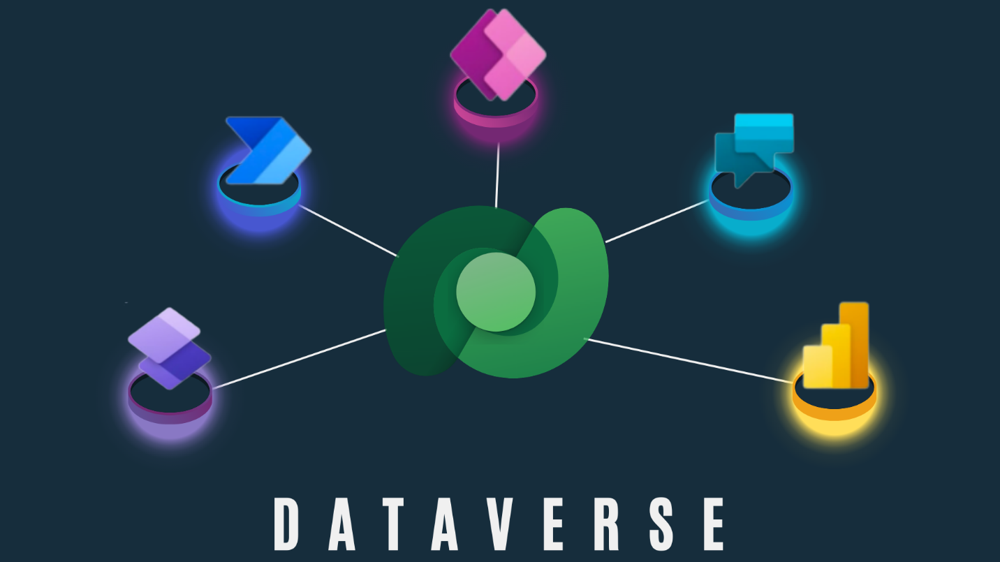

Whether you're building a model-driven app or a canvas app, Dataverse is the ideal data source because it's the foundational data source of Microsoft Power Platform. As a result, you'll experience the most functionality, the deepest integrations, the most features, and the best ease of use of any available data sources. From simple web-based data design to robust, role-based security, Microsoft Dataverse is a straightforward platform that you can use to begin designing your data structures and helping to keep them safe. Then, with your data in place, you have rich integration capabilities from Power Apps and the rest of Microsoft Power Platform. Additionally, by applying business rules, you can trust that your business integrity will be maintained no matter what tool you use to interact with the data.

Another benefit of using Dataverse is that all your data is stored in tables. A table is a set of records that are used to store data, similar to how a table stores data within a database. Dataverse includes a base set of standard tables that cover typical scenarios, but you can also create custom tables that are specific to your organization. Standard and custom tables within Dataverse help provide a secure and cloud-based storage option for your data. Tables allow you to create a business-focused definition of your organization\'s data for use within apps.

> [!div class="mx-imgBorder"]
> 

In this video, we take a look at the architecture design of Dataverse and look at how to build a table.

> [!VIDEO https://www.microsoft.com/videoplayer/embed/RE5dTbZ]
