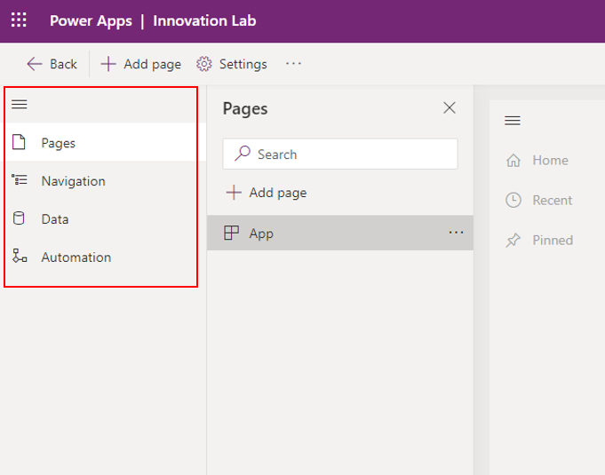
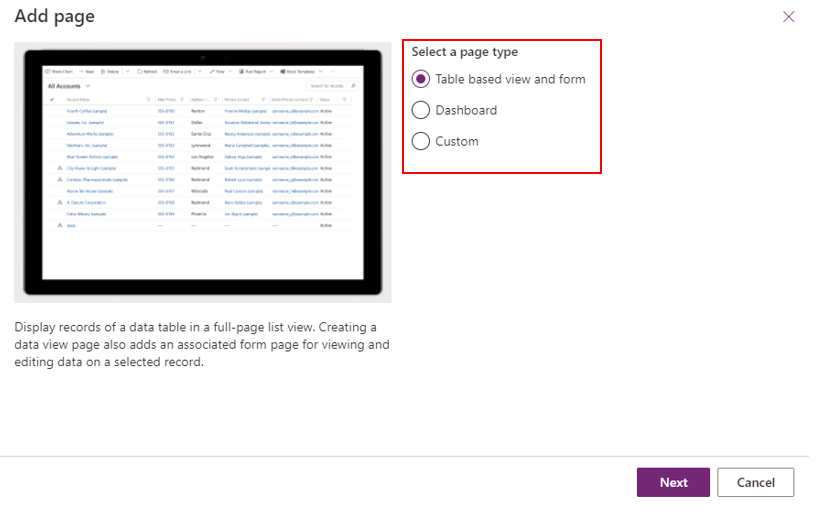
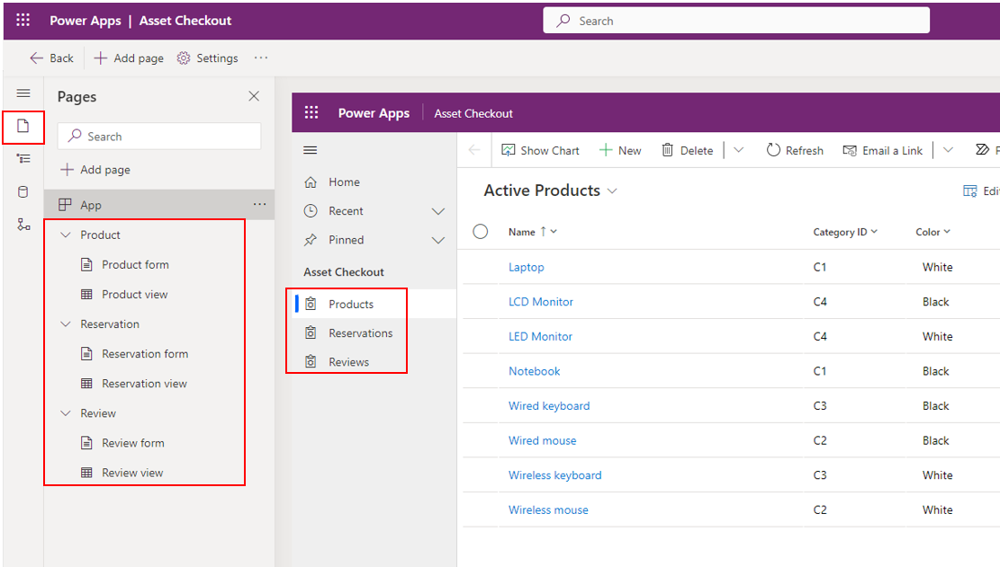
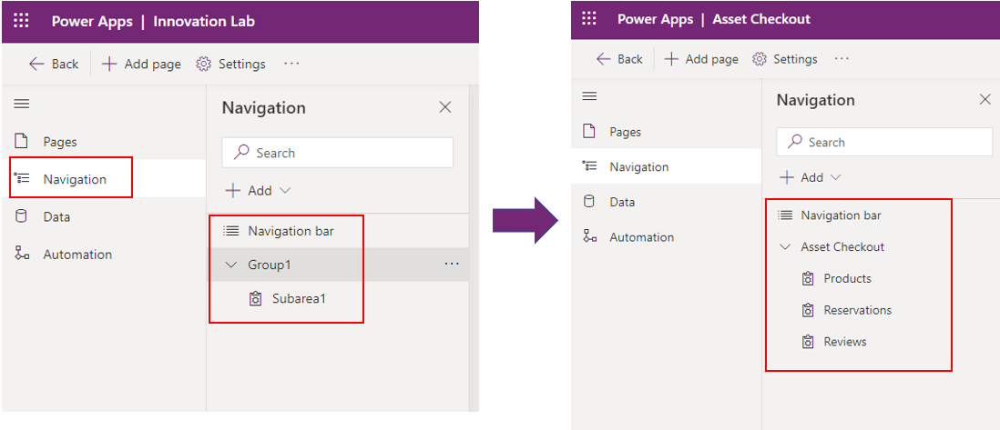
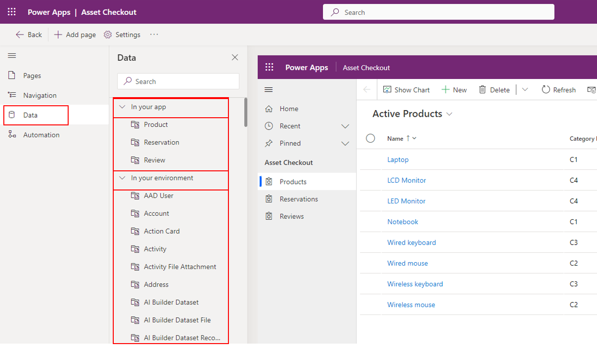
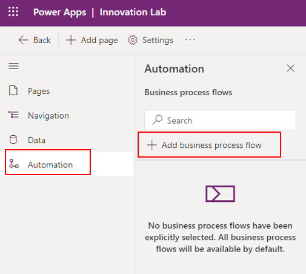
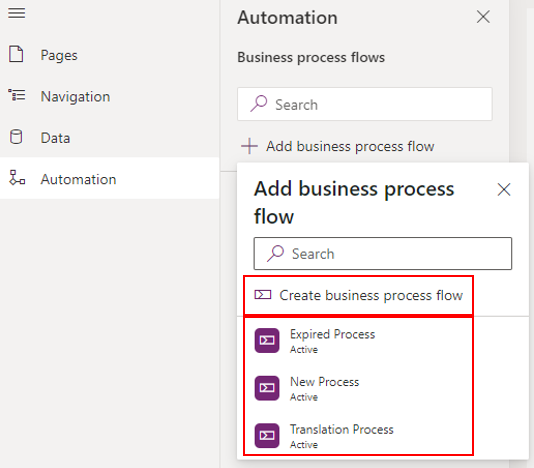

Unlike canvas apps, where you build out an app screen-by-screen by adding logic and code as you go, model-driven apps can be created with a few simple steps. Model-driven apps use a component-focused approach to develop the app. When developing canvas apps, you have complete control over the appearance and behavior of your app, whereas, with model-driven apps, the layout is based on the components that you add to the app.

With model-driven apps, many different components and component properties are available for you to add and modify when designing an app.

## Robust design capability

Designing a model-driven app comprises pages, navigation, data and automation.

> [!div class="mx-imgBorder"]
> 

You have three different page types to select from, they're **Table based view and form, Dashboard** and **Custom.**

> [!div class="mx-imgBorder"]
> 

Here you can see all three layers of how and where the pages are laid in the app.

> [!div class="mx-imgBorder"]
> 

You can set up the navigation based on a Group or Subarea. Group names appear as a navigation element in an app with the subarea names within the group listed beneath it.

Subareas and pages appear under the group that they're configured within in the app designer.

> [!div class="mx-imgBorder"]
> 

## Dataverse as your data source 

When you create a model-driven app, you can use all of the power of Dataverse to rapidly configure your forms, and process flows. Relationships set between tables are automatically available here and easy to use when building views.

> [!div class="mx-imgBorder"]
> 

## Automation using Business Process Flows

Through model-driven apps, you can create business process flows.

> [!div class="mx-imgBorder"]
> 

Currently, you have three templates available and the option to create more.

> [!div class="mx-imgBorder"]
> 

## Responsive apps with a similar UI across various devices from desktop to mobile

With model-driven apps, much of the user interface is determined by the app maker and is largely designated by the components added to the app. Apps have a similar user interface across various devices from desktop to mobile and are accessible and responsive automatically.

> [!VIDEO https://www.microsoft.com/videoplayer/embed/RE5dQoy]
