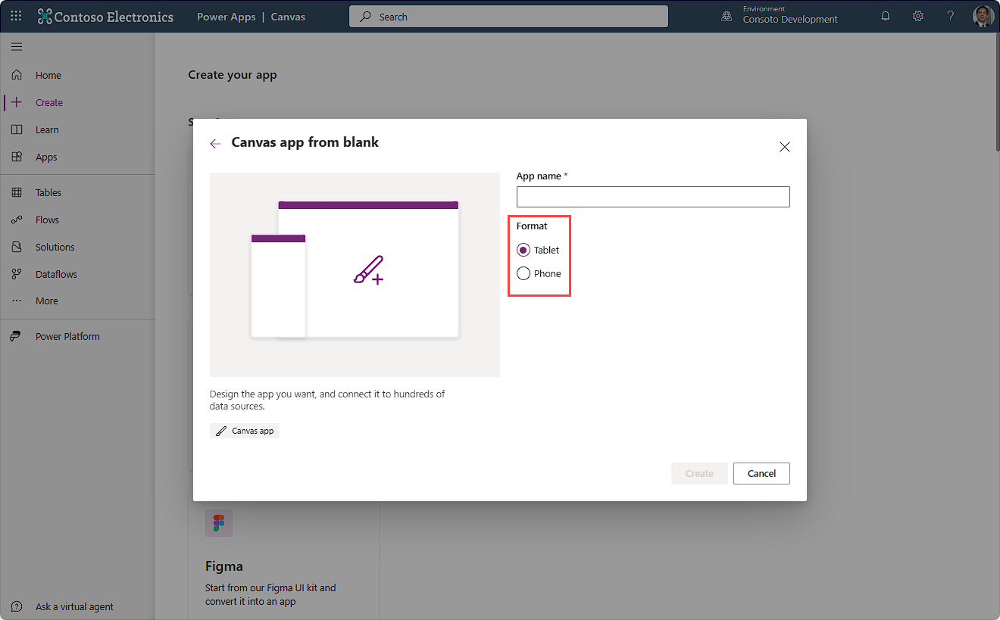

In this unit, we explore some components in Power Apps that help you create a mobile-optimized app including:

- Canvas app creation

- Application display settings

- Responsive forms

- Control and form design considerations

- Containers

- Offline capabilities

- Alert users about no connectivity

## Canvas app creation

You complete your planning, and venture to the **Power Apps home page** to begin your app. You select the **Create** option and **Start from a blank app**, creating a blank canvas app. Power Apps proposes the **Format** option or form factor before even creating your app. This is your first option point to adopt the form factor that you need for your mobile app, which best suits your needs.

> [!div class="mx-imgBorder"]
> 

You can use either layout on a mobile phone or tablet, but you have different experiences. For example, when you're creating a phone layout, the application assumes a vertical orientation and includes the ability for the user to scroll up and down in a narrow window on their device. In tablet mode, the layout on that same device assumes that users operate in a landscape mode and holds the device horizontally by default. The best application varies case-by-case.

## Application display settings

While editing the canvas app, you can navigate to **Settings > Display** and view several important display settings.

- **Orientation** - The orientation of the application is the default presentation layout of your app. It can be in the longer portrait orientation or the wider landscape orientation.

- **Scale to fit** - For a responsive app design, you want to set this option to **Off**. It's set to **On** by default.

- **Lock aspect ratio** - This feature automatically maintains the ratio between height and width. Enabled only if the **Scale to fit** option is set to **On**. If this option is set to **Off**, then the designer is no longer designing a canvas app for a specific screen dimension.

- **Lock orientation**

  - If this option is set to **On**, the setting in **Orientation** is locked. For example, if an application is in portrait mode, and **Lock orientation** is set to **On**, then the canvas app never allows the user to enter a landscape orientation.

  - If this option is set to **Off**, then the mobile app allows the user to switch the application between landscape and portrait by moving the mobile device's orientation.

## Responsive layouts

When you add a new screen to your app, you can select several responsive options from the **Layout** tab including **Split screen**, **Sidebar** and **Header and footer**. These three options are responsive layouts by design, and they adapt to the platform accordingly.

If none of these options suits your business purpose, you can create your own responsive layout by using containers, formulas, and conditions.

## Control and form design considerations

Buttons should be easy for users to locate and select. Consider placing them at the top or bottom of a form that spans the application from edge to edge. If it's an action, such as a delete action, place the button to the side of the record where users are likely holding the device (right hand or left hand).

When you include fields on a form, add enough spacing between fields and the edge of the device to provide a buffer for inaccurate screen touch selections. Likely, users touch inconsistently in the middle of a field, so the experience shouldn't accidentally move the focus to another unintentional field. Buffers between the edge of a field and the edge of the form help users avoid accidentally triggering device swipe actions, such as navigating back to a previous form. If mandatory fields exist, try to prioritize them as the first fields.

Grids with data should span from edge to edge on a form and only scroll in one direction: vertically or horizontally. If you need other fields on a form, include them below the primary field of the record, not in other columns to the right or left of the record. When you use multiple forms, strive to make scrolling a uniform experience across the app.

## Containers

Containers are a great tool to help you organize your controls. Additionally, you can use them to automatically lay out the controls in them horizontally or vertically.

The **Horizontal container** and **Vertical container** controls both use an auto-layout feature, which automatically determines the position (x and y properties) of the child components inserted in them. Also, these controls can distribute the available space to their child components and determine the vertical and horizontal alignment of child components.

The auto-layout containers are ideal when you need the user interface to be responsive to screen size or form factor changes. Also when you want Power Apps to handle stacking and spacing of your components automatically within the available space.

## Offline capabilities

When users run Power Apps Mobile, they can store certain offline data on their mobile devices. When the mobile device reconnects with the internet, Power Apps Mobile can transmit stored data from the device. Two functions we didn't cover include the **LoadData** and **SaveData** functions, which simply save and reload a collection from the app device's storage. Likewise, the **ClearData** function removes the collection from mobile device memory.

## Alert users about non connectivity

Power Apps can alert users when an app is offline via the **Connection** signal formula. You can use an **Icon** control that changes color based on feedback from the connection. You can also use the **Notify** function to alert your user about connectivity, or even change the display mode of certain controls based on the connection.

To summarize, there are various tools available to assist you in designing a mobile-optimized app. From the time you create your app, to the point that you're adding finishing touches, you have options to help get the most from your app. The module summary includes some links to more information about how to build these types of features into your app.
