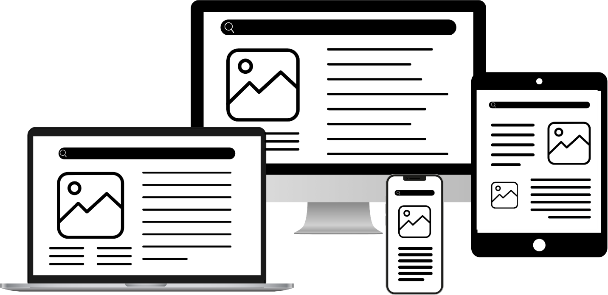
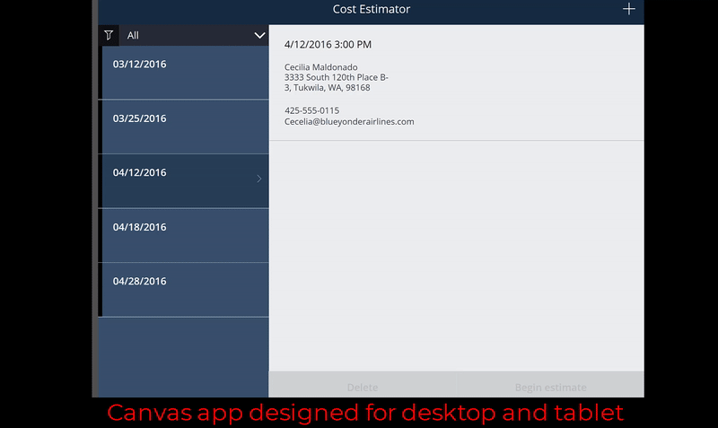

People can interact with a canvas app from Microsoft Power Apps in many different ways, devices, and locations. Some people might use a desktop computer to access the canvas app through a web browser, whereas others might use a tablet or phone.

> [!div class="mx-imgBorder"]
> 

On a phone or tablet, the user can interact with the canvas app without the help of peripherals, such as a keyboard and a mouse on a device that's in a single, consistent location. Instead, people can interact with a device that moves between multiple locations. A designer should consider those variables when creating a mobile-optimized canvas app.

Often, a person who's creating a canvas app gathers requirements for a canvas app, creates the application, and then deploys the application for users to interact with. Considerations for the app interaction design are usually an afterthought. The Power Apps creation environment doesn't always provide the same conditions as the environment that the canvas app is used in.

The following animation demonstrates how a desktop or tablet experience doesn't always translate into a good mobile phone experience that has the same layout. App designers need to keep special design considerations in mind to create the best user experience.

> [!div class="mx-imgBorder"]
> 

This module reviews the different considerations for designers to create a canvas app that's optimized for the mobile experience.
