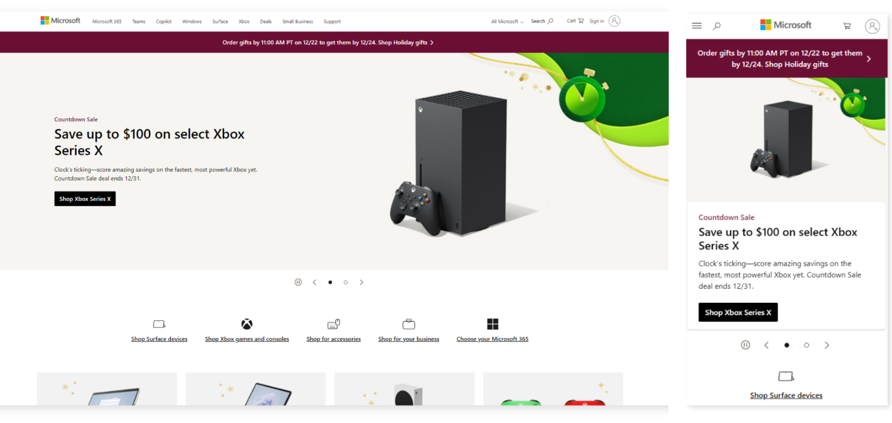
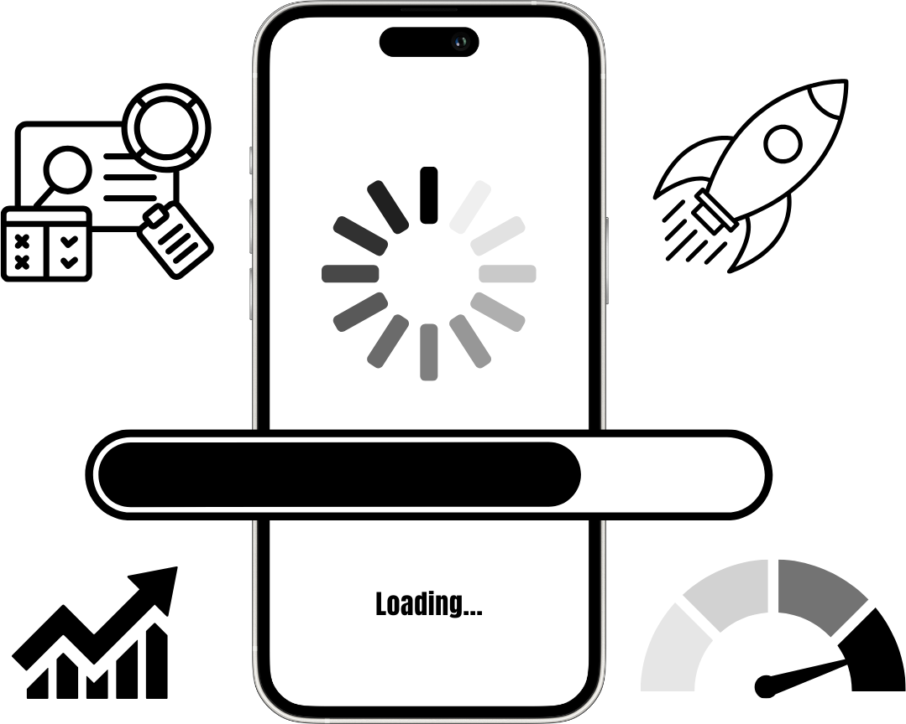

When you design and create a mobile-optimized canvas app from Power Apps, you need to consider several design components.

A mobile-optimized canvas app should have the following design characteristics:

- A clearly defined purpose

- A responsive design [Bring your own device (BYOD)]

- Simplistic user interface

- Intuitive navigation

- External peripherals aren't required

- Offline capabilities

- Connectivity alerts

- Seamless setup

- Optimized for performance

## Clearly defined purpose

A mobile-optimized application should have a clearly defined purpose. When people use apps in a mobile capacity, the fewest actions required to accomplish the task directly correlate to a better user experience.

Determine if you want a single app with many different actions, such as a mobile warehouse application that does all actions for maintaining inventory. Or you might want a single application for a specific purpose, such as creating customers. Then, ask yourself the following clarifying questions:

- Is it easier to navigate back to a home page to complete different actions, or is it easier to exit the app to complete another action?

- Is it a better experience for someone within an organization to navigate through multiple apps?

- If a single application exists, does it try to do too much, therefore complicating the purpose?

When you're designing the forms for the app, make sure that each form has a purpose that you can define in a single, simple sentence. Avoid the urge to have a single form that contains too many purposes, such as creating customers and customer contacts. Instead, consider creating multiple forms, each with a specific purpose.

## Responsive design

Any mobile application or website that is considered mobile-optimized should adapt to the application in which you view it.

For example, someone can view a website such as Microsoft.com on a desktop or mobile view. The application or website adjusts its layout for the design in which you view it. The following example shows Microsoft.com in a desktop view and then a mobile-optimized view.

> [!div class="mx-imgBorder"]
> 

## Simplistic user interface

Resist the urge to include too many fields and input controls on a form.

It might seem like a good idea to include all fields that people might want to use for a task, such as creating a customer, so that the canvas app is comprehensive. However, providing several extra controls that people rarely use creates a cluttered interface and creates more scrolling and "field hunting" to find the fields that they use most often. Instead, consider creating a succinct form and creating a new form for advanced field entry that people would use only on rare occasions.

If users must navigate to multiple screens, they might have a negative experience.

When you need a button, such as a **Submit** button, consider where to place the button in relation to where it's easiest for users to select.

Design with simplicity:

- If too many buttons and fields are on a screen, users might select a button or field by accident.

- Consider adding buffer space around fields and **Submit** buttons to allow for user error variance.

## Intuitive navigation

A mobile-optimized app shouldn't have to come with a complex user manual. Instead, organize the tasks and business actions in a way that guides the user through their daily operations.

> [!NOTE]
> No single, correct way exists for creating a user interface.

Determine the most logical way to organize the tasks for a user based on the previously defined purpose. Consider the following two design scenarios:

- A team uses the mobile app to create sales orders 90 percent of the time and to create new customers 20 percent of the time. As a result, the first navigation button should be to the sales order creation form, and the second navigation button should be to the customer creation form.

- A team uses the mobile app to find new customers by creating their first order, versus looking up the customer first, then using autofill on the order form. Therefore, the first navigation button should be to find the customer form, and the second navigation button should be to the sales order creation form.

Users always want an easier way to go back to the main screen. Therefore, keep the following considerations in mind when creating return navigation:

- Each form should include a simple way to return to the main screen to conduct another action.

- Requiring a customer to return to a central point through multiple actions results in a poor user experience.

- If a user finishes a specific task and has no new tasks to complete, then the app should return automatically to the home location, where they can conduct their next actions.

## Exclude external peripherals

Likely, users who are on a phone or tablet don't have a mouse and keyboard.

When you design the application's user interface, imagine yourself holding a specific device in your hand and interacting with the application to help you determine whether it's a good experience or not. For example, when a user enters field information, a keyboard appears on the screen, so you should determine whether that factor impacts the user's experience.

## Include offline capabilities

People using mobile applications sometimes find themselves out of cell service and Wi-Fi. Ask yourself the following questions to help determine when the app might need offline capabilities:

- Do users need the app in a location where they might need to conduct an action without internet connectivity?

- Including offline capabilities in a canvas app can be complex. Are the efforts to make the actions offline-capable worth the effort?

- Are the actions that need to be conducted offline unavailable on the device, such as reading/writing data that's only available at a specific location?

## Connectivity alerts

In a cloud-first solution, connectivity to the cloud is imperative. Most users assume that they have connectivity to the internet when they access the canvas app.

> [!div class="mx-imgBorder"]
> 

Different forms and actions that have internet connectivity requirements should include a form verification. Before the user attempts to enter data, this form verification can alert the user that the mobile application is in offline mode and that the action isn't available. For example, if the action of creating a customer requires connectivity, then the application shouldn't allow a user to access the customer creation form and enter data when the mobile application is offline.

Alerting the user as soon as possible helps reduce potential data entry rework. You should consider including an alert indicator, such as a banner on the top of the screen indicating that the mobile application doesn't have connectivity.

## Seamless setup

Seamless setup is vital to users who are adopting the app. Microsoft's deployment of Power Apps makes the deployment seamless, but configuration might be required in scenarios where you're connecting those apps to necessary data sources or user access.

When prompting the user to enter required data, such as a URL to an application or API, you should consider including tips for users to find that data. Assume that your user is using the app for the first time and that they need guidance.

Additionally, you should consider including a comprehensive and direct description of the mobile application that tells users what app is being used.

## Optimize for performance

Performance is more important for mobile applications than desktop applications. The limitations of multitasking with several tasks on a mobile phone make performance a significant factor. Desktop users can effortlessly navigate to another application while the canvas app does specific tasks.

> [!div class="mx-imgBorder"]
> 

When optimizing the app for performance, you should:

- Consider the data sources and the complexity of the data that's being retrieved.

- Evaluate the data connectors used for the application.

- Try to eliminate complex or unnecessary data sources.

- Attempt to retrieve only the specific number of records required for a given action.

In summary, when you're planning to create a mobile application, it's wise to put some thought into the design before you create it. It's easier to clarify the path before starting than it is to correct an already built app.
