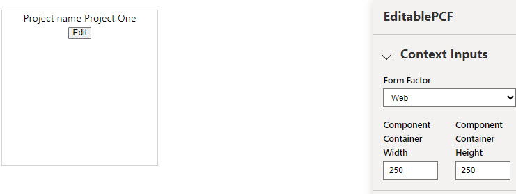
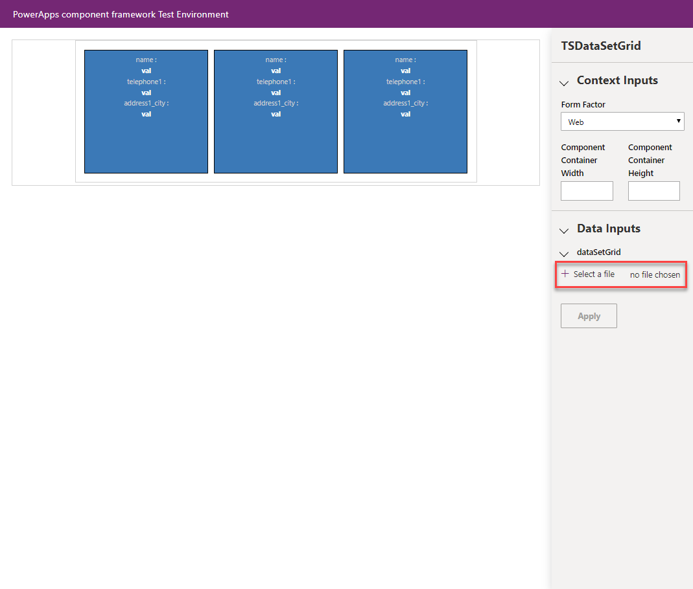
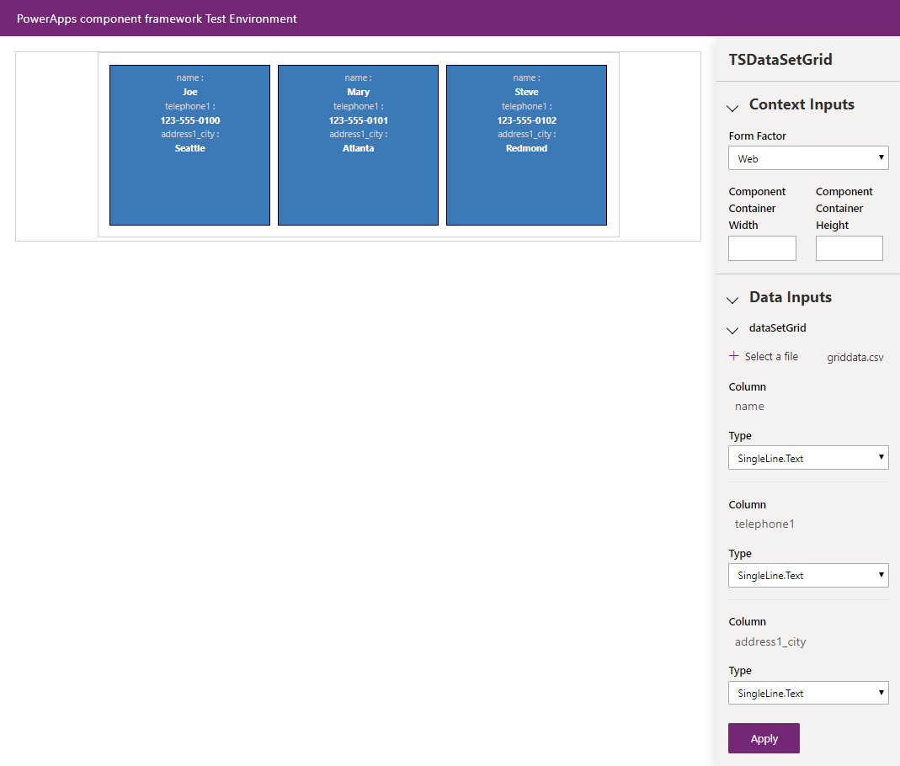
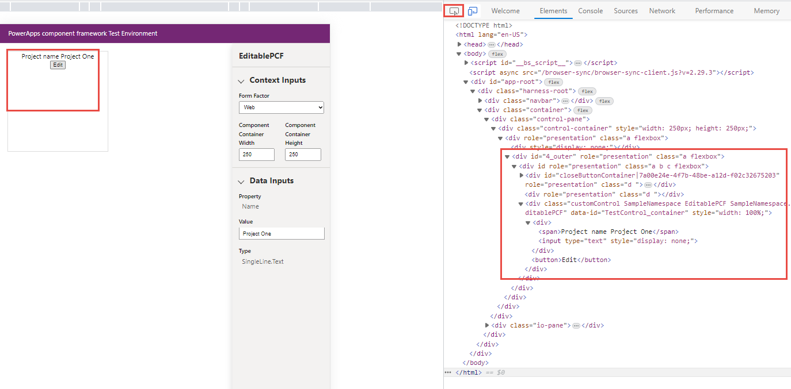
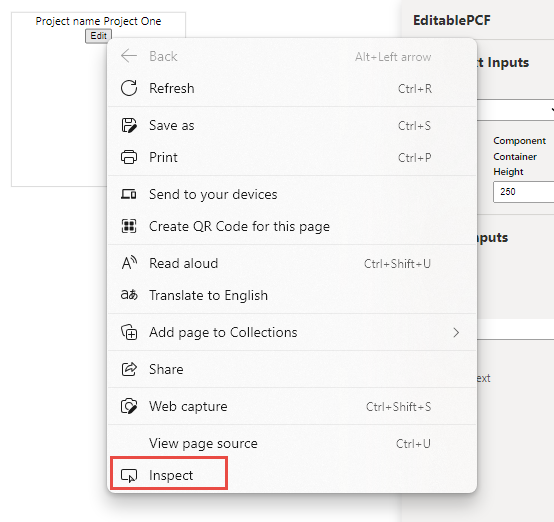
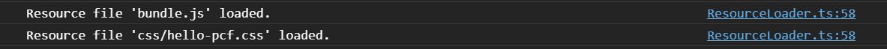
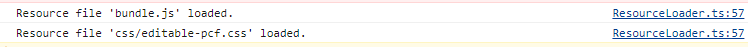
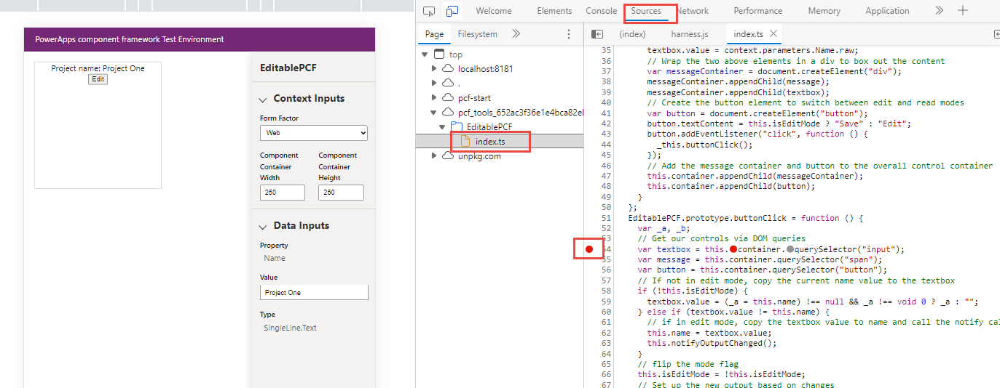
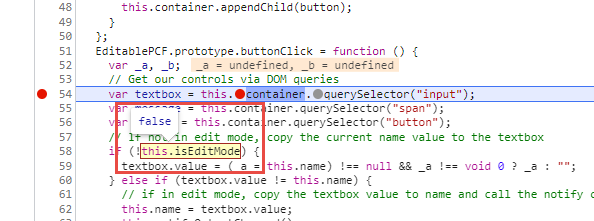

As you develop more complex components, you might need to test and debug their logic in interactive ways. One useful utility that you have is the Power Apps component test harness, which allows you to test different data and context inputs to ensure that your component is functioning correctly. Also, because you build code components with standard web technologies like TypeScript, CSS, and HTML, you have numerous utilities provided through that ecosystem, such as client debugging capabilities available in most modern browsers.

## Test and debug your code component in the Power Apps component test harness

The Power Apps component test harness is a utility built by Microsoft that helps you quickly render a Power Apps component in a localized environment. If you've gone through the exercise in this module on writing a code component, you've already seen this utility in action. You can start a local test harness from within a Power Apps component project by using the *npm*
start command.

After the test harness has started, your component will display in a browser window, like the one that you built in the previous exercise.

> [!div class="mx-imgBorder"]
> 

### Context inputs

Within the test harness, you can provide your component with various inputs to specify how it's rendered (which is useful for ensuring that the component renders properly under different display contexts).

In the **Context Inputs** drop-down menu, you can select **Form Factor** such as **Web**, **Tablet**, and **Phone**. You can also provide explicit width and height fields to see how the component renders in various dimensions.

### Data inputs

The **Data Inputs** drop-down menu helps you ensure that the component functions as expected when different data parameters are provided and also allows you to determine how the component will render based on the type specified in a given field.

If your component is a dataset component, you can load CSV files with mock data. You can export a CSV from a sample target environment against which you're building your component, or you can build a new one.

> [!div class="mx-imgBorder"]
> 

In the previous example, if you wanted to build a new CSV file, it should look similar to the following sample:

 name, telephone1, address1\_city

 Joe, 123-555-0100, Seattle

 Mary, 123-555-0101, Atlanta

 Steve, 123-555-0102, Redmond

After the CSV has successfully loaded, the component will display its records and, as with your property controls, you can assign various types as specified by the component's corresponding type group (which is defined in the component's ControlManifest.Input.xml file).

> [!div class="mx-imgBorder"]
> 

## Debug a code component by using browser debugging

Most modern browsers have various built-in debugging capabilities. Microsoft Edge, Google Chrome, Mozilla Firefox, and Apple Safari each have built-in developer tools that allow for interactive debugging experiences. For more information on each browser, see the following links.

| Browser         | Developer Tools Documentation                                           |
|-----------------|-------------------------------------------------------------------------|
| Microsoft Edge | [https://learn.microsoft.com/microsoft-edge/devtools-guide-chromium](/microsoft-edge/devtools-guide-chromium) |
| Google Chrome          | https://developers.google.com/web/tools/chrome-devtools |
| Mozilla Firefox         | https://developer.mozilla.org/docs/Tools/Debugger |
| Apple Safari          | https://support.apple.com/guide/safari-developer/welcome/mac            |

For this exercise, you'll use Microsoft Edge. With an active Microsoft Edge browser open, start Microsoft Edge's DevTools by pressing F12 on your keyboard.

## Inspect your HTML with the elements panel

In DevTools, the first available tab after **Welcome** is **Elements**. Select **Elements** and the Elements panel provides you with a way to view the HTML that is rendered within the page. You can go to where your control is being rendered by using the Inspect functionality, which can be accessed in one of three ways:

1. Select the **Select an element in the page to inspect it** icon at the top left of the Elements panel, and then select the element in the Component Test Harness. This action selects that element in your viewer on the right (see 3 in the diagram below).

	> [!div class="mx-imgBorder"]
	> 

1. Highlight and right-click an element within your component and then select **Inspect**.

	> [!div class="mx-imgBorder"]
	> 

1. Select any element from the Elements panel.

## Inspect console logs and run script in the console panel

A frequent mechanism for providing debug context within client script is to use the *console.log()* method. If you want to provide logging inside of your component's logic, you can use this method. These logs are displayed in the DevTools console panel whenever they're run, which provides a valuable way to trace logic as it runs within your component. The following image shows an example of a couple of logs from the test harness.

> [!div class="mx-imgBorder"]
> 

You also have the ability to run your own script from within the console. This method can be valuable for testing various method calls and logic from within the context of a live environment.

> [!div class="mx-imgBorder"]
> 

## Set debugger breakpoints in the sources panel

One of the most valuable utilities in DevTools is the ability to set debugger breakpoints in your code so that you can inspect variables and the flow of your method implementation. This example sets a breakpoint in your *index.ts* file that you developed as part of your Power Apps component. In the following example, you'll stop at a breakpoint on each run of the *refreshData* method.

> [!div class="mx-imgBorder"]
> 

If you select the button of your control, this breakpoint is hit, providing you with the ability to manually step through the logic of the event handler. Additionally, you can inspect values, such as those that have changed, as shown in the following image.

> [!div class="mx-imgBorder"]
> 
