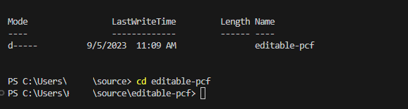
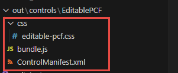

Power Apps provides numerous built-in functionalities for app makers to build their apps, but sometimes, you'll need to create custom user experiences to handle your unique requirements. Examples might be replacing a percentage value with a gauge, rendering a bar code rather than an ID, or replacing existing controls with controls that have more functionality—like a drag-and-drop grid view. You can also wrap the Power Apps component framework around existing components you've written in other web frameworks, like React or Angular.

Creating these components allows you to use the full breadth of the modern web development ecosystem: the libraries, frameworks, and other tools you may be familiar with, and packages that capability into a form that allows app makers to build apps with your code as if it were an out-of-the-box part of the platform.

> [!NOTE]
> Other [sample components, including those that use Angular or React](/power-apps/developer/component-framework/use-sample-components/?azure-portal=true) are available.

Custom Power Apps components are frequently referred to as *code components* because they require custom code to build them. They consist of three elements: a manifest, an implementation, and resources. 

In the following exercise, you'll create a custom code component to handle a scenario for your company. Your company would like to have some fields on the form in the application that are read-only until the user manually initiates an edit on the data value. The team has identified that none of the built-in controls will work so they have asked you to create a custom code component. 

To solve this requirement, you'll create an editable field custom component that will look like the following image. The value will be read-only until the user selects edit.


This component will listen to changes coming from the host app and allow the user to make changes that are then pushed to the host app. The following steps will help you build this component.

## Install Power Platform CLI

To prepare your computer to build code components, follow these steps:

1. Install [Npm](https://www.npmjs.com/get-npm/?azure-portal=true) (comes with Node.js) or [Node.js](https://nodejs.org/en/?azure-portal=true) (comes with npm). We recommend that you use an LTS (Long-Term Support) version.

1. Install [Visual Studio Code](https://code.visualstudio.com/Download/?azure-portal=true).

1. Install [Power Platform Tools extension](https://marketplace.visualstudio.com/items?itemName=microsoft-IsvExpTools.powerplatform-vscode).

## Create a new component project

To create a new component project, follow these steps:

Create a directory where you'll build your component. In this sample, you'll place the component in **C:\\source\\Editable-pcf**; however, you can create your own directory. To create your own directory, you'll use Visual Studio Code.

1. Start Visual Studio Code.

1. Select **Terminal** and select **New Terminal**.

    > [!div class="mx-imgBorder"]
    > 

1. Change directory to your source folder.

    ```console
    cd source
    ```

1. From your source directory, create a directory named **hello-pcf**.

    ```console
    md editable-pcf
    ```

1. Change directory to hello-pcf.

    ```console
    cd editable-pcf
    ```

    > [!div class="mx-imgBorder"]
    > 

1. Initialize your component project by using Power Platform CLI with the following command:

    ```
    pac pcf init --namespace SampleNamespace --name EditablePCF --template field
    ```

    The following image shows an example of the output that you should see.

	> [!div class="mx-imgBorder"]
    > [](../media/terminal.png#lightbox)

1. Install the project build tools by using the command `npm install`. You might see some warnings displayed; however, you can ignore them.

    ```
    npm install
    ```

1. Run the command below to open project in Visual Studio Code.

    ```
    code -a .
    ```

1. The project contents should look like the image below.

	> [!div class="mx-imgBorder"]
    > 

## Update your code component's manifest

Update the manifest file to accurately represent your control.

1. Expand the **EditablePCF** folder and open the **ControlManifest.Input.xml** file.

    

1. Change the version to **1.0.0** and description-key to **Edits project name**.

	> [!div class="mx-imgBorder"]
    > [](../media/change-version.png#lightbox)

1. Locate the **property** node.

1. Change the name value to **Name**, display-name-key to **Name**, and description-key to **A name**.

	> [!div class="mx-imgBorder"]
    > [](../media/change-name.png#lightbox)

1. Locate the **resources** node.

1. Include a reference to a CSS file named *editable-pcf.css* that you'll create.

    ```css
    <css path="css/editable-pcf.css" order="1" />
    ```

	> [!div class="mx-imgBorder"]
    > 

1. Save your changes by selecting **File** and then **Save**.

## Add styling to your code component

To add styling to your code component, follow these steps:

1. Make sure you still have the **ControlManifest.Input.xml** file selected and then select **New Folder**.

    

1. Name the new folder **css**.

1. Select the **css** folder you created and select **New File**.

1. Name the new file **editable-pcf.css**.

1. Open the new editable-pcf.css file you created, and paste the following CSS snippet.

    ```css
    .SampleNamespace\.HelloPCF {
          font-size: 1.5em;
        }
    ```

1. The content of the CSS file should now look like the image below.

	> [!div class="mx-imgBorder"]
    > 

1. Select **File** and select **Save**.

## Build your code component

Before you can implement your component logic, you need to run a build on your component. This makes sure that the right TypeScript types are generated to match the properties in your ControlManifest.xml document.

Go back to the terminal and build your project by using the following command.

```css
npm run build
```

The component is compiled into the **out/controls/EditablePCF** directory. The build artifacts include:

- **css** folder

- **bundle.js** - Bundled component source code

- **ControlManifest.xml** - Actual component manifest file that is uploaded to the Microsoft Dataverse organization

	> [!div class="mx-imgBorder"]
    > 

## Implement your code component's logic

To implement your code component's logic, follow these steps:

1. Open **index.ts** file.

1. Above the **constructor** method, insert the following private variables: 

    ```TypeScript
    // The PCF context object\
    private context: ComponentFramework.Context<IInputs>;
    // The wrapper div element for the component\
    private container: HTMLDivElement;
    // The callback function to call whenever your code has made a change to a bound or output property\
    private notifyOutputChanged: () => void;
    // Flag to track if the component is in edit mode or not\
    private isEditMode: boolean;
    // Tracking variable for the name property\
    private name: string | null;
    ```

	> [!div class="mx-imgBorder"]
    > 

1. Locate the **init** method and replace it with the method below.

    ```TypeScript
    public init(context: ComponentFramework.Context<IInputs>, notifyOutputChanged: () => void, state: ComponentFramework.Dictionary, container: HTMLDivElement) {

    // Track all the things

    this.context = context;
    
    this.notifyOutputChanged = notifyOutputChanged;
    
    this.container = container;
    
    this.isEditMode = false;
    
    }
    ```

1. Add the snippet below to the **init** method. This snippet will create the span that will hold the project name.

    ```TypeScript
    // Create the span element to hold the project name
    
    const message = document.createElement("span");
    
    message.innerText = `Project name ${this.isEditMode ? "" :context.parameters.Name.raw}`;
    ```

1. Add the snippet below to the **init** method. This code will create a textbox to edit the name.

    ```TypeScript
    // Create the textbox to edit the name
    
    const textbox = document.createElement("input");
    
    textbox.type = "text";
    
    textbox.style.display = this.isEditMode ? "block" : "none";
    ```

1. Add the below if statement to **init** method.

    ```TypeScript
    if (context.parameters.Name.raw) {
    }
    ```

1. Add the snippet below inside the **if** statement. This snippet will set the textbox value and wrap the textbox and the message in a div.

    ```TypeScript
    textbox.value = context.parameters.Name.raw;
    
    // Wrap the two above elements in a div to box out the content
    
    const messageContainer = document.createElement("div");
    
    messageContainer.appendChild(message);
    
    messageContainer.appendChild(textbox);
    ```

1. Add the snippet below inside the **if** statement. This snippet will create a button that will switch between edit and read mode.

    ```TypeScript
   // Create the button element to switch between edit and read modes
    
    const button = document.createElement("button");
    
    button.textContent = this.isEditMode ? "Save" : "Edit";
    
    button.addEventListener("click", () => { this.buttonClick(); });
    ```

1. Add the snippet below inside the **if** statement. This snippet will add the message container and a button to the main container.

    ```TypeScript
    // Add the message container and button to the overall control container
    
    this.container.appendChild(messageContainer);
    
    this.container.appendChild(button);
    ```

1. The **init** method should now look like the image below.

	> [!div class="mx-imgBorder"]
    > [](../media/finished.png#lightbox)

1. Add button select handler method. Add the following method below the **init** method.

    ```TypeScript
    public buttonClick() {
    }
    ```

1. Add the snippet below inside the **buttonClick** method. This snippet will get the controls via DOM queries.

    ```TypeScript
    // Get our controls via DOM queries
    
    const textbox = this.container.querySelector("input")!;
    
    const message = this.container.querySelector("span")!;
    
    const button = this.container.querySelector("button")!;
    ```

1. Add the snippet below inside the **buttonClick** method. This snippet will copy the text value to name and the call the notify method if in edit mode.

    ```TypeScript
    // If not in edit mode, copy the current name value to the textbox

    if (!this.isEditMode) {

    textbox.value = this.name ?? "";

    } else if (textbox.value != this.name) {

    // if in edit mode, copy the textbox value to name and call the notify callback

    this.name = textbox.value;

    this.notifyOutputChanged();
    }
    ```

1. Add the snippet below inside the **buttonClick** method. This snippet will flip the mode flag.

    ```TypeScript
    // flip the mode flag
    this.isEditMode = !this.isEditMode;
  
    ```

1. Add the snippet below inside the **buttonClick** method. This snippet will set up new output, based on the changes.

    ```TypeScript
    // Set up the new output based on changes

    message.innerText = `Project name ${this.isEditMode ? "" : this.name}`;

    textbox.style.display = this.isEditMode ? "inline" : "none";

    textbox.value = this.name ?? "";

    button.textContent = this.isEditMode ? "Save" : "Edit";

    ```

1. The **buttonClick** method should now look like the image below.

	> [!div class="mx-imgBorder"]
    > 

1. Locate the **updateView** method and replace it with the method below.

    ```TypeScript
    public updateView(context: ComponentFramework.Context<IInputs>): void {

    // Checks for updates coming in from outside
 
    this.name = context.parameters.Name.raw;
    const message = this.container.querySelector("span")!;
    message.innerText = `Project name ${this.name}`;
    }
    ```

1. Locate the replace **getOutputs** and replace it with the method below.

    ```TypeScript
    public getOutputs(): IOutputs {
    return {
    // If our name variable is null, return undefined instead
    Name: this.name ?? undefined
    };
    }
    ```

1. Locate the destroy method and replace it with the method below. 

    ```TypeScript
    public destroy() {
    // Remove the event listener we created in init
   this.container.querySelector("button")!.removeEventListener("click", this.buttonClick);
   }
   ```

1. The updateView, getOutputs, and destroy methods should now look like the image below.

	> [!div class="mx-imgBorder"]
    > 

## Rebuild and run your code component

To rebuild and run your code component, follow these steps:

1. Now that your component's logic is implemented go back to the terminal and rebuild it by using the command below.

    ```console
    npm run build
    ```

1. The build should succeed.

	> [!div class="mx-imgBorder"]
    > 

1. Run your component in Node's test harness by running the command below.

    ```console
    npm start
    ```

    > [!Note]
    > You can also enable watch mode to ensure that any changes to the following assets are made automatically without      > having to restart the test harness by using the `npm start watch` command.
    > 
    >    - index.ts file.
    > 
    >    - ControlManifest.Input.xml file
    > 
    >    - Imported libraries in index.ts
    > 
    >    - All resources listed in the manifest file

1. A new browser window should load the test harness. (The window should open automatically, but you can also reference the address as found in the command window).

1. Select **Edit**.

	> [!div class="mx-imgBorder"]
	> 

1. Enter **Project One** and select **Save**.

1. You may change the container size.

1. The test harness should now look like the image below.

	> [!div class="mx-imgBorder"]
	> 

1. Close the test harness browser window.

1. Go back to the terminal and stop the watcher by holding **[CONTROL] + C**.

1. Type **Y** and then **[ENTER]**.
