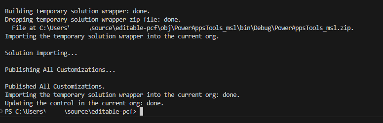

You must deploy a code component to a Microsoft Dataverse environment before using it in Power Apps or Power Pages. Your first task to deploy a component is to package your code component into a solution, allowing you to import it into an environment. You can accomplish this in two ways. You can use the CLI Push command to create a temporary solution to push your component to an environment to facilitate testing. This approach is great for use during the development of the component. The other option is to create a solution for the component and import it separately into your Dataverse environment. This option is good for use in build pipelines or manual deploys to other than your development environment. Let's explore both options in more detail.

In the following steps, you'll practice both techniques using the code component that you built in the last topic or one of the samples components available.

## Prerequisites

You must have an existing code component project that is already built. You can follow these steps for any other code component project, such as the [Sample components](/power-apps/developer/component-framework/use-sample-components/?azure-portal=true).

## Push a component to a Dataverse environment during development

To push a code component using the Power Platform CLI, follow these steps:

1. Navigate to [Power Platform admin center](https://admin.powerplatform.microsoft.com/) and select **Environments**.

1. Select to open the environment you're using for this lab.

1. Right select on the **Environment URL** and select **Copy link**.

	> [!div class="mx-imgBorder"]
	> 

1. Save the **Environment URL** on a notepad.

1. Start Visual Studio Code and select **Explorer**.

1. Select **Open Folder**.

	> [!div class="mx-imgBorder"]
	> 

1. Select the **editable-pcf** project folder you created in the previous lab and select **Select Folder**.

1. Select the **Power Platform** tab and select **Add Auth Profile**

1. Look for a **Sign in to your account** popup and select the account you wish to use.

1. The profile you added will show up under **Auth Profiles**, along with the associated **Environments & Solutions**.

1. Select **Terminal** and select **New Terminal**.

1. Build the project by running the command below and make sure it builds successfully.

    ```console
    npm run build
    ```

1. Push the custom control to your environment by running the command below.

    ```console
    pac pcf push --publisher-prefix msl
    ```

1. The solution should get imported into your environment and published.

	> [!div class="mx-imgBorder"]
	> 

1. Navigate to [Power Apps maker portal](https://make.powerapps.com/) and make sure you are in the correct environment.

1. Select **Solutions**.

1. You should see **PowerAppsTools_msl** solution. Select to open the solution.

	> [!div class="mx-imgBorder"]
	> 

1. You should see the custom control you created.

	> [!div class="mx-imgBorder"]
	> 

## Create a solution file with Power Platform CLI

To create a solution file with Power Platform CLI, follow these steps:

1. Go back Visual Studio Code and make sure you have the **EDITABLE-PCF** project open.

1. Go to the terminal and to **Command prompt**.

1. Create new folder by running the command below.

    ```console
    md Solution
    ```

1. Change the directory to the Solution folder you created. Run the command below.

    ```console
    cd Solution
    ```

1. Initialize your Dataverse solution project with the following command:

    ```console
    pac solution init --publisher-name mslearn --publisher-prefix msl
    ```

1. Inform your solution project its components will be added during the build. To accomplish this task, use the following command:

    ```dotnetcli
    pac solution add-reference --path ..
    ```

1. To generate your solution's zip file, use Microsoft Build Engine, or msbuild for short. You'll only need to use the /restore flag the first time the solution project is built. In every subsequent build, you'll need to run msbuild only. The path to your MSBuild.exe can be different depending on the version of Visual Studio you've installed on your machine.

    ```console
    "C:\Program Files (x86)\Microsoft Visual Studio\2022\BuildTools\MSBuild\Current\Bin\MSBuild.exe\" /t:build /restore
    ```

1. The build should succeed.

1. Locate the **Solution** folder you created and expand it.

1. Expand the **bin\debug** folder.

1. You should see the solution.zip file here.

	> [!div class="mx-imgBorder"]
	> 

> [!NOTE] 
> To run MSBuild, you need to have either Visual Studio or the Visual Studio Build Tools installed. You can install the build tools from the [Visual Studio Downloads](https://visualstudio.microsoft.com/downloads/#build-tools-for-visual-studio-2022). To access MSBuild, you might need to add it to the path directory of your Windows environment variables. For example, Visual Studio 2022 stores MSBuild at *C:\Program Files (x86)\Microsoft Visual Studio\2022\Enterprise\MSBuild\Current\Bin*. You can also use the Visual Studio Developer Command Prompt to access MSBuild, or run it by using the full qualified path (*"C:\Program Files (x86)\Microsoft Visual Studio\2022\Enterprise\MSBuild\Current\Bin\MSBuild.exe\"/t:build /restore*).

The default package type is a Managed solution. If you want to export as Unmanaged (or Both), you can clear (or uncomment) the comment in the following section from your Solutions.cdsproj and edit the SolutionPackageType node accordingly:

```TypeScript
   <!-- Solution Packager overrides un-comment to use: SolutionPackagerType Managed, Unmanaged, Both)-->
        <PropertyGroup>
        <SolutionPackageType>Unmanaged</SolutionPackageType>
        </PropertyGroup>
```
You can set the msbuild configuration to **Release** to issue a production build, for example, msbuild /p:configuration=Release.

You can manually import the containing zip file that is found in bin\Debug or bin\Release, depending on your release configuration. You can also programmatically deploy your code components by using the Power Platform CLI. For more information, see [Connecting to your environment](/power-apps/developer/component-framework/import-custom-controls#connecting-to-your-environment) and [Deploying code components](/power-apps/developer/component-framework/import-custom-controls#deploying-code-components) sections of the [Package a code component](/power-apps/developer/component-framework/import-custom-controls) documentation.
