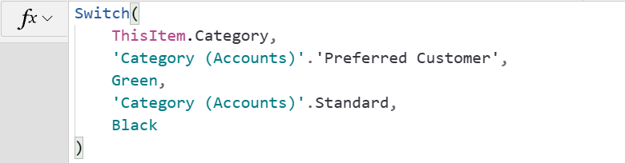
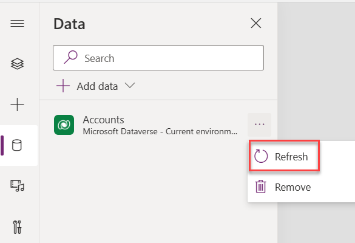
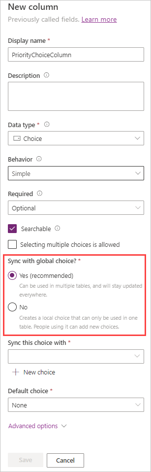
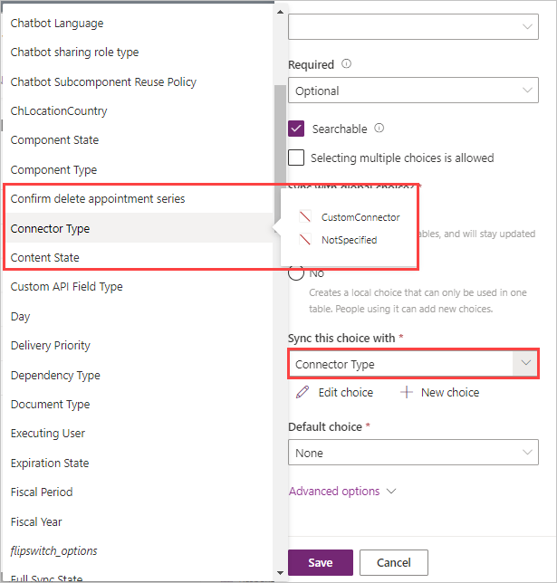
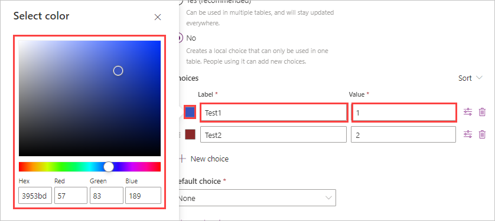
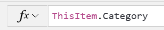
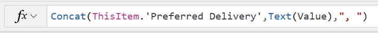

A common requirement for business app data storage is to have a data column that has a standardized, infrequently changing list of values to help ensure data consistency. Users who are entering data would choose an option from a list instead of typing a free-form value. Examples of these options include a list of countries/regions, incident priority, satisfaction rating, and so on.

Microsoft Dataverse has a column type that supports this concept, the **Choice** column. Choice columns allow a user to pick values from a list. By default they'll pick a single choice, but they can be easily configured to allow multiple values from a single list of known values. For example, **Primary Category** could be a single choice column and **Other Categories** could be configured for multiple selections, and both could be using the same list of categories.

The system, or a customizer, defines the list of values for a choice column, and they store the values as table column metadata. Unlike application data, only an app maker can modify it, not an app user. A benefit of this feature is that when you're building an app that works with a list of values, your formulas can use the name of the choice list. Your formulas can also use the display name of the values in the formula. For example, the following formula sets a color on an item's fill property based on the **Category** column, which is a choice column.

> [!div class="mx-imgBorder"]
> 

As you compose this formula, Power Apps will know the possible values for the **Category** column, and will allow you to select the value to compare from the list of known values for the choice column.

> [!NOTE]
> If you add or change values on a choice list, and the modified item is not showing in the editor yet, refresh the table on the data panel by selecting the ellipsis (**...**) next to the table and selecting **Refresh** from the pop-up menu.

> [!div class="mx-imgBorder"]
> 

## Local versus global

You can create a list of available choice values as a local or global list. **Local choice** list values are used only for the column where they're defined and can only be used within that table. The **Global choice** option allows the list to be used for multiple columns in the same table or in many different tables. When you create a new **Choice** column, the default value for the option **Sync with global choice?** is **Yes** (which is recommended). The **Global choice** option allows use of the same choices in other tables. Unless you're confident that the values only apply to that single column in that single table, you want to use global choice values.

> [!div class="mx-imgBorder"]
> 

When you select **Yes**, notice how the **Sync this choice with** becomes a mandatory field and you must make a selection for the choices. When you select this field, a pane showing the various options available will appear next to the new column pane. You can either type in the choice-type you're looking for, or scroll through the list to select one. Also, notice that when you hover over any of the choice sets, you'll get a preview of the choices that are already part of that choice set.

> [!div class="mx-imgBorder"]
> 

It's also possible to create a new choice set by selecting the **+ New choice**, and by entering information on your choices.

Notice that you can also assign a **Default choice** for your column as you create it, however, once you've saved the column, you can't add a default choice.

If you determine that you want to keep your choice options as a **local** choice set, you would select **No** under **Sync with global choice?**.  In this case, you would define your choices just below the **No** button. (At least one is required.) You'll just need to add a **Label** for the choice; Power Apps will automatically assign an integer value for that item, which you can change to suit you.  You can also select a color for each choice by selecting the box just to the left of your entered **Label** name. In the **Select color** popup, you can hard-code the color value through the entry fields for **Hex** or the R-G-B values. Alternatively, you can adjust the color slider bar and fine-tune what's in the color slider by using the box above the slider.

> [!div class="mx-imgBorder"]
> 

You add more choices by selecting the **+ New choice** button and repeating the process.

## Display column values

When the data for a choice is stored in a Dataverse row, only the numeric value is stored, not the text. For multiple choices, a comma-separated list of numeric values is stored to represent multiple selections.

How you display values in a control, such as a label, is different for single and multiple choice values. Choice fields can be used to set the value of a label to display the list text value. For example, if you had a **Category** choice field for the category of customer, you could display that field in a label in a gallery by using the following formula.

> [!div class="mx-imgBorder"]
> 

For multiple choices columns, the property on the record is of type Table. It's a single column table with a value column, with each row representing a selected value. To display a user-friendly, comma-separated list of text values, some preprocessing is required. For example, if you had a **Preferred Delivery** column that allowed users to choose one or more weekdays for delivery, you'd use the following formula to set the **Text** property on a label.

> [!div class="mx-imgBorder"]
> 

This formula would result in the following display of the list of selected values.

> [!div class="mx-imgBorder"]
> 

## Choice vs. lookup

One common data modeling decision is choosing between a choice column and a lookup column or between multiple choices and a many-to-many relationship. There's no right or wrong answer. However, your decision affects how you manage the list of values and the formulas that you can apply. Consider the differences that are summarized in the following table.

| Choice | Lookup or many-to-many relationship |
|-------------------|-------------------------------------|
| List modified by maker, no user editing. | List is only table data and normal security applies. |
| Data stored as a whole number or a comma-separated list of numbers (when more than one). | Data stored as a table reference. |
| No built-in way to inactivate or retire choice. | Supports inactive state on row and can be filtered by formulas in app to limit selection. |
| Treated as a solution component with full ALM support. | Treated as reference data. |
| Only has label, value and color, and only label is useable in formulas. (For example, filter and sorting only on display label.) | Can add other data to a look-up target table that can be used in formulas. (For example, filter and sorting on any column that is added to table.) |
| Localization built in. | Handle localization yourself. |
| No built-in support of dependent choice columns. | Easier to data model and implement dependent columns. (See [Create a dependent dropdown list in a canvas app](/power-apps/maker/canvas-apps/dependent-drop-down-lists/?azure-portal=true).) |

After you've created the column, you can't change the data type; therefore, before you create the column, consider how the apps and automation will be using the data.

The rest of this module explores how to use choice columns when you're building a canvas app from Microsoft Power Apps.
