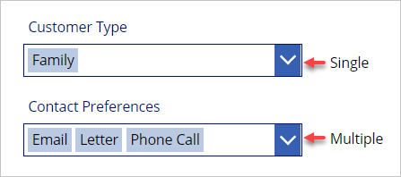
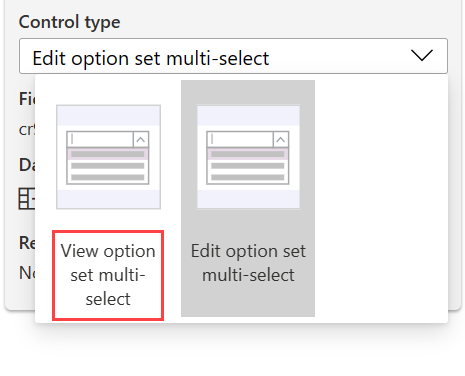
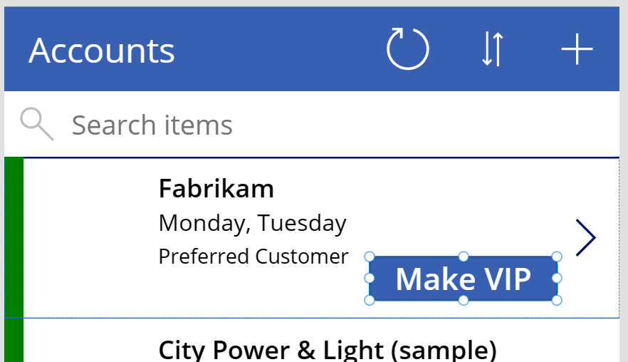
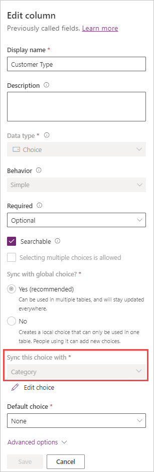

The simplest way to set a choice column value in your table is to use an [Edit form](/power-apps/maker/canvas-apps/controls/control-form-detail/?azure-portal=true). When you add a choice column to the form, it sets up the field to complete the following tasks:

- Set up as either a dropdown menu (for a single choice) or a combo box (more than one choice). (When you add an **Edit form**, Power Apps will set up both with a combo box.)

- Use the **Choices()** function to populate the list of values that the user can select (again this is done automatically when using **Edit form**).

- Set the control's current value from the row's column value.

- Save the value to your table by using the **SubmitForm** function on a control (such as a button).

> [!div class="mx-imgBorder"]
> [](../media/choice.png#lightbox)

When a column is added to the form by default, it will be editable. If you want to display the choice column on the form but not have it editable, you can change the form field **Control type** to the **View option**.

> [!div class="mx-imgBorder"]
> [](../media/multi.png#lightbox)

## Use Patch to create or update

You can also create or modify choice columns by using the Patch() function. This approach is suitable when you're updating only a few fields and they require little or no user input. For example, on a gallery item, you can have a button that, when selected, will use the **OnSelect** behavior to run a Patch() function to update the row.

The following example shows that a button has been set up on the gallery item to make the account a preferred customer. When the button is selected, the goal is to set the row's **Category** choice field to **Preferred Customer**. To accomplish this task, we've added a **Make VIP** button to the gallery item.

> [!div class="mx-imgBorder"]
> [](../media/button.png#lightbox)

The **OnSelect** property for the **Make VIP** button contains the Patch() formula, as shown below:

```powerappsfl
Patch(Accounts, ThisItem, {Category: Category.'Preferred Customer'})
```

If your table column uses a Choice set, when you use Patch, you'll need to prefix your value with the Choice set name, else you'll get an 'OptionSetValue' error. You can learn what the Choice set name is by going to your Table in Dataverse, selecting that column in Edit mode, and looking for the field **Sync this choice with**. Just below that column will be the name of the Choice set.

> [!div class="mx-imgBorder"]
> [](../media/choice-set-name.png#lightbox)

In a case like this, your Patch() on a button in a similar table would be similar to this:

```powerappsfl
Patch(Accounts, ThisItem, {'Customer Type': Category.Preferred})
```
