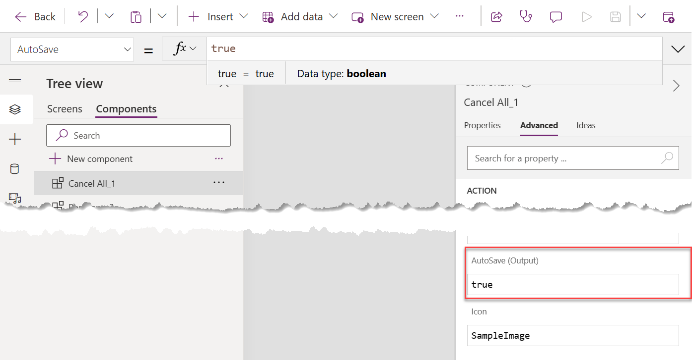

Under certain conditions, a command bar command automatically saves a form's data when the user selects the command before running the command's action logic. The AutoSave only occurs when you configure the command to use Power Fx for the action logic. Anytime you use JavaScript for the action logic, the command logic runs without an automatic save happening.

Commands configured for Power Fx are set up by default to automatically save the form's data before running the expression. The AutoSave only will occur on a main form command bar. You can encounter AutoSave on a new data row or when a user updates an existing row.

## New data rows

When a user selects your command while creating a new row, the app will attempt to save the row with any data provided at the time the command is selected. After you successfully save the data row, the form will run your command logic, and the Self.Selected.Item is set to the data row created. Your Power Fx logic should run as expected.

If the user doesn't provide all required columns, the save of the data row won't occur. However, your command action logic will still run. Since the new row didn't get created, Self.Selected.Item will be blank and not set to a valid data row. Any logic that uses Self.Selected.Item won't function as expected. For example, it's impossible to update any columns on the data row, evaluate their values, or create related data rows.

It's possible to disable the AutoSave feature of a Power Fx command by updating the component library as described later. Disabling AutoSave, however, will cause the save not to be done before the form runs your logic. Resulting in Self.Selected.Item still being blank when your logic is initiated prior to the user selecting Save on the form.

You should evaluate each command to determine if the AutoSave when the user selects the command before the data row is created will provide the user with an expected outcome. In many cases, the best implementation is to implement Visibility logic that hides the button when a new data row is in progress using the following Visibility formula:

`If (Self.Selected.State = 1, false, true)`

This Visibility formula prevents the user from being surprised when they have only input 5 of 20 columns and select your command. The form will create the data row and your command runs. In some cases, this command might have consequences to automation that could trigger because of the new data row before you finish inviting all the data.

In some scenarios, however, you might find this behavior beneficial. For example, let's take an example where you're creating an order, and the command acts as Save and Ship. The order is saved and added to the ship queue by selecting Save and Ship, and the logic navigates to the order list. If the user selected the normal Save command, they could keep working on the item before being added to the ship queue for processing. In this example, the user benefitted from the combined save and command button logic.

## Update rows

When a user selects your command while updating an existing data row, the app will attempt to save the row with any data provided at the time the command is selected. If the form can save the data row, your command logic will run and Self.Selected.Item is set to the data row created. Your logic should run as expected.

It's possible to disable the AutoSave feature of a Power Fx command by updating the component library as described later. Disabling AutoSave, however, will cause the save not to be done before your logic is invoked. Leaving Self.Selected.Item set to the value prior to the user changing any columns on the form. When deciding if AutoSave should be enabled or disabled, consider any impact on automations that run on an update of the data row.

## Disable AutoSave

When you create a new command that uses Power Fx for the action, the AutoSave property defaults in the component library to AutoSave enabled. You can change this to disable AutoSave by opening the component library. Select the Advanced tab on the property panel on the right side and scroll down to locate the AutoSave (Output) option. Modify the value to false to disable AutoSave.

> [!div class="mx-imgBorder"]
> 

Often the default setting of AutoSave will work best for your custom commands. Understanding how AutoSave works can help you correctly configure your command to provide your users with the best user experience.