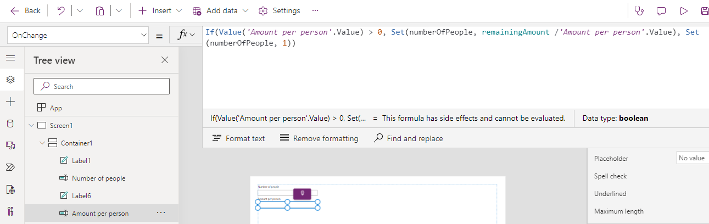
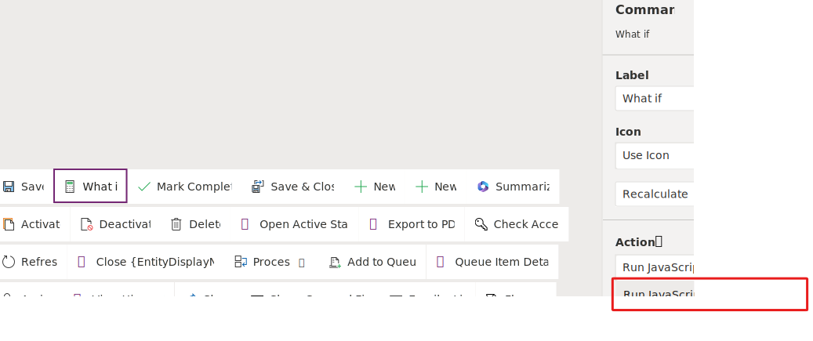
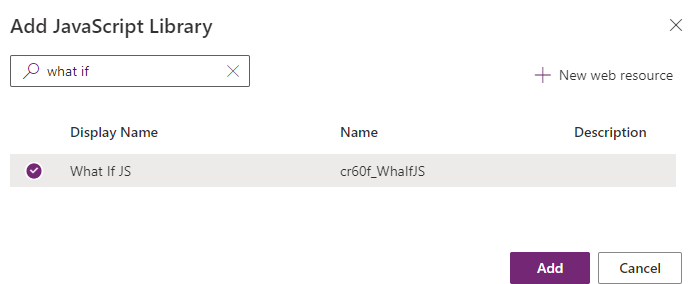

In this exercise, you'll add a command bar button that will show a custom page in a modal dialog.

> [!IMPORTANT]
> Use a test environment with Microsoft Dataverse provisioned and the sample apps enabled. If you don't have one, you can sign up for the [community plan](https://powerapps.microsoft.com/communityplan/?azure-portal=true).

## Task: Create custom page

In this task, you'll add a new custom page to the Fundraiser application.

1.  Navigate to [https://make.powerapps.com](https://make.powerapps.com) and make sure you have your test environment selected.

1.  Select **Apps**, select the **Fundraiser** application and, then select **Edit**.

	> [!div class="mx-imgBorder"]
	> [](../media/edit.svg#lightbox)

1.  Select **+ New**.

	> [!div class="mx-imgBorder"]
	> [](../media/add-page.svg#lightbox)

1.  Select **Custom page** and then select **Next**.

1.  Select **Create a new custom page**, enter **What if** for Name, and select **Add**.

	> [!div class="mx-imgBorder"]
	> [](../media/custom-page.svg#lightbox)

1.  Select the **Data** tab and then select **Add data**.

	> [!div class="mx-imgBorder"]
	> [](../media/add-data.png#lightbox)

1.  Search for fundraiser and select the **Fundraiser** table.

	> [!div class="mx-imgBorder"]
	> [](../media/add-data-dialog.png#lightbox)

1.  Select the **Tree view** tab and then select **App** object.

1.  Select OnStart from and paste the formula below in the formula bar. This formula will create variables:

	1.  The record variable will hold the current record on the form.
	
	1.  The remainingAmount variable will hold the remaining amount for the fundraiser goal.
	
	1.  The numberOfPeople variable will keep track of how many people will donate to reach the fundraiser goal. We initialize this variable with 1.
	
	1.  The averageDonation variable will keep track of the amount each person will donate to reach the fundraiser goal. We initialized this variable with the remaining amount.

	`Set(record,LookUp(Fundraisers,Fundraiser=GUID(Substitute(Substitute(Param("recordId"),"{",""),"}",""))));Set(remainingAmount,record.'Fundraiser Goal'-record.'Total Donations');Set(numberOfPeople,1);Set(averageDonation,remainingAmount)`

	> [!div class="mx-imgBorder"]
	> [](../media/formula.png#lightbox)

1. Select **Screen1** and then select **+ Insert**.

1. Expand the **Layout** group and select **Vertical container**.

	> [!div class="mx-imgBorder"]
	> [](../media/vertical-container.png#lightbox)

1. Select the container.

1. Go to the formula bar and change the **Width** value of the container to **1280**.

1. Change the **Height** value of the container to **680**.

1. The container should now look like the image below.

	> [!div class="mx-imgBorder"]
	> [](../media/resized-container.png#lightbox)

1. Select the container and select the **+ Insert** button.

1. Select **Label** from the **Popular** group.

1. Enter **Number of people** for Text.

	> [!div class="mx-imgBorder"]
	> [](../media/label-text-value.png#lightbox)

19. Select the container and select the **+ Insert** button.

1. Select **Text box** from the **Popular** group.

1. Rename the Text box **Number of people**.

1. Set the **Value** of the Number of people text box to **numberOfPeople**.

	> [!div class="mx-imgBorder"]
	> [](../media/text-box-value.png#lightbox)

1. Select the container and select the **+ Insert** button.

1. Select **Label** from the **Popular** group.

1. Enter **Amount per person** for Text.

1. Select the container and select the **+ Insert** button.

1. Select **Text box** from the **Popular** group.

1. Rename the Text box **Amount per person**.

1. Set the **Value** of the Amount person text box to **averageDonation**.

	> [!div class="mx-imgBorder"]
	> [](../media/value-text-box.png#lightbox)

1. Set the **OnChange** value of the Amount per person text box to the formula below. This formula will set the number of people based on a given average donation.

	`If(Value('Amount per person'.Value) > 0, Set(numberOfPeople, remainingAmount /'Amount per person'.Value), Set(numberOfPeople, 1))`

	> [!div class="mx-imgBorder"]
	> [](../media/on-change-value.png#lightbox)

1. Select the **Number of people** text box.

1. Set the **OnChange** value of the Number of people text box to the formula below. This formula will set the average donation based on a given number of people.

	`If(Value('Number of people'.Value) > 0, Set(averageDonation, remainingAmount / 'Number of people'.Value), Set(numberOfPeople, 1);Set(averageDonation, remainingAmount))`

1. Select **Save** and wait for the page to be saved.

1. Select **Publish**.

1. Select **Publish this version** and wait for the publishing to complete.

1. Close the custom page editor browser window or tab.

1. You should now be back on the Model-driven application editor. Select **OK**.

	> [!div class="mx-imgBorder"]
	> [](../media/republish-application.png#lightbox)

1. Select **Save** and wait for the app to be saved.

1. Select **Publish** and wait for the app to be published.

1. Start a new browser session, navigate to [https://make.powerapps.com](https://make.powerapps.com) and make sure you have your test environment selected.

1. Select **Solutions** and open the **Default Solution**.

1. Select **Pages**, locate the **What if** page you created and copy the Name. Keep this name on a notepad, you'll need it in a future step.

	> [!div class="mx-imgBorder"]
	> [](../media/custom-page-name.svg#lightbox)

1. You can close this browser session after you copied the name.

## Task: Add command button

In this task, you'll add a new command button to the Fundraiser table main form.

1.  Open a notepad and paste the JavaScript below. This JavaScript will open centered dialog.

	```javascript
	function calculate(itemId)
	{
	// Centered Dialog
	var pageInput = {
	    pageType: "custom",
	    name: "[YOUR CUSTOM PAGE NAME]",
		recordId: itemId
	};
	var navigationOptions = {
	    target: 2, 
	    position: 1,
	    width: {value: 50, unit:"%"},
	    title: "What if"
	};
	Xrm.Navigation.navigateTo(pageInput, navigationOptions)
	    .then(
	        function () {
	            // Called when the dialog closes
	        }
	    ).catch(
	        function (error) {
	            // Handle error
	        }
	    );
	}
	```

1.  Replace **\[YOUR CUSTOM PAGE NAME\]** with your custom page name that you copied in task 1.

	> [!div class="mx-imgBorder"]
	> [](../media/javascript-file.png#lightbox)

1.  Save the file locally on your computer and name it **WhatIf.js**. Make sure the file extension is **.js**.

1.  Go back to the model-driven app designer.

1.  Select the **...** button of the **Fundraiser** and select **Edit command bar**.

	> [!div class="mx-imgBorder"]
	> [](../media/edit-command-bar.svg#lightbox)

1.  Select **Main form** and then select **Edit**.

1.  Select **+ New** and then select **Command**.

	> [!div class="mx-imgBorder"]
	> [](../media/add-new-command.png#lightbox)

1.  Select **Power Fx** and then select **Continue**.

1.  Enter **What if** for Label, select **Use Icon**, select **Recalculate**, and select **Run JavaScript** for Action.

	> [!div class="mx-imgBorder"]
	> [](../media/action-values.svg#lightbox)

1. Select **+ Add library**.

	> [!div class="mx-imgBorder"]
	> [](../media/add-library.svg#lightbox)

1. Select **+ New web resource**.

	> [!div class="mx-imgBorder"]
	> [](../media/web-resource.svg#lightbox)

1. Select **Choose file**.

1. Select the **WhatIf.js** file you created and select **Open**.

1. Enter **What If JS** for Display name, enter **WhaIfJS** for Name, select **JavaScript (JS)** for Type, and then select **Save and publish**.

	> [!div class="mx-imgBorder"]
	> [](../media/web-resource-dialog.png#lightbox)

1. Search for what if, select the **What If JS** web resource you just added, and then select **Add**.

	> [!div class="mx-imgBorder"]
	> [](../media/javascript-library-dialog.png#lightbox)

1. Enter **calculate** for Function name and select **+ Add parameter**.

	> [!div class="mx-imgBorder"]
	> [](../media/add-parameter.svg#lightbox)

1. Select **FirstPrimaryItemId** for Parameter 1.

1. Select **Save and Publish** and wait for the publishing to complete.

1. Select **Play**.

1. Select **Fundraisers** and open one of the fundraiser records.

1. You should see the What If command bar button you added. Select the What if command bar button.

	> [!div class="mx-imgBorder"]
	> [](../media/what-if-command.svg#lightbox)

1. The what if dialog should come to view.

	> [!div class="mx-imgBorder"]
	> [](../media/custom-page-dialog.png#lightbox)

1. Change the **Number of people** value to **5**. The Amount per person should update to how to mush each person will need to donate to reach the fundraiser goal.

	> [!div class="mx-imgBorder"]
	> [](../media/calculated-donation.png#lightbox)

1. Change the Amount per person value and see how that calculates the number of people.

1. Congratulations, you've created a custom page and opened it as dialog using a command bar button.
