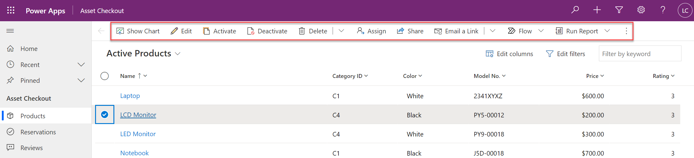

In Power Apps model-driven apps, command bars provide users with a set of commands they can select to run custom logic. In this module, we'll explore some advanced concepts and techniques you can use when customizing command bar commands.

> [!div class="mx-imgBorder"]
> 

In this module you will:

-   Understand how application life cycle management works when customizing command bars.

-   Discover how AutoSave works with commands and how to provide your users with the best experience.

-   Explore scenarios where using JavaScript to implement the command action would be beneficial and learn how to configure JavaScript for the command action.

-   Configure command scope to make your command bar command available broader than a single app.

-   Learn how to use Power Apps custom pages as dialog boxes launched from a command bar command.
