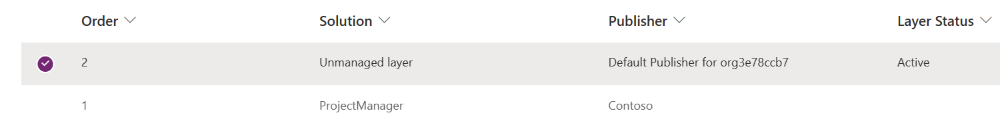

When you customize a command bar in a Power Apps model-driven app, Microsoft Dataverse solutions track your customizations. Dataverse solutions are how you can transport command bar customizations, the app, and related solution components from one Power Platform environment to another, such as between dev to test to production.

When you create your first command from the command bar designer, you'll choose a command type that will determine if a [component library](/power-apps/maker/canvas-apps/component-library/?azure-portal=true) is needed. The component library is necessary if you use Power Fx logic for the Visibility or the OnSelect of the command. The following is the dialog that allows you to choose Power Fx or JavaScript for your command logic.

> [!div class="mx-imgBorder"]
> 

You don't need a component library if you only use JavaScript. However, you can create a component library anytime to use Power Fx by selecting Run formula or Show on condition from the formula on the command property panel. When you make that change, you'll see a prompt to create the component library.

Typically, [creating a custom solution](/power-apps/maker/data-platform/create-solution/?azure-portal=true) for your app and related assets is best. If your app is in a custom Dataverse solution, the component library will also be in the same solution. Otherwise, your app and the component library will be in the default Common Data Services Default Solution. The name of the component library will use your app name plus DefaultCommandLibrary. The following shows a solution with a table, an app, and a component library.

> [!div class="mx-imgBorder"]
> 

If you customized the command bar in multiple applications and used Power Fx, each would have a corresponding component library.

The component library will have a component for each Power Fx formula used for a command bar command. Other properties like display labels, icons, and tooltips are separate and part of the model-driven app definition. Where a Dataverse solution tracks these resources is essential to understand because it can affect how changes transport between Power Platform environments. If you aren't careful, it's also possible to have the two solution resources that together make up a command definition out of sync in a target environment if any changes are made directly in that environment. For example, if you move your solution as managed from a development environment to a test environment and then make any changes directly in the test environment. Being out of sync can also occur if someone publishes an application, and you import it into your development environment and customize it. Future updated versions with command bar changes from the original app maker won't be visible because you've created your [solution layer](/power-apps/maker/data-platform/solution-layers/?azure-portal=true) of customization.

If you don't see the latest changes to a command bar command, you can check solution layers to see if an unmanaged change has been made and is preventing your latest version from being visible. To accomplish this, select the component library in solution explorer and select Advanced > See Solution Layers. The following is an example of a component library where an update was done on top of the managed solution.

> [!div class="mx-imgBorder"]
> 

In this example, because someone made an unmanaged layer change in this environment, if you import any updates, they won't be active in this environment until you remove the unmanaged layer change.

It's best to make changes only in your development environment and to avoid unintentionally creating a layer of changes on top of the imported solution. You can also mark a component library as not customizable by updating the component library managed property setting.

> [!div class="mx-imgBorder"]
> 

The managed property setting allows you to disable customization for the component library.

> [!div class="mx-imgBorder"]
> 

Disabling customizations prevents customization of the formulas for Visibility and OnSelect but doesn't prevent changes to the other command properties like Display Label. When enabled, it takes effect only after you export your solution as managed and import it to another environment. If you attempt to modify it after importing it as managed, you'll be prevented and see the following error.

> [!div class="mx-imgBorder"]
> 

## Localization support

After you customize the command bar to add commands, you may want to translate their labels into other languages. To provide translations for commands, take the following steps:

-   From solution explorer, select Translations > Export translations.

-   After the export completes the exported translations, a compressed (zip) file is downloaded to your browser's default download folder containing the exported labels.

-   Extract the XML file from the compressed (.zip) file.

-   Open the CrmTranslations.xml file in Excel.

-   Select the sheet named Localized Labels.

On the Localized Labels sheet, scroll down to where the Entity name contains "appaction". Each command bar command may have multiple lines representing each of the properties like text, tooltip, and description. For each button, provide the translations like in the 1034 (Spanish) worksheet column.

> [!div class="mx-imgBorder"]
> 

When you've completed your changes, save the file and zip up the files into a new compressed file. Use the Translation > Import translations menu option to update the translations in your Dataverse solution. Repeat this process when you update labels or add commands to command bars.

Dataverse solutions are important in allowing command bar customizations to be tracked and transported from one environment to another. Solutions also play an important part in ensuring dependencies between solution components. Dependencies prevent mistakes like removing a component library that the app depends on for its command bar Power Fx expressions. As you start making customizations to command bars, take a minute to make sure you're working in a custom solution and that the app, and the component library will be together. This way, when you export the solution, you won't have to worry about resolving any missing dependencies.
