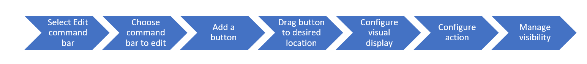

From the Power Apps model-driven app designer, you can create or edit modern commands by selecting edit command bar from the pages area in the app designer.

The following shows the process to create and configure a new command bar button.

> [!div class="mx-imgBorder"]
> 

The following video walks through the process to create a new command bar button.

> [!VIDEO https://www.microsoft.com/videoplayer/embed/RE5dTtj]
