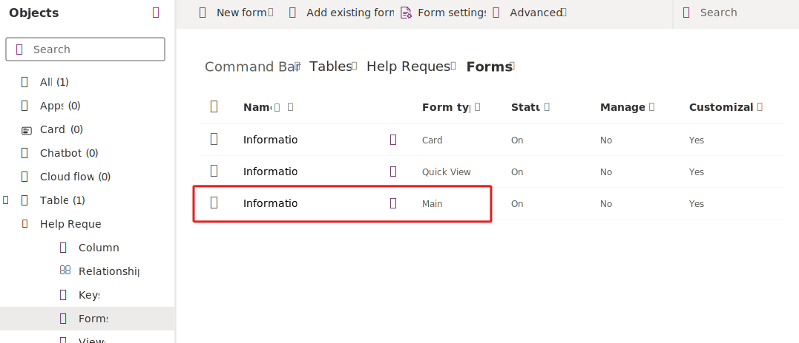
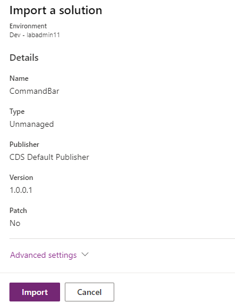
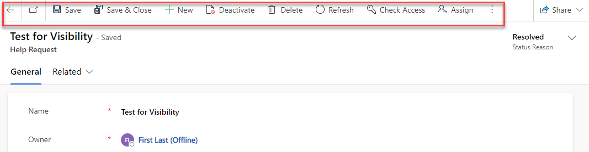

In this exercise, you'll add a command bar button to the help request table form. This button will be visible for active help requests and when it's clicked, a new task will be created for the help request.

> [!IMPORTANT]
> Use a test environment with Microsoft Dataverse provisioned and the sample apps enabled. If you do not have one you can sign up for the community plan [here](https://powerapps.microsoft.com/communityplan/?azure-portal=true).

### Task - Prepare your environment

In this task, you'll create a solution, create a new help request table, and then create a model driven application. If you would prefer to skip this task and use a starting solution, proceed to the **Import a solution** task.

1. Navigate to [Power Apps maker portal](https://make.powerapps.com/?azure-portal=true) and make sure you are in the correct environment that has the sample apps enabled.

   > [!div class="mx-imgBorder"]
   > 

1. Select **Solutions**.

1. Select **+ New solution**.

1. Enter **Command Bar** for **Display name**, select **CDS default publisher** for **Publisher**, and select **Create**.

   > [!div class="mx-imgBorder"]
   > 

1. Open the **Command Bar** solution you created.

1. Select **+ New** and the select **Table > Table**.

1. Enter **Help Request** for Display name, **Help Requests** for Plural name, and expand **Advanced** **options**.

   > [!div class="mx-imgBorder"]
   > 

1. Go to the **Make this table an option when** section, check the **Create a new activity** checkbox, and select **Save**.

   > [!div class="mx-imgBorder"]
   > 

1. Expand the **Help Request** table you created and select **Columns**.

   > [!div class="mx-imgBorder"]
   > 

1. Open the **Status Reason** column.

   > [!div class="mx-imgBorder"]
   > 

1. Select **New choice**.

   > [!div class="mx-imgBorder"]
   > 

1. Enter **Resolved** for Label and select **Save**.

   > [!div class="mx-imgBorder"]
   > 

1. Select Forms and open the Main form.

   > [!div class="mx-imgBorder"]
   > 

1. Drag the **Status Reason** column and drop it in the form header.

   > [!div class="mx-imgBorder"]
   > 

1. Select **Save and publish** and wait for the form to be published.

1. Select the **Back** button.

1. Select **Apps**.

1. Select **+ New** and then select **Model-driven app**.

   > [!div class="mx-imgBorder"]
   > 

1. Enter **Help Request App** for Name and select **Create**.

1. Select the **Navigation ...** button and then select **New group**.

   > [!div class="mx-imgBorder"]
   > 

1. Go to the properties pane.

1. Change the Title to **Requests** and ID to **help_requests_group**.

   > [!div class="mx-imgBorder"]
   > 

1. Select **Requests ...** and then select **New page**.

1. Select **Dataverse table** for Content type and then select **Next**.

1. Select **Help Request** for table and then select **Add**.

   > [!div class="mx-imgBorder"]
   > 

1. Select the Help Requests view you just added and go to the **Settings** tab.

1. Change the ID to **help_requests_subarea**.

   > [!div class="mx-imgBorder"]
   > 

1. Select **Save** and wait for the application to be saved.

1. Select **Publish** and wait for the application to be published.

1. Select the **Back** button.

   > [!div class="mx-imgBorder"]
   > 

1. Select **Publish all customizations** and wait for the publishing to complete.

### Task - Import solution

In this task, you'll import the starting solution into your environment. You only need to complete this task if you didn't complete the Prepare your environment task. If you completed the Prepare your environment task, proceed to the Add command button task.

1. Download the [**CommandBar_1_0_0_1.zip**](https://github.com/MicrosoftDocs/mslearn-developer-tools-power-platform/raw/master/command-bar/CommandBar_1_0_0_1.zip) solution file located in the GitHub and save locally on your computer.

1. Navigate to [Power Apps maker portal](https://make.powerapps.com/?azure-portal=true) and make sure you are in the correct environment that has the sample apps enabled.

1. Select **Solutions**.

1. Select **Import solution**.

1. Select **Browse**.

1. Choose the file you downloaded and select **Open**.

1. Select **Next**.

1. Select **Import** and wait for the solution import to complete.

   > [!div class="mx-imgBorder"]
   > 

1. You should see a notification when the import completes. Select **Publish all customizations** and wait for the publishing to complete.

### Task - Add command button

In this task, you'll add a new command button to the Help Request table main form.

1. Open the **Command Bar** solution you created/imported.

1. Select **Apps** and open the **Help Request App**.

   > [!div class="mx-imgBorder"]
   > 

1. Select the ellipsis **...** button of the **Help Request view** and select **Edit command bar > Edit**.

   > [!div class="mx-imgBorder"]
   > 

1. Select **Main form** and then select **Edit**.

1. Select **New** and then select **Command**.

   > [!div class="mx-imgBorder"]
   > 

1. Select **Power Fx** and then select **Continue**.

1. Enter **Follow Up** for Label, select **Use Icon**, select **Placeholder**, and select **Show on condition from formula** for Visibility.

   > [!div class="mx-imgBorder"]
   > 

1. Enter **Follow Up** for Tooltip tile, Tooltip description, and Accessibility text.

1. Go to the formula bar, select Visibility, and paste this formula. This Power Fx formula will show the button if the help request is active, and hide it if it's resolved.

   `If(Self.Selected.Item.'Status Reason' =  'Status Reason (Help Requests)'.Active, true, false)`

   > [!div class="mx-imgBorder"]
   > 

1. Select **Save and publish**.

1. Wait for the publishing to complete.

1. Select **Play**.

   > [!div class="mx-imgBorder"]
   > 

1. Select **+ New**.

1. Enter **Test for Visibility** as Name and select **Save**.

   > [!div class="mx-imgBorder"]
   > 

1. The **Follow Up** command button should become visible. Change the Status Reason to **Resolved**.

   > [!div class="mx-imgBorder"]
   > 

1. Select **Save**.

1. The **Follow Up** command button should no longer be visible.

   > [!div class="mx-imgBorder"]
   > 

1. Change the Status Reason to **Active**.

1. Select **Save**.

1. The **Follow Up** command button should become visible again.

1. Close the application browser window or tab.

1. You should now be back to the command bar editor. Don't navigate away from this page.

### Task - Add button action

In this task, you'll add a Power Fx formula that will create a new task that is due in one week when the command button is clicked.

1. Select **Open component library**.

   > [!div class="mx-imgBorder"]
   > 

1. Select the **Data** tab, select **Add data**, search for tasks, and selected the **Tasks** table.

   > [!div class="mx-imgBorder"]
   > 

1. Select **Save**.

1. Select **Publish**

1. Select **Publish this version**.

1. Close the component library browser window or tab.

1. Select **Resume**.

   > [!div class="mx-imgBorder"]
   > 

1. Select the **Follow Up** command button you added.

1. Go to the formula bar and select **OnSelect**.

   > [!div class="mx-imgBorder"]
   > 

1. Paste this formula in the formula bar. This formula will create a task for the current help request and set the due date to one week from the time the button is clicked and display a notification.

   `Patch(Tasks, {Subject: Self.Selected.Item.Name, Regarding: Self.Selected.Item, 'Due Date': DateAdd(Now(),7) }); Notify("Created new task")`

   > [!div class="mx-imgBorder"]
   > 

1. Select **Save and publish**.

1. Wait for the changes to be published.

1. Select **Play**.

1. Open the **Test for Visibility** help request record.

1. Select the **Follow Up** button.

   > [!div class="mx-imgBorder"]
   > 

1. You should see the notification. Select the **Related** chevron button and then select **Activities**,

   > [!div class="mx-imgBorder"]
   > 

1. You should see the created task. Make sure the **Due Date** is set to 7 days from current date.

   > [!div class="mx-imgBorder"]
   > 
