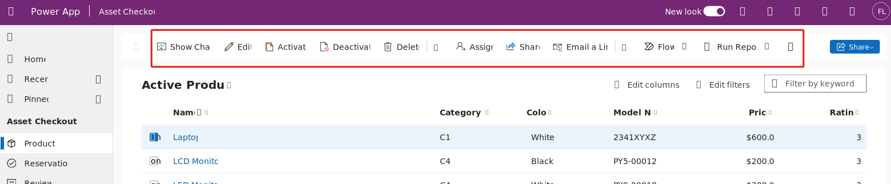
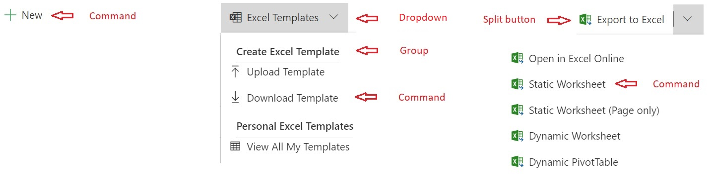
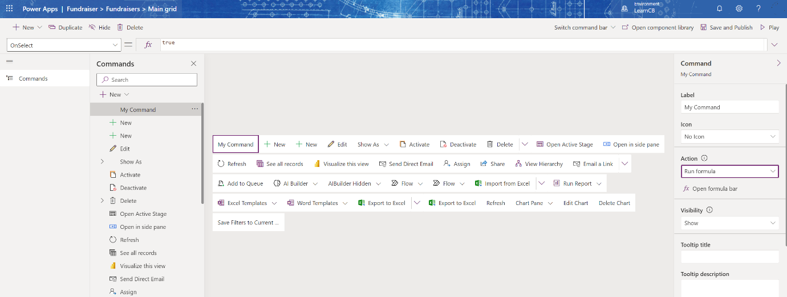

Power Apps model-driven apps implement a consistent user experience. A key component of that experience is how users are presented and can interact with available commands. As part of designing the model-driven app, a maker can customize the bars to add commands, hide commands and modify their behavior. Each command has a defined action that implements the logic that is executed when the user selects the command. The command action can be implemented using Power Fx or JavaScript.

Commands allow users to invoke actions in the context of the data the user is working on. Commands are presented to the user in a visual collection called a command bar. An example of a command would be the **New** or **Delete** command buttons that appear on the command bar for the main grid of any Microsoft Dataverse table. When a user selects delete for example, the command action removes the row from the table. Power Apps can have multiple command bars in various pre-determined locations that we'll explore.

> [!div class="mx-imgBorder"]
> 

## Command bar locations

The locations of command bars in model-driven apps are pre-determined and consistent. So the user can look in the same place to see what commands are available in an app regardless of who built the app or what data is visible. The following are the most common customized command bars and their purpose:

- **Main Grid** - This command bar is displayed at the top of a list of rows from a Dataverse table when the user navigates to the list from the left-hand navigation. Commands can act on any of the rows displayed in the list.

- **Main Form** - This command bar is displayed when you open a row from a table and is displayed using the main form for the table. Commands act in the context of the single row displayed on the form.

- **Subgrid View** - This command bar is visible when a user is displaying a main form for a table row, and you configure the form to have a subgrid with a related tables data. Commands act on the rows displayed in the subgrid list.

- **Associated View** - This command bar is displayed above a list of related table rows displayed from the main form. The user can display this view by selecting the related table on the main form for a row and choosing a specific table to display. Commands act in the context of one or more of the related rows displayed in the list.

In the following video, we'll explore an example of each of these command bars.

> [!VIDEO https://www.microsoft.com/videoplayer/embed/RE5dO9P]

## Command bar composition

A command bar contains one or more commands. When a command bar is visible, the commands are presented next to each other. By default, the command is a button the user can select to perform an action. Additionally, you can further organize buttons on the command bar by adding more grouping elements to contain the command buttons.

The following are the available options for grouping commands:

- **Dropdown** - Creates a menu (commonly called a flyout) that is visible when selected by a user. The menu content is one or more groups of commands. A dropdown is helpful in keeping related commands together and only visible when selected.

- **Split button** - Similar to dropdown, but a primary command is available for selection without expanding the groups that contain extra commands.

- **Group** - Used to label and contain one or more commands on a dropdown or split button.

The following image illustrates the use of each of these command types to provide more organization of the command bar:

> [!div class="mx-imgBorder"]
> 

## Command bar designer

While editing a model-driven app, you can select a table and launch the visual command bar designer. After choosing which command bar you wish to modify, you'll see a visual representation of the current command bar commands. From the designer, you can add new commands and modify existing custom commands. Older legacy commands that weren't created with the visual designer aren't modifiable, and we'll explore options later in the module. Here's an example of a main grid command bar in the command bar designer.

> [!div class="mx-imgBorder"]
> 

## Options for implementing actions

The action of a command allows you to implement custom logic that executes when the user selects the command. The command logic could perform actions like modifying values on the form or creating/modifying other data rows. A command action logic has the current selected item(s) available to it, and can use the item column values in the logic.

You can create the action logic using Power Fx expressions or by using JavaScript. For example, a command using the following Power Fx expression would navigate to a specific view for the Accounts table.

`Navigate( 'Accounts (Views)'.'My Active Accounts' )`

In the rest of this module, we'll dive deeper into how you can customize the command bar in your model-driven apps.
