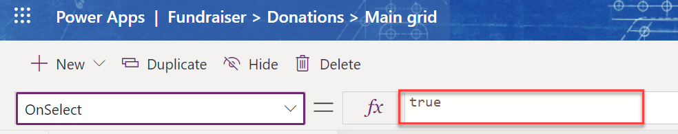

Power Fx is the low-code language that will be used across Microsoft Power Platform. You might be familiar with Power Fx if you built a Power Apps canvas app. Power Fx can also be used to implement custom logic with Power Apps model-driven command bar commands. Command bar logic can use a [subset](/power-apps/maker/model-driven-apps/commanding-use-powerfx?azure-portal=true#functions-not-supported) of the full Power Fx language capabilities.

There are two places you can use Power Fx when customizing a command:

- **OnSelect** - This logic executes when a command button is selected by a user.

- **Visible** - This logic is executed to evaluate if the command should be hidden or visible to the user running the app.

## Configuring OnSelect

In order to use Power Fx logic when the command is selected make sure the action property is configured to run formula.

> [!div class="mx-imgBorder"]
> 

When configured, the formula bar is enabled and Power Fx logic can be provided. This option is the default for new commands. However, if the formula bar is disabled, you're likely working with a command that uses JavaScript for the logic.

You can provide your custom logic using the formula bar at the top of the page.

> [!div class="mx-imgBorder"]
> 

The default formula is simply "true" which doesn't result in any thing happening. You must provide your own logic for the command to do any intentional action when selected.

You can also select open formula bar, which will put focus on the formula bar for you to make changes.

> [!div class="mx-imgBorder"]
> 

When a user selects the command, any pending changes on the form data are saved and then the command OnSelect logic is executed. This order ensures a consistent state of the data at the time the command is executed.

## Configuring visibility

By default, new commands added to a command bar will be visible. By changing the visibility property on the command to show on condition from formula, you can then provide a formula that is evaluated to determine if the command should be visible.

> [!div class="mx-imgBorder"]
> 

You can provide your custom logic using the formula bar at the top of the page.

> [!div class="mx-imgBorder"]
> 

Remember, the default formula is simply "true" which simply makes the command always visible. You must provide your own logic that results in a true or false determination. If the evaluation of your formula results in a false result, the command won't be visible.

The visibility formula is reevaluated if any of its dependent values change. It allows the visibility to react to the current condition of data and user actions. For example, a button could be not visible until rows in a grid are selected.

## Currently active data

A valuable feature when writing formulas for commands is the ability to reference the currently active data. For example, if the command bar is on the main form for a table row the current active data is the row. If the command bar is on the main grid, then the current active data will be the table of rows displayed on the grid.

You can access the current active data by using the selected property. The selected property is populated at runtime automatically. The selected property has multiple fields it makes available depending on if a single item or a table of items is selected.

| Field | Type | Description |
|-------|------|-------------|
| Item | Record from the DataSource | Available only when a single row is selected or when on a form displaying a single row. When not populated it will be set to blank. For example, the following formula would check the value of the account rating column. `Self.Selected.Item.'Account Rating'>20` |
| AllItems | Table of records from the DataSource | All of the rows selected from the DataSource. For example, the following formula would check the count selected. `CountRows(Self.Selected.AllItems) > 0` |
| State | Enum | Indicates if the hosting control is in **Edit (=0)**, **New (=1)**, or **View (=2)** state. |
| Unsaved | Boolean | Returns true if Selected or SelectedItems have unsaved changes. Otherwise returns false. |

## Data from data sources

In addition to working with data from the Selected property, you can also query and save data to other Microsoft Dataverse tables. For example, the following changes the name on an account row.

`Patch(Accounts, Self.Selected.Item, {'Account Name': "New Account name"})`

You can also use relationships between tables to access the related rows. For example, the following formula allows access to the related recurring appointments of the currently selected item.

`Self.Selected.Item.'Recurring Appointments'`

Currently, Microsoft Dataverse is the only data source available for use from command logic.

## Common scenarios

Using Power Fx logic on a command makes it possible to handle a wide range of use cases you'll encounter. The following are some examples of common use cases you could implement.

- Create related rows based on current data. For example, create a series of scheduled follow-up calls based on potential opportunity value.

- Navigate to internal or external websites. For example, you might do a search on a news site for the current company passing the row's company name as a search parameter.

- Modify data on the current row. For example, you might have a service table that tracks active service customers. You could select a command on an inactive row to reactivate service for the customer by setting various values on the row to reflect the new service status.

- Use RecordInfo to ensure commands are visible when they should be. RecordInfo can be used to obtain information about a particular record of a data source. For example, you could check if the user has edit permission and only show the command if they do.

As you start implementing Power Fx logic for commands, you'll be inspired to create other unique use cases for your own apps.
