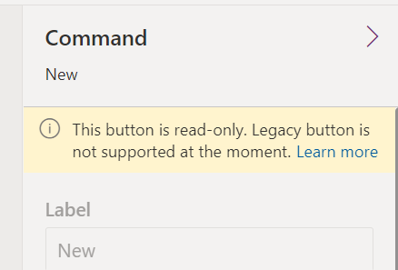

As you start working with the command bar designer, you'll notice that some commands can't be customized with the visual command bar designer.

> [!div class="mx-imgBorder"]
> 

It includes out-of-the-box commands for every table in your app. These commands are classic commands and use an internal infrastructure that doesn't support customization using low code techniques. New commands you add are referred to as modern commands. Both classic and modern commands can co-exist on a command bar in an app. The classic commands will be incrementally migrated to modern commands over time.

Until a command has been migrated, if you need to customize it you should use the techniques for [customizing commands and the ribbon](/power-apps/developer/model-driven-apps/customize-commands-ribbon/?azure-portal=true) to complete the task.

For classic custom commands, you can consider hiding the classic command or removing it and creating it as a modern command. Creating it as a modern command would enable you to use Power Fx.

You can read more about the key differences between classic and modern commands in the [Modern commanding overview](/power-apps/maker/model-driven-apps/command-designer-overview/?azure-portal=true) article.
