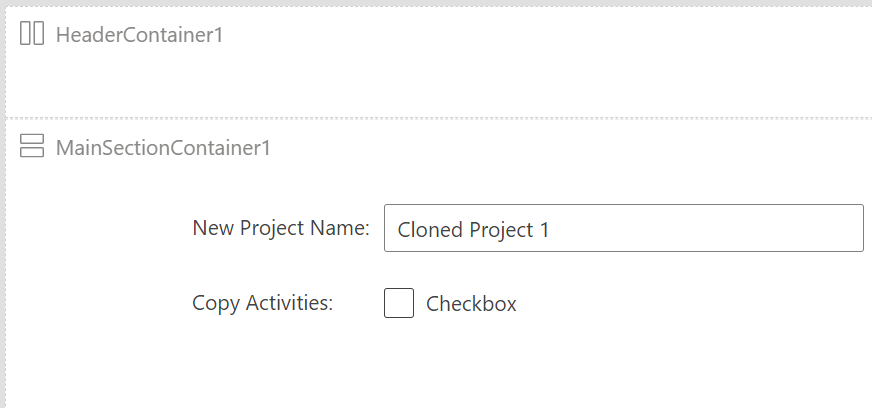

One of the common requirements is to allow a user to copy or clone a table row or a set of selected table rows. For example, in a Project Management app, a user might want to copy a previous project to start a new project. The idea is to preserve the existing project row while saving time creating the new project row.

To accomplish it, add a new command bar button to either the main grid or the main form command bar. You can control the button visibility using simple logic, like only showing the button if a row in the grid is selected. You could also only show the button if the data row qualifies using Power Fx logic. For example, you could only allow the button to show if the project created on column value is less than one year old. In the action logic, you would create the new row by selecting only the columns from the source row you want to copy. You could use Power Fx functions to enhance the new row. For example, calculate a new project end date based on the current date.

In the following video, we'll walk through implementing a command bar button to duplicate a row.

> [!VIDEO https://www.microsoft.com/videoplayer/embed/RE5eb8t]

> [!NOTE]
> You can increase the video resolution by selecting the three dots, **Quality**, and selecting a higher bitrate. 

If you implement the command bar button from the main grid or one of the other views where a user could select multiple rows, there would be a few changes. First, you wouldn't need to check **Self.Selected.State** in the visibility formula because only existing rows would be available. You could check and only show the button if at least one row is selected using the following visibility formula:

`If(CountRows(Self.Selected.AllItems)>0,true,false)`

Notice the use of **Self.Selected.AllItems** instead of **Self.Selected.Item**, which you would use only when a single row could be active. The Self.Selected.AllItems is a table of the records that are currently selected.

The Power Fx logic to copy the rows is also different because it needs to use the ForAll function to copy all the rows in the table.

```power-fx
ForAll(Self.Selected.AllItems,
  Patch(Projects,Defaults(Projects),
    {
      Name:Concatenate("Cloned ", ThisRecord.Name),
      Description:ThisRecord.Description,
      Budget:ThisRecord.Budget*1.10,
      'Start Date':DateAdd(Today(),1,Days),
      'End Date':DateAdd(Today(),30,Days)
    }
  )
)
```

After the button logic runs, the grid will be refreshed and show the newly created items if they qualify for the view criteria. Unlike the single record copy, navigating to the newly created row isn't practical. You could use the notify function to display how many rows were copied by adding the following after the ForAll function:

`Notify("Copied " & CountRows(Self.Selected.AllItems) & " rows")`

Make sure it isn't added inside the ForAll to avoid getting a message for each row copied.

In addition to the two options we discussed, a more advanced option is to use a [Power Apps Custom Page as a dialog](/power-apps/maker/model-driven-apps/commanding-designer-use-custom-pages-as-dialogs/?azure-portal=true). When you use this approach, the command bar button would display a Custom Page and pass the row to copy as a parameter to the page. The page could then interact with the user to allow a more customized experience for the specification of what values got copied. The custom page would contain the logic to complete the copy. The following image shows an example of a custom page that allows the user to provide the new project name and indicate if they want to copy the old project's activities:

> [!div class="mx-imgBorder"]
> [](../media/duplicate.png#lightbox)

Using a command bar to allow users to copy rows makes it easier for users to efficiently perform the copy. Using Power Fx logic you can implement logic to determine when they're allowed to do a copy and what data to copy.
