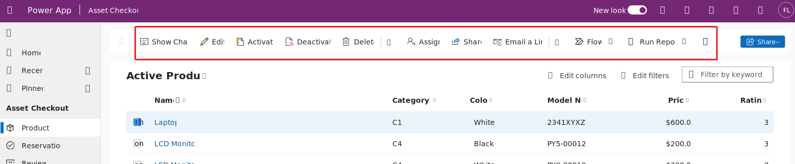

# Common command bar scenarios

The command bar provides a consistent way for users to invoke actions in a Power Apps model-driven app. By customizing the command bar, you can add your own buttons that execute custom logic implemented using either Power Fx or JavaScript. The logic runs in the context of either a single data row or multiple data rows depending on the command bar that the user selected the button from.

> [!div class="mx-imgBorder"]
> 

In this module, we'll explore some of the common uses and techniques you can use when implementing logic for both the action and visibility on buttons.

In this module, you will:

- Implement a copy/clone of a data row from a command bar

- Dynamically use table permissions and definitions from command bar logic

- Improve the user experience using command bar commands using the Notify and Confirm functions

- Navigate to internal and external app content from command bar commands
