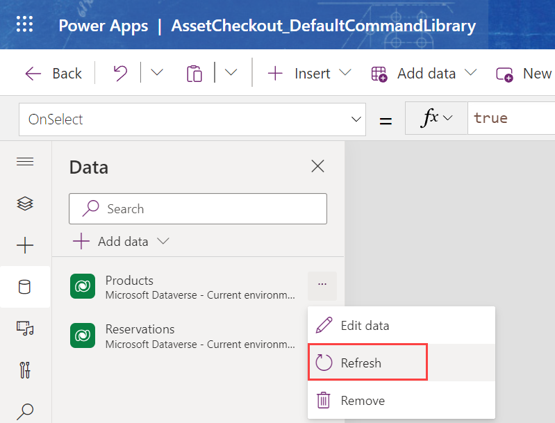

Command bar button logic for Visible and OnSelect can access multiple data sources in their Power Fx expressions. When you add a command bar button to a command bar, the table you're editing the command bar for will be available as a data source in your Power Fx logic. For example, if you're editing the main grid command bar for the project table, then the project table will be added as a data source. In the action logic, if you wanted to access the project team table, you would need to add that data source manually before you can use the data source in your formulas.

When you customize the command bar and add Power Fx logic, a component library is associated with your model-driven app. The component library automatically configures the table for that command as a data source. To manually add another data source, you must open the component library and associate that data source.

The following video will look at how to use multiple data sources.

> [!VIDEO https://www.microsoft.com/videoplayer/embed/RE5dQep]

> [!NOTE]
> You can increase the video resolution by selecting the three dots, **Quality**, and selecting a higher bitrate. 

Another essential thing to know about Dataverse table data sources is that you must manually refresh them after changing the table definitions. For example, if you add a new column to a table, that column won't be available to your command bar formulas until you refresh the data source.

To refresh a data source:

- Save your command bar.

- Select **Open Component Library**.

- In the Data panel, select the ellipsis (...) next to the table data source you wish to refresh.

- Select **Refresh**.

> [!div class="mx-imgBorder"]
> 

When manually adding more data sources, you can add any connector and aren't limited to just Dataverse tables as data sources. While you can associate the connectors with the component library, they won't work in your command bar formulas. You can only use Dataverse as a data source in command bar formulas. If you attempt to use a non-Dataverse connector in a command bar formula, you'll likely not see the command bar at runtime.
