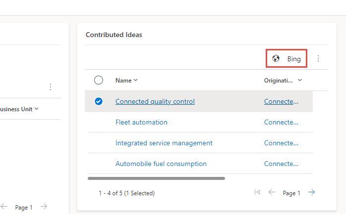

In this exercise, you'll add a command bar button that will use Bing to search for idea names.

## Exercise - Launch external site

> [!IMPORTANT]
> Use a test environment with Microsoft Dataverse provisioned and the sample apps enabled. If you do not have one you can sign up for the **[community plan](https://powerapps.microsoft.com/communityplan/)**.

### Task - Add command button

In this task, you'll add a new command button to the Idea table associated view.

1. Navigate to [make.powerapps.com](https://make.powerapps.com/?azure-portal=true) and make sure you have your test environment selected.

1. Select **Apps**, select the **Innovation Challenge** application and, then select **Edit**.

   > [!NOTE]
   > If you don't see the Innovation Challenge application, you don't have the sample apps installed and need to configure an environment with them enabled.

   > [!div class="mx-imgBorder"]
   > 

1. Select the **...** button of the **Idea view** and select **Edit command bar > Edit**.

   > [!div class="mx-imgBorder"]
   > 

1. Select **Subgrid view** and then select **Edit**.

1. Select **New** and then select **Command**.

   > [!div class="mx-imgBorder"]
   > 

1. Select **Power Fx** and then select **Continue**.

1. Enter **Bing** for Label, select **Use Icon**, select **OpenInBrowser**, and select **Show on condition from formula** for Visibility.

   > [!div class="mx-imgBorder"]
   > 

1. Enter **Search on Bing** for Tooltip, Tooltip description, and Accessibility text.

1. Go to the formula bar, select Visible, and paste this formula. This Power Fx formula will show the button only when one item is selected from the view.

   `If(CountRows(Self.Selected.AllItems) = 1, true, false)`

   > [!div class="mx-imgBorder"]
   > 

1. Move the command bar button you added before the Edit button.

   > [!div class="mx-imgBorder"]
   > 

1. Select **Save and publish**.

1. Wait for the publishing to complete.

1. Select **Play**.

   > [!div class="mx-imgBorder"]
   > 

1. Select **Challenges** and open one of the challenge records.

   > [!div class="mx-imgBorder"]
   > 

1. Go to the Contributed ideas section. The Bing button shouldn't be visible.

   > [!div class="mx-imgBorder"]
   > 

1. Select one of the idea records. The Bing button should now become visible.

   > [!div class="mx-imgBorder"]
   > 

1. Select two or more idea records. The Bing button should now become hidden.

   > [!div class="mx-imgBorder"]
   > 

1. Close the application browser window or tab.

1. You should now be back to the command bar editor. Don't navigate away from this page.

### Task - Add button action

In this task, you'll add a Power Fx formula that will launch a Bing search for the idea name.

1. Select the **Bing** command button you added.

1. Go to the formula bar and select **OnSelect**.

   > [!div class="mx-imgBorder"]
   > 

1. Paste this formula into the formula bar. This formula will launch Bing search for the idea name.

   `Launch(Concatenate("https://www.bing.com/search?q=", Self.Selected.Item.Name))`

   > [!div class="mx-imgBorder"]
   > 

1. Select **Save and publish**.

1. Wait for the changes to be published.

1. Select **Play**.

1. Select **Challenges** and open one of the challenge records.

1. Select one of the contributed idea records and then select the **Bing** button.

   > [!div class="mx-imgBorder"]
   > 

1. A new browser session should launch Bing search and search for the idea name.

   > [!div class="mx-imgBorder"]
   > 

1. You can close the search result browser tab or window.

1. Close the model driven browser tab or window.

1. You should now be back on the command bar editor.

1. Don't navigate away from this page.

## Exercise - Navigate to views

In this exercise, you'll add a command bar button that will navigate to the active ideas view.

### Task - Add a command button

In this task, you'll add a new command button to the Idea table associated view.

1. Select **New** and then select **Command**.

   > [!div class="mx-imgBorder"]
   > 

1. Enter **Active ideas** for Label, select **Use Icon**, and select **SelectView**.

   > [!div class="mx-imgBorder"]
   > 

1. Enter **Active ideas** for Tooltip tile, Tooltip description, and Accessibility text.

1. Move the **Active ideas** button before the **Bing** button.

   > [!div class="mx-imgBorder"]
   > 

1. Select **Save and Publish**.

1. Wait for the publishing to complete.

1. Don't navigate away from this page.

### Task - Add a button action

In this task, you'll add a Power Fx formula that will navigate to the active ideas view.

1. Select the **Active ideas** command button you added.

1. Go to the formula bar and paste this formula. This formula will navigate to the active ideas view.

   `Navigate('Ideas (Views)'.'Active Ideas')`

   > [!div class="mx-imgBorder"]
   > 

1. Select **Save and publish**.

1. Wait for the changes to be published.

1. Select **Play**.

1. Select **Challenges** and open one of the challenge records.

1. Go to the Contributed ideas section and select the **... More commands for Idea** button.

   > [!div class="mx-imgBorder"]
   > 

1. Select the **Active ideas** button.

   > [!div class="mx-imgBorder"]
   > 

1. You should be navigated to the Active Ideas view.

   > [!div class="mx-imgBorder"]
   > 

1. Close the Innovation Challenge application browser window or tab.

1. You can close the command bar editor browser window or tab.
