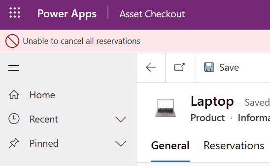
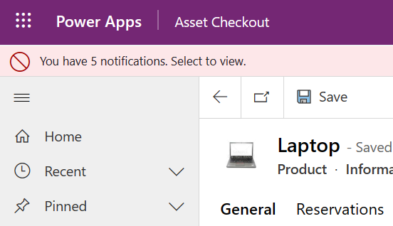
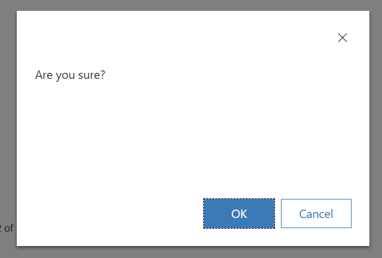
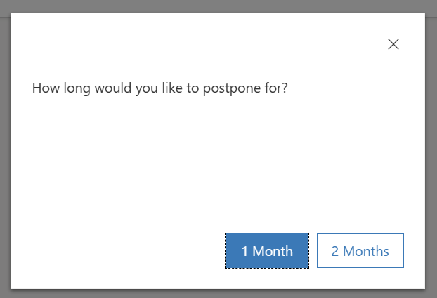

Command bar buttons provide a simple way for app users to find and run custom actions on a data row or set of selected rows. The goal is to present a command button that the user can select to perform an action. Some commands are obvious to the user that they've completed. For example, when the command navigates to another location. Other commands are less obvious to the user. The logic could use a Notify function to inform the user that the command logic has successfully run or it has failed.

When you call the **Notify** function from a command bar action, you can specify a message, notification type, and timeout. You can improve the user experience consuming the notification by providing the type and timeout when used from the command bar logic. It's an example of using Notify. It will be displayed as an error and timeout after 10 seconds.

`Notify("Unable to cancel all reservations",NotificationType.Error,10000)`

When the **Notify** function runs, a notification message will display at the top of the application.

> [!div class="mx-imgBorder"]
> 

Only the first Notify from your logic will display, any extra ones will be ignored. If a command is selected again, it can produce other notifications, and the user will be able to see multiple notifications, one from each command action.

> [!div class="mx-imgBorder"]
> 

You can use different types of notifications to get the user's attention. When you use the Notify function from your command bar logic, it supports information, warning, and error notification types. The success type is also available but will display the same as the information type when used from command bar logic.

The app will automatically dismiss the notification message without user intervention if you set the timeout. If you don't specify a timeout, the notification message will be displayed until the user dismisses it or navigates away. Forcing the user to dismiss a notification message might be useful for error situations where the user needs to know about the failure.

You can use the **Confirm** function if you want more interaction with the app user. Confirm displays a dialog box on top of the current screen content. The user can interact with the dialog box to select an action. The dialog box includes a confirm and cancel button from which the user can select. The following expression is a simple example: a dialog box is shown to the user to confirm they wish to delete the item. When the user confirms, the logic will delete the data row, and the app navigates back to the list of items.

`If(Confirm( "Are you sure?" ), Remove(Products,Self.Selected.Item);Navigate(Products))`

The user would see the following dialog box to interact with.

> [!div class="mx-imgBorder"]
> 

It's also possible to repurpose the two buttons from OK / Cancel to your own custom labels. For example, if we had a Postpone command, we might prompt the user for one month or two.

```power-fx
If( Confirm( "How long would you like to postpone for?",
    { ConfirmButton: "1 Month", CancelButton: "2 Months" }
  ),
  ForAll(Self.Selected.Item.Reservations,
    Patch(Reservations,ThisRecord,
      {'Reservation Start':DateAdd(Today(),1,Months)})),
  ForAll(Self.Selected.Item.Reservations,
    Patch(Reservations,ThisRecord,
      {'Reservation Start':DateAdd(Today(),2,Months)}))
)
```

The user would see the following dialog box to interact with.

> [!div class="mx-imgBorder"]
> 

By using the Notify and Confirm functions, you can improve the user experience for app users using your command bar customizations. Confirm provides a simple way to obtain input from the user and allow it to influence the command's action logic. Another option for more complex user interactions is to use the command to [launch a Custom Page as a dialog](/power-apps/maker/model-driven-apps/commanding-designer-use-custom-pages-as-dialogs/?azure-portal=true).
