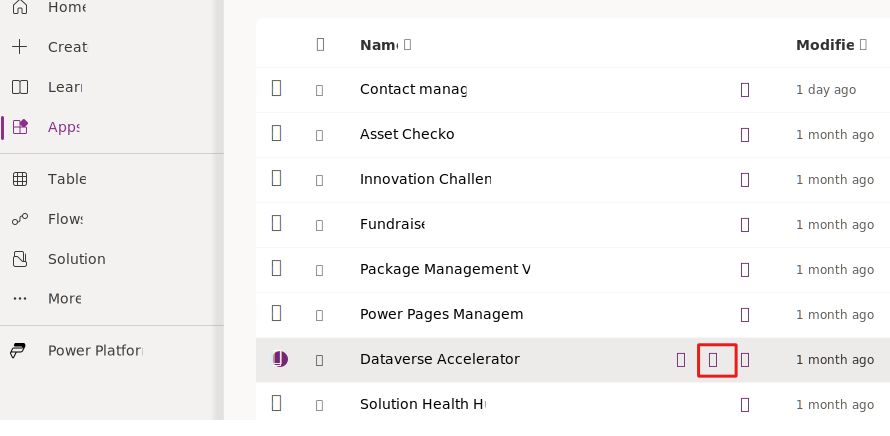

In addition to implementing your plug-in logic by using Power Fx, you can also call Microsoft Power Platform connector operations. With this feature, you can expand your ability to integrate the connector logic as an extension to your plug-in logic. You can use public and custom connectors from your plug-in. 

You might use this capability in scenarios where you want to:

- Create an automated plug-in that uses a connector to augment data on a created row.

- Create an automated plug-in that uses a connector to validate data on a row that someone is creating or updating.

- Use a custom API for an internal system by creating a custom connector and calling it from a plug-in.

- Create an instant plug-in that simplifies calling a connector that has more complex input/output parameters.

- Create a plug-in that uses multiple connectors that integrate across multiple systems.

## Use connectors in your logic

Before using a connector in your Power Fx logic, you need to create a connection reference within your environment. You should include this connection reference in the same Dataverse solution that you use to track your plug-in. You can create the connection reference before creating your plug-in, or you can make it part of creating the plug-in. When creating a new plug-in in the Dataverse Accelerator application, you can find the available connectors and create a new connection reference by selecting the connector icon in the upper-right corner.

> [!div class="mx-imgBorder"]
> 

If you create the connection reference while creating a plug-in, your first task is to select a solution in the advanced properties section. This approach ensures that your connection reference picks up your solution prefix, not a default prefix. You use the solution prefix and the connection reference name to reference the connector from your Power Fx logic.

For example, if your solution prefix is **contoso** and your connection reference is named **BingMaps**, and if you want to use the **Get location by address** action, the following logic is what your Power Fx logic uses:

```
contoso_BingMaps.Getlocationbyaddress()
```

To get that expression, copy it from the connector panel by selecting an available connector and then selecting **copy** on one of the supported actions that are listed. Additionally, you can begin typing your connection reference prefix, such as **contoso**, and IntelliSense helps you locate the available actions as you type part of the connection and action names.

You can use many different connectors with low-code plug-ins, including custom connectors. However, not all are currently supported. You should also avoid using the Dataverse connector to work with Dataverse data. To complete Dataverse operations, you should use the Power Fx logic to work directly with the data.

When low-code plug-ins interact with connectors and data loss prevention (DLP) policies are in effect, the policy can block the creation of connections.

## Exercise - Build an instant low-code plug-in

In the following exercise, you'll build an instant low-code plug-in that uses the MSN Weather connector.

1. Go to [Power Apps maker portal](https://make.powerapps.com/?azure-portal=true).

1. Select the correct environment and then select **Apps**.

1. Select **All** and then launch **Dataverse Accelerator App**.

    > [!div class="mx-imgBorder"]
    > 
1. Select the **Create instant plug-in** card.

1. Enter **Get Weather** for the **Display name**, and then select **+ New input parameter**.

1. Enter **City** for **Label** and then select **String** for **Data type**.

1. Select **+ New input parameter** again.

1. Enter **Units** for **Label** and then select **String** for **Data type**.

1. Select **+ New out parameter**.

1. Enter **Forecast** for **Label** and then select **String** for **Data type**.

1. You should now have two input parameters and one output parameter. Expand the **Advanced options** section.

    > [!div class="mx-imgBorder"]
    > 
1. Select **LearnLowCodePlugins** for the **Solution**.

1. Select the **Connection references** button located on the upper right of the screen.

    > [!div class="mx-imgBorder"]
    > 
1. Select **Create a connection reference**.

1. Enter **MSN Weather** for the **Display name**,  select **MSN Weather** for **Connector**, and then select **+ New connection**.

    > [!div class="mx-imgBorder"]
    > 
1. Select **Create**.

1. Close the connections browser window or tab.

1. Select the **Refresh** connection button.

1. Select the connection that you created and then select **Create**.

1. The MSN weather connection reference displays. Select the **MSN Weather** connector.

    > [!div class="mx-imgBorder"]
    > 
1. The actions of the **MSN Weather** connector should display. Select the **Get forecast for today** action and then select **Copy**.

    > [!div class="mx-imgBorder"]
    > 
1. Go to the **Expression** text box and paste what you copied. This expression shows you how to use the **Get forecast for today** action. You can remove the action from the expression.

1. Paste the following expression in the **Expression** field.

	```{Forecast:contoso_MSNWeather.TodaysForecast(City, Units).responses.daily.day.summary}```

1. Select **Save** and then wait for the plug-in to save.

    > [!div class="mx-imgBorder"]
    > 
1. Select **Test**.

1. Enter **Redmond** for the **City**, enter **Metric** for **Units**, and then select **Run**.

The test should run successfully, and a summary of today's forecast should display.

   > [!div class="mx-imgBorder"]
   > 
