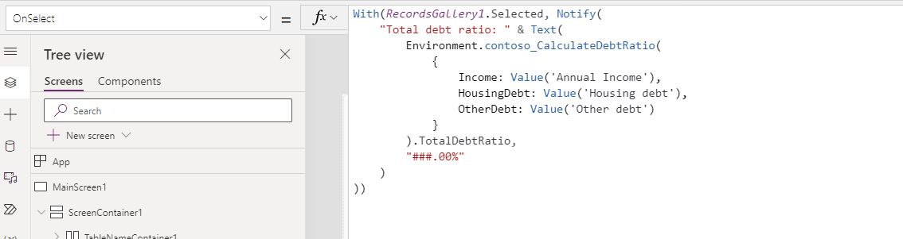

You can use instant low-code plug-ins from Power Apps canvas applications. How you go about invoking the instant plug-in depends on whether the plug-in is set up for global or entity.

## Use global instant plug-ins

Instant plug-ins that are set up as global aren't bound to a specific Dataverse table. To use these plug-ins, you need to add a reference to an environment language object from the data source panel.

> [!div class="mx-imgBorder"]
> 

After you add the environment language object, you can use the instant plug-in from your Power Fx expressions in the app. The following example shows using a global instant plug-in:

```
Environment.contoso_CalculateRiskScore(...inputs...)
```

> [!IMPORTANT]
> You need to re-add the environment language object to access new plug-ins inside existing canvas apps. For plug-ins that you create after adding the environment data source to an existing canvas app, you need to remove and re-add the Power Fx environment language object.
>
## Use entity instant plug-ins

Instant plug-ins that are set up as entity are bound to a specific Dataverse table. When you use these plug-ins from a Power Fx expression, you can access them from the Dataverse table and you're required to pass an identifier to an existing row from that table.

For example, to invoke a CalculateRiskScore plug-in that's set up for entity and Account as the table, you would use the following expression:

```
Accounts.contoso_CalculateRiskScore(RecordsGallery1.Selected.Account)
```

In the following exercise, you use the low-code plug-ins to calculate debt ratio in a Power Apps canvas application.

> [!IMPORTANT]
> Use a test environment with Microsoft Dataverse provisioned and the sample apps available. If you don't have one, you can sign up for the [community plan](https://powerapps.microsoft.com/communityplan/?azure-portal=true).
> [!IMPORTANT]
> This exercise uses the plug-ins that you created in module 1. If you didn't complete module 1, you can import and use the starting solution [LearnLowCodePlugins_1_0_0_1.zip](https://github.com/MicrosoftDocs/mslearn-developer-tools-power-platform/blob/master/power-apps/configure-low-code/LearnLowCodePlugins_1_0_0_1.zip) that's included in this module.
>
### Prepare your environment

To prepare your environment, follow these steps:

1. Go to [Power Apps maker portal](https://make.powerapps.com/?azure-portal=true).

1. Select the correct environment and then select **Apps**.

1. Select **Start with data**.

    > [!div class="mx-imgBorder"]
    > 
1. Select the **Select an existing table** card.

1. Select the **Contact** table and then select **Create app**.

    > [!div class="mx-imgBorder"]
    > 
   The canvas app studio should open the new application.

1. Remove the columns that you don't need from the form. Go to the **Tree view** tab and select **Form1**.

    > [!div class="mx-imgBorder"]
    > 
1. While you still have **Form1** selected, go to the **Properties** pane on the left and then select the **Edit fields** link button.

1. Select the ellipsis (**...**) button next to the **Last Name** field and then select **Remove**.

    > [!div class="mx-imgBorder"]
    > 
1. Remove all but the **Full Name**, **Annual Income**, **Credit Limit**, **Housing debt**, and **Other debt** fields. You might need to add missing columns by selecting the **+ Add field** button.

1. Close the **Fields** pane.

    > [!div class="mx-imgBorder"]
    > 
1. Select the **Data** tab on the left and then select **+ Add data**.

1. Search for and then select **Environment**.

    > [!div class="mx-imgBorder"]
    > 
1. Back in the **Tree view**, select **MainConatiner1**.

1. Select the **+ Insert** button and then select **Button**.

    > [!div class="mx-imgBorder"]
    > 
1. Rename the button to **Invoke unbound**.

    > [!div class="mx-imgBorder"]
    > 
1. Change the test text of the button to **Invoke unbound**.

1. Change the width of the button to **200**.

1. Select **MainContainer1**, select the **+ Insert** button, and then select **Button** again.

1. Rename the **Invoke bound** button.

1. Change the test text of the button to **Invoke bound**.

1. Change the width of the button to **200**.

1. Select **MainContainer1** and then change the LayoutGap to **10**.

   The screen should now resemble the following image.

    > [!div class="mx-imgBorder"]
    > 
1. Don't navigate away from this page.

### Invoke the plug-in

To invoke the plug-in, follow these steps:

1. Select the **Invoke unbound** button. Go to the formula bar, select **OnSelect**, and then paste the following expression. This expression uses the Calculate Debt Ratio plug-in that you created in module 1. The expression uses the annual income, housing debt, and other debt from the form as inputs, and then it displays a formatted total debt ratio as notification. Casing of the letters matters. If you get errors, confirm that the casing matches what was done in prior labs.

    ```
    With(RecordsGallery1.Selected, Notify(
    "Total debt ratio: " & Text(
        Environment.contoso_CalculateDebtRatio(
            {
                Income: Value('Annual Income'),
                HousingDebt: Value('Housing debt'),
                OtherDebt: Value('Other debt')
            }
        ).TotalDebtRatio,
        "###.00%"
    )
    ))
    ```

    > [!div class="mx-imgBorder"]
    > 

1. Select the **Invoke bound** button. Go to the formula bar, select **OnSelect**, and then paste the following expression. This expression uses the Calculate Contact Debt Ratio plug-in that you created in module 1. The expression uses the ID of the selected contact as input, and then it displays the formatted total debt ratio as notification.

    ```
    With(
    Contacts.contoso_CalculateContactDebtRatio(RecordsGallery1.Selected.Contact),
    Notify(
        "Total debt ratio: " & Text(
            TotalDebtRatio,
            "###.00%"
        )
    )
    )
    ```

1. Select **Save**.

1. Enter **Contact manager** for the **Name** and then select **Save**. Wait for the application to save.

1. Select the **Play** button.

1. The application should launch. Select the **Edit** button.

    > [!div class="mx-imgBorder"]
    > 

1. Enter **250000** for **Annual Income**, enter **30000** for **Housing debt**, enter **50000** for **Other debt**, and then select the **Save** icon.

1. Select the **Invoke unbound** button.

   A notification that shows all debt ratio values should display.

    > [!div class="mx-imgBorder"]
    > 
1. Close the preview by selecting the **X** button in the upper-right corner of the screen.
