You can use instant low-code plug-ins from Power Automate cloud flows by using the Dataverse connector. Use the following action depending on whether your low-code plug-in is entity or global.

- **Entity** - Use the **Perform a bound action** operation. When you use this action, you need to provide the row ID for the table that you set up on the low-code plug-in definition. In addition, you need to provide other input parameters that are defined for the plug-in.

- **Global** - Use the **Perform an unbound action** operation. You need to provide other input parameters that are defined for the plug-in.

If the instant plug-in has output parameters, you can use these values in subsequent steps of your flow. The available output is in the dynamic content.

In the following exercise, you'll use the Calculate Debt Ratio low-code plug-in in a Power Automate cloud flow.

> [!IMPORTANT]
> Use a test environment with Microsoft Dataverse provisioned and the sample apps available. If you don't have one you, can sign up for the [community plan](https://powerapps.microsoft.com/communityplan/?azure-portal=true).
> [!IMPORTANT]
> This exercise uses the plug-ins that you created in another module. If you didn't complete the module and build the Calculate Debt Ratio plug-in, you can import and use the starting solution **LearnLowCodePlugins_1_0_0_1.zip** that's included in this module.

## Use an unbound low-code plug-in in a flow
To use an unbound low-code plug-in in a flow, follow these steps:

1. Go to [Power Automate portal](https://make.powerautomate.com/?azure-portal=true).

1. Select the correct environment and then select **Solutions**.

	 In the following exercise, you'll use the calculate debt ratio low code plug-in.
    > [!div class="mx-imgBorder"]
    > 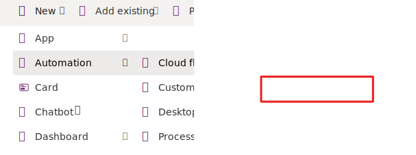
1. Enter **Invoke unbound LC plugin** for the **Name**, select **Manually trigger a flow**, and then select **Create**.

1. Select the trigger and then select **+ Add an input**.

    > [!div class="mx-imgBorder"]
    > 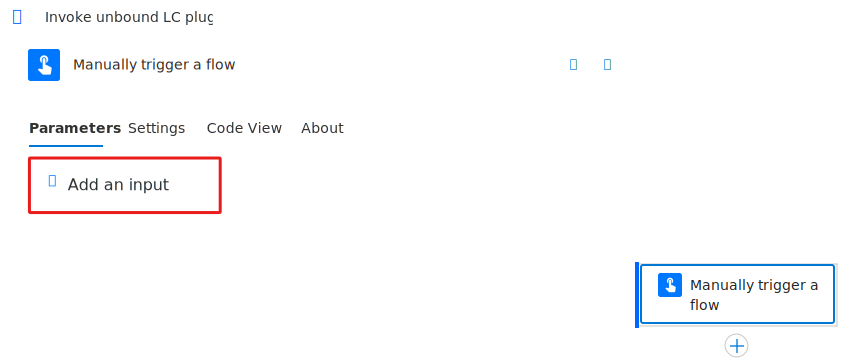
1. Select **Number**.

1. Enter **Income** for the **Name** and then select **+ Add an input** again.

    > [!div class="mx-imgBorder"]
    > 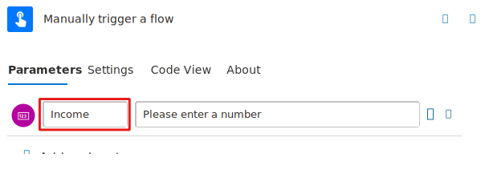
1. Select **Number**.

1. Enter **Housing debt** for the **Name** and then select **+ Add an input** one more time.

1. Select **Number**.

1. Enter **Other debt** for the **Name**.

1. You should now have three inputs. Select **Insert a new step** and then select **Add an action**.

    > [!div class="mx-imgBorder"]
    > 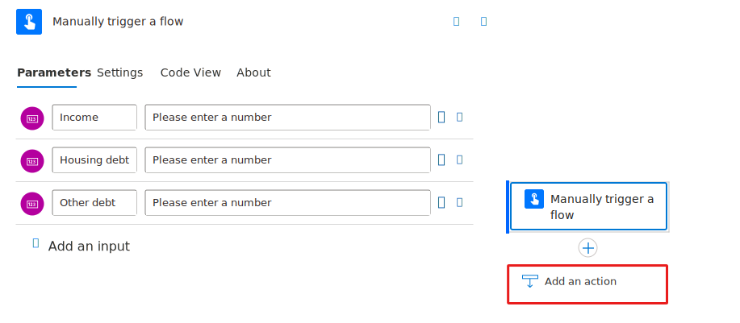
1. Search for and select **Perform an unbound action**.

    > [!div class="mx-imgBorder"]
    > 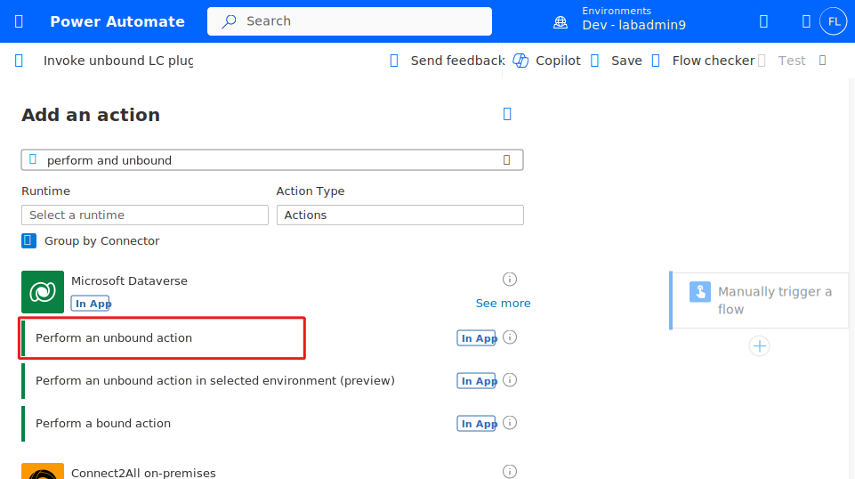
1. Sign in if prompted.

1. From the **Action Name** lookup, select **contoso_CalculateDebtRatio** and then select the **Show all** button.

	> [!NOTE]
	> The order in which these parameters display might be different on your screen. You can continue regardless.

    > [!div class="mx-imgBorder"]
    > 

1. Select the **Item/Income** field, enter a slash **/**, and then select **Insert Dynamic Content**.

    > [!div class="mx-imgBorder"]
    > 
1. Select **Income** from the dynamic content pane.

    > [!div class="mx-imgBorder"]
    > 
1. Select the **Item/HousingDebt** field, enter a slash **/**, and then select **Insert Dynamic Content**.

1. Select **Housing debt** from the dynamic content pane.

1. Select the **Item/OtherDebt** field, enter a slash **/**, and then select **Insert Dynamic Content**.

1. Select **Other debt** from the dynamic content pane.

1. The unbound action should now resemble the following image. Select **Save** and then wait for the flow to save.

    > [!div class="mx-imgBorder"]
    > 
	
     In the following exercise, you'll use the calculate debt ratio low code plug-in.

1. Select **Manually** and then select **Test**.

1. Enter **180000** for **Income**, enter **60000** for **Housing debt**, enter **70000** for **Other debt**, and then select **Run flow**.

    > [!div class="mx-imgBorder"]
    > 
1. Select **Done**.

1. The flow should run successfully and the output should show the total debt ratio and housing debt ratio.

    > [!div class="mx-imgBorder"]
    > 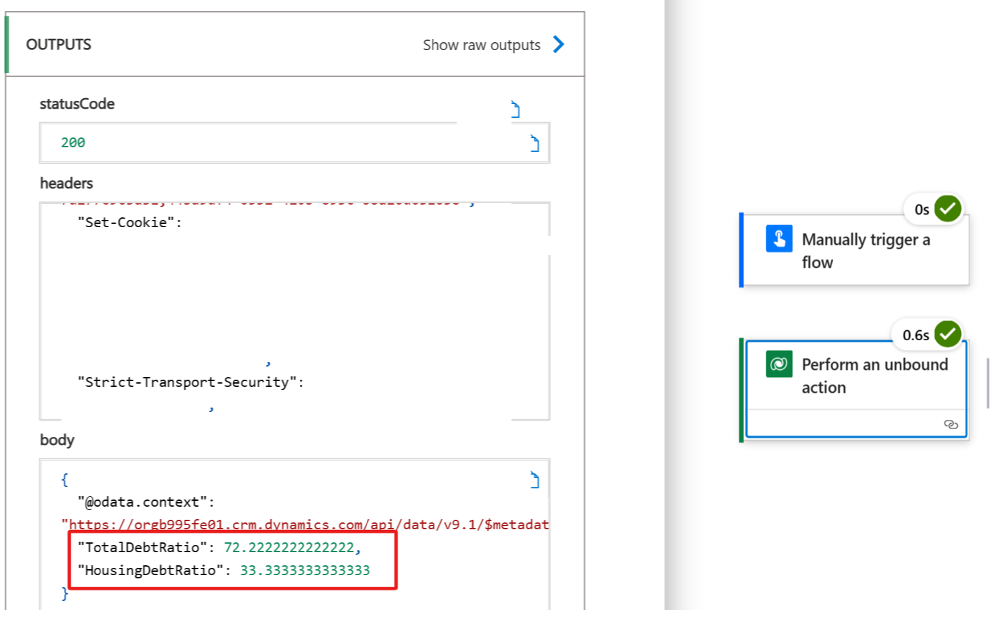
1. You can now close the flow designer.

## Use a bound low-code plug-in in a flow
To use a bound low-code plug-in in a flow, follow these steps:

1. Go to [Power Automate portal](https://make.powerautomate.com/?azure-portal=true).

1. Select the correct environment and then select **Solutions**.

	In the following exercise, you'll use the calculate debt ratio low code plug-in.

    > [!div class="mx-imgBorder"]
    > 
1. Enter **Invoke bound LC plugin** for the **Name**, select **Manually trigger a flow**, and then select **Create**.

1. Select **Insert a new step** and then select **Add an action**.

    > [!div class="mx-imgBorder"]
    > 
1. Search for **list rows** and select **Microsoft Dataverse List rows**.

    > [!div class="mx-imgBorder"]
    > 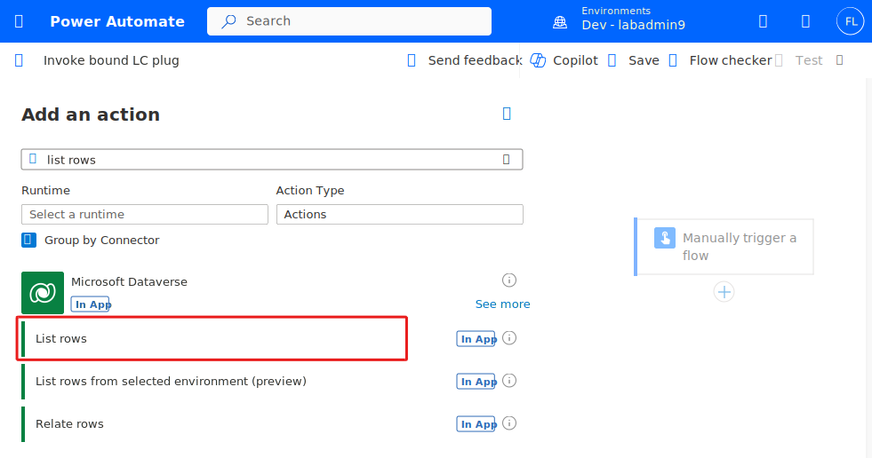
1. Select **Contacts** for the **Table Name** and then select the **Show all** button.

1. Enter **lastname eq 'McKay (sample)'** for **Filter Rows**. You're using this contact because you set the annual income, housing debt, and other debt values in a previous exercise. If you didn't complete that exercise, you need to launch the Contact manager canvas application. Then, you need to edit McKay's record and provide annual income, housing debt, and other debt values.

    > [!div class="mx-imgBorder"]
    > 
1. Select **Insert a new step** and then select **Add an action**.

1. Search for **perform bound** and then select **Perform a bound action**.

    > [!div class="mx-imgBorder"]
    > 
1. Select **Contacts** for the **Table Name**, select **contoso_CalculateContactDebtRatio** for **Action Name**, enter a slash **/** in the **Row ID** field, and then select **Insert Dynamic Content**.

    > [!div class="mx-imgBorder"]
    > 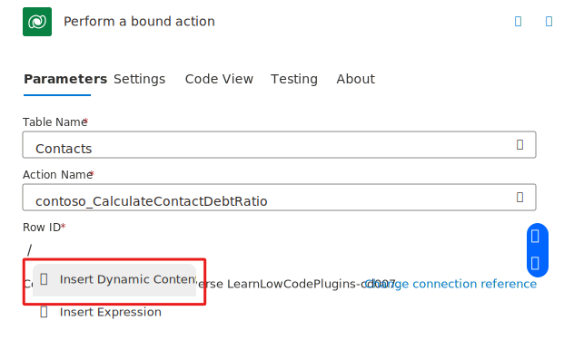
1. Select **Contact** from the Dynamic content pane.

    > [!div class="mx-imgBorder"]
    > 
1. The system adds a **For each** control for you, and the flow should now resemble the following image. Select **Save** and then wait for the flow to save.

    > [!div class="mx-imgBorder"]
    > 
	
    In the following exercise, you'll use the calculate debt ratio low code plug-in.

1. Select **Run flow**.

1. Select **Done** and then wait for the flow run to complete.

1. The flow should run successfully, and the housing debt ratio and total debt ratio should show as output.

    > [!div class="mx-imgBorder"]
    > 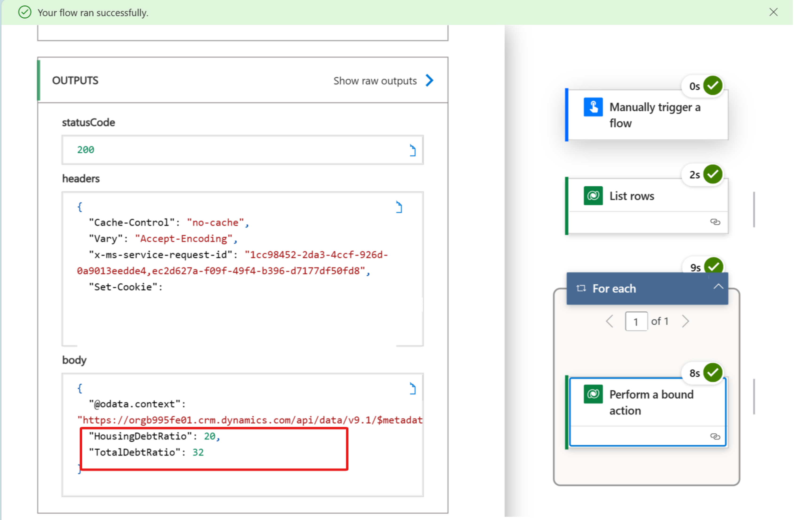

1. Close the flow designer.
