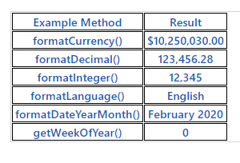

Power Apps component framework exposes a formatting API that can be especially useful when you need to format various values in your application. This unit shows how to use this API by producing an HTML table to illustrate how various methods can be used.

> [!div class="mx-imgBorder"]
> 

## Initialize your component's project

To initialize your component's project, follow these steps:

1. Start Visual Studio Code.

1. Select **Terminal**, select **New Terminal**.

1. Change the directory to your source folder.

    ```console
    cd source
    ```

1. From your source directory, create a directory named **Formatting-API**.

    ```console
    md Formatting-API
    ```

1. Run the following command to switch to the new directory.

    ```console
    cd Formatting-API
    ```

1. Initialize the project by running the following command.

    ```console
    pac pcf init --namespace SampleNamespace --name FormattingAPI --template field
    ```

1. Run npm install to load dependent libraries into your project.

    ```console
    npm install
    ```

1. Open the project in Visual Studio Code by running the following command.

    ```console
    code -a .
    ```

## Implement your code component's logic

To implement your code component's logic, follow these steps:

1. Expand the **FormattingAPI** folder and open the **ControlManifest.Input.xml** file.

1. Replace the entire manifest with the following XML.

    ```xml
    <?xml version="1.0" encoding="utf-8" ?>
    <manifest>
      <control namespace="SampleNamespace" constructor="FormattingAPI" version="1.1.0" display-name-key="TS_FormattingAPI_Display_Key" description-key="TS_FormattingAPI_Desc_Key" control-type="standard">
        <property name="controlValue" display-name-key="controlValue_Display_Key" description-key="controlValue_Desc_Key" of-type="SingleLine.Text" usage="bound" required="true" />
        <resources>
          <code path="index.ts" order="1" />
          <css path="css/TS_FormattingAPI.css" order="2" />
        </resources>
      </control>
    </manifest>
    ```

    You add the supporting files that are found in this manifest later.

1. Open the **Index.ts** file.

1. Above the **constructor** method, insert the following private variables.

    ```typescript
    // PCF framework delegate that will be assigned to this object that would be called whenever any update happens.
    private _notifyOutputChanged: () => void;

    // Reference to the div element that holds together all the HTML elements that you are creating as part of this control
    private divElement: HTMLDivElement;

    // Reference to HTMLTableElement rendered by control
    private _tableElement: HTMLTableElement;

    // Reference to the control container HTMLDivElement
    // This element contains all elements of your custom control example
    private _container: HTMLDivElement;

    // Reference to ComponentFramework Context object
    private _context: ComponentFramework.Context<IInputs>;

    // Flag if control view has been rendered
    private _controlViewRendered: Boolean;
    ```

1. Place the following logic inside of the **init** method.

    ```typescript
    this._notifyOutputChanged = notifyOutputChanged;
    this._controlViewRendered = false;
    this._context = context;

    this._container = document.createElement("div");
    this._container.classList.add("TSFormatting_Container");
    container.appendChild(this._container);
    ```

1. Add the following logic to the **updateView** method:

    ```typescript
    if (!this._controlViewRendered)
    {
        // Render and add HTMLTable to the custom control container element
        let tableElement: HTMLTableElement = this.createHTMLTableElement();
        this._container.appendChild(tableElement);

        this._controlViewRendered = true;
    }
    ```

1. Add the following helper methods to generate your HTML table that will display formatted values after the destroy method.

    ```typescript
    /**
    * Helper method to create an HTML Table Row Element
    * @param key : string value to show in left column cell
    * @param value : string value to show in right column cell
    * @param isHeaderRow : true if method should generate a header row
    */
    private createHTMLTableRowElement(key: string, value: string, isHeaderRow: boolean): HTMLTableRowElement
    {
        let keyCell: HTMLTableCellElement = this.createHTMLTableCellElement(key, "FormattingControlSampleHtmlTable_HtmlCell_Key", isHeaderRow);
        let valueCell: HTMLTableCellElement = this.createHTMLTableCellElement(value, "FormattingControlSampleHtmlTable_HtmlCell_Value", isHeaderRow);

        let rowElement: HTMLTableRowElement = document.createElement("tr");
        rowElement.setAttribute("class", "FormattingControlSampleHtmlTable_HtmlRow");
        rowElement.appendChild(keyCell);
        rowElement.appendChild(valueCell);

        return rowElement;
    }

    /**
    * Helper method to create an HTML Table Cell Element
    * @param cellValue : string value to inject in the cell
    * @param className : class name for the cell
    * @param isHeaderRow : true if method should generate a header row cell
    */
    private createHTMLTableCellElement(cellValue: string, className: string, isHeaderRow: boolean): HTMLTableCellElement
    {
        let cellElement: HTMLTableCellElement;

        if (isHeaderRow)
        {
            cellElement = document.createElement("th");
            cellElement.setAttribute("class", "FormattingControlSampleHtmlTable_HtmlHeaderCell " + className);
            let textElement: Text = document.createTextNode(cellValue);
            cellElement.appendChild(textElement);
        }
        else
        {
            cellElement = document.createElement("td");
            cellElement.setAttribute("class", "FormattingControlSampleHtmlTable_HtmlCell " + className);
            let textElement: Text = document.createTextNode(cellValue);
            cellElement.appendChild(textElement);
        }
        return cellElement;
    }
    ```

1. Add the following method, which contains sample usages of the formatting API, by saving them as table cells after the helper methods.

    ```typescript
    /**
    * Creates an HTML Table that showcases examples of basic methods available to the custom control
    * The left column of the table shows the method name or property that is being used
    * The right column of the table shows the result of that method name or property
    */
    private createHTMLTableElement(): HTMLTableElement
    {
        // Create HTML Table Element
        let tableElement: HTMLTableElement = document.createElement("table");
        tableElement.setAttribute("class", "FormattingControlSampleHtmlTable_HtmlTable");

        // Create header row for table
        let key: string = "Example Method";
        let value: string = "Result";
        tableElement.appendChild(this.createHTMLTableRowElement(key, value, true));

        // Example use of formatCurrency() method
        // Change the default currency and the precision or pass in the precision and currency as additional parameters.
        key = "formatCurrency()";
        value = this._context.formatting.formatCurrency(10250030);
        tableElement.appendChild(this.createHTMLTableRowElement(key, value, false));

        // Example use of formatDecimal() method
        // Change the settings from user settings to see the output change its format accordingly
        key = "formatDecimal()";
        value = this._context.formatting.formatDecimal(123456.2782);
        tableElement.appendChild(this.createHTMLTableRowElement(key, value, false));

        // Example use of formatInteger() method
        // change the settings from user settings to see the output change its format accordingly.
        key = "formatInteger()";
        value = this._context.formatting.formatInteger(12345);
        tableElement.appendChild(this.createHTMLTableRowElement(key, value, false));

        // Example use of formatLanguage() method
        // Install additional languages and pass in the corresponding language code to see its string value
        key = "formatLanguage()";
        value = this._context.formatting.formatLanguage(1033);
        tableElement.appendChild(this.createHTMLTableRowElement(key, value, false));

        // Example of formatDateYearMonth() method
        // Pass a JavaScript Data object set to the current time into formatDateYearMonth method to format the data
        // and get the return in Year, Month format
        key = "formatDateYearMonth()";
        value = this._context.formatting.formatDateYearMonth(new Date());
        tableElement.appendChild(this.createHTMLTableRowElement(key, value, false));

        // Example of getWeekOfYear() method
        // Pass a JavaScript Data object set to the current time into getWeekOfYear method to get the value for week of the year
        key = "getWeekOfYear()";
        value = this._context.formatting.getWeekOfYear(new Date()).toString();
        tableElement.appendChild(this.createHTMLTableRowElement(key, value, false));

        return tableElement;
    }
    ```

1. Select **File** and **Save All** your changes.

1. After you've made the updates, your completed class should look similar to the following example.

    ```typescript
    import {IInputs, IOutputs} from "./generated/ManifestTypes";

    export class FormattingAPI implements ComponentFramework.StandardControl<IInputs, IOutputs> {

        // PCF framework delegate that will be assigned to this object that would be called whenever any update happens.
        private _notifyOutputChanged: () => void;

        // Reference to the div element that holds together all the HTML elements that you are creating as part of this control
        private divElement: HTMLDivElement;

        // Reference to HTMLTableElement rendered by control
        private _tableElement: HTMLTableElement;

        // Reference to the control container HTMLDivElement
        // This element contains all elements of your custom control example
        private _container: HTMLDivElement;

        // Reference to ComponentFramework Context object
        private _context: ComponentFramework.Context<IInputs>;

        // Flag if control view has been rendered
        private _controlViewRendered: Boolean;

        /**
        * Used to initialize the control instance. Controls can kick off remote server calls and other initialization actions here.
        * Dataset values are not initialized here, use updateView.
        * @param context The entire property bag is available to control through the Context Object; It contains values as set up by the customizer and mapped to property names that are defined in the manifest and to utility functions.
        * @param notifyOutputChanged A callback method to alert the framework that the control has new outputs ready to be retrieved asynchronously.
        * @param state A piece of data that persists in one session for a single user. Can be set at any point in a control's life cycle by calling 'setControlState' in the Mode interface.
        * @param container If a control is marked control-type='starndard', it will receive an empty div element within which it can render its content.
        */
        public init(context: ComponentFramework.Context<IInputs>, notifyOutputChanged: () => void, state: ComponentFramework.Dictionary, container:HTMLDivElement)
        {
            this._notifyOutputChanged = notifyOutputChanged;
            this._controlViewRendered = false;
            this._context = context;

            this._container = document.createElement("div");
            this._container.classList.add("TSFormatting_Container");
            container.appendChild(this._container);
        }

        /**
        * Called when any value in the property bag has changed. This includes field values, datasets, global values such as container height and width, offline status, control metadata values such as label, visible, and so on.
        * @param context The entire property bag that is available to control through the Context Object; It contains values as set up by the customizer that are mapped to names defined in the manifest and to utility functions
        */
        public updateView(context: ComponentFramework.Context<IInputs>): void
        {
            if (!this._controlViewRendered)
            {
                // Render and add HTMLTable to the custom control container element
                let tableElement: HTMLTableElement = this.createHTMLTableElement();
                this._container.appendChild(tableElement);

                this._controlViewRendered = true;
            }
        }

        /**
        * It is called by the framework prior to a control receiving new data.
        * @returns an object based on nomenclature that is defined in the manifest, expecting object[s] for property marked as "bound" or "output"
        */
        public getOutputs(): IOutputs
        {
            return { };
        }

        /**
        * Called when the control is to be removed from the DOM tree. Controls should use this call for cleanup,
        * such as canceling any pending remote calls, removing listeners, and so on.
        */
        public destroy()
        {

        }

        /**
        * Helper method to create an HTML Table Row Element
        * @param key : string value to show in left column cell
        * @param value : string value to show in right column cell
        * @param isHeaderRow : true if method should generate a header row
        */
        private createHTMLTableRowElement(key: string, value: string, isHeaderRow: boolean): HTMLTableRowElement
        {
            let keyCell: HTMLTableCellElement = this.createHTMLTableCellElement(key, "FormattingControlSampleHtmlTable_HtmlCell_Key", isHeaderRow);
            let valueCell: HTMLTableCellElement = this.createHTMLTableCellElement(value, "FormattingControlSampleHtmlTable_HtmlCell_Value", isHeaderRow);

            let rowElement: HTMLTableRowElement = document.createElement("tr");
            rowElement.setAttribute("class", "FormattingControlSampleHtmlTable_HtmlRow");
            rowElement.appendChild(keyCell);
            rowElement.appendChild(valueCell);

            return rowElement;
        }

        /**
        * Helper method to create an HTML Table Cell Element
        * @param cellValue : string value to inject in the cell
        * @param className : class name for the cell
        * @param isHeaderRow : true if method should generate a header row cell
        */
        private createHTMLTableCellElement(cellValue: string, className: string, isHeaderRow: boolean): HTMLTableCellElement
        {
            let cellElement: HTMLTableCellElement;

            if (isHeaderRow)
            {
                cellElement = document.createElement("th");
                cellElement.setAttribute("class", "FormattingControlSampleHtmlTable_HtmlHeaderCell " + className);
                let textElement: Text = document.createTextNode(cellValue);
                cellElement.appendChild(textElement);
            }
            else
            {
                cellElement = document.createElement("td");
                cellElement.setAttribute("class", "FormattingControlSampleHtmlTable_HtmlCell " + className);
                let textElement: Text = document.createTextNode(cellValue);
                cellElement.appendChild(textElement);
            }
            return cellElement;
        }

        /**
        * Creates an HTML Table that showcases examples of basic methods that are available to the custom control
        * The left column of the table shows the method name or property that is being used
        * The right column of the table shows the result of that method name or property
        */
        private createHTMLTableElement(): HTMLTableElement
        {
            // Create HTML Table Element
            let tableElement: HTMLTableElement = document.createElement("table");
            tableElement.setAttribute("class", "FormattingControlSampleHtmlTable_HtmlTable");

            // Create header row for table
            let key: string = "Example Method";
            let value: string = "Result";
            tableElement.appendChild(this.createHTMLTableRowElement(key, value, true));

            // Example use of formatCurrency() method
            // Change the default currency and the precision or pass in the precision and currency as additional parameters.
            key = "formatCurrency()";
            value = this._context.formatting.formatCurrency(10250030);
            tableElement.appendChild(this.createHTMLTableRowElement(key, value, false));

            // Example use of formatDecimal() method
            // Change the settings from user settings to see the output change its format accordingly
            key = "formatDecimal()";
            value = this._context.formatting.formatDecimal(123456.2782);
            tableElement.appendChild(this.createHTMLTableRowElement(key, value, false));

            // Example use of formatInteger() method
            // change the settings from user settings to see the output change its format accordingly.
            key = "formatInteger()";
            value = this._context.formatting.formatInteger(12345);
            tableElement.appendChild(this.createHTMLTableRowElement(key, value, false));

            // Example use of formatLanguage() method
            // Install additional languages and pass in the corresponding language code to see its string value
            key = "formatLanguage()";
            value = this._context.formatting.formatLanguage(1033);
            tableElement.appendChild(this.createHTMLTableRowElement(key, value, false));

            // Example of formatDateYearMonth() method
            // Pass a JavaScript Data object set to the current time into formatDateYearMonth method to format the data
            // and get the return in Year, Month format
            key = "formatDateYearMonth()";
            value = this._context.formatting.formatDateYearMonth(new Date());
            tableElement.appendChild(this.createHTMLTableRowElement(key, value, false));

            // Example of getWeekOfYear() method
            // Pass a JavaScript Data object set to the current time into getWeekOfYear method to get the value for week of the year
            key = "getWeekOfYear()";
            value = this._context.formatting.getWeekOfYear(new Date()).toString();
            tableElement.appendChild(this.createHTMLTableRowElement(key, value, false));

            return tableElement;
        }

    }
    ```

## Add styling to your code component

To add styling to your code component, follow these steps:

1. Create a new **css** subfolder under the FormattingAPI folder.

1. Create a new **TS_FormattingAPI.css** file inside the CSS subfolder.

1. Add the following style content to the TS_FormattingAPI.css file.

    ```css
    .SampleNamespace\.FormattingAPI
    {
        font-family: 'SegoeUI-Semibold', 'Segoe UI Semibold', 'Segoe UI Regular', 'Segoe UI';
    }

    .SampleNamespace\.FormattingAPI .TSFormatting_Container
    {
        overflow-x: auto;
    }

    .SampleNamespace\.FormattingAPI .FormattingControlSampleHtmlTable_HtmlRow
    {
        background-color: #FFFFFF;
    }

    .SampleNamespace\.FormattingAPI .FormattingControlSampleHtmlTable_HtmlHeaderCell
    {
        text-align: center;
    }

    .SampleNamespace\.FormattingAPI .FormattingControlSampleHtmlTable_HtmlCell,
    .SampleNamespace\.FormattingAPI .FormattingControlSampleHtmlTable_HtmlHeaderCell
    {
        border: 1px solid black;
        padding-left: 3px;
        padding-right: 3px;
    }

    .SampleNamespace\.FormattingAPI .FormattingControlSampleHtmlTable_HtmlInputTextCell
    {
        border: 1px solid black;
        padding: 0px;
    }

    .SampleNamespace\.FormattingAPI .FormattingControlSampleHtmlTable_HtmlHeaderCell
    {
        font-weight: bold;
        font-size: 16px;
    }

    .SampleNamespace\.FormattingAPI .FormattingControlSampleHtmlTable_HtmlCell_Key
    {
        color: #1160B7;
    }

    .SampleNamespace\.FormattingAPI .FormattingControlSampleHtmlTable_HtmlCell_Value
    {
        color: #1160B7;
        text-align: center;
    }
    ```

1. Select **File** and **Save All** your changes.

## Build and run your component

To build and run your component, follow these steps:

1. Build your solution by running the following command.

    ```console
    npm run build
    ```

1. Upon a successful build, you can test your new formatting API component by running npm start.

    ```console
    npm start
    ```

1. Close the test harness browser window.

1. Go back to the terminal and stop the watcher by holding **[CONTROL] + C**.

1. Type **Y** and then **[ENTER]**.

For more information, see [Implementing formatting API component](/power-apps/developer/component-framework/sample-controls/formatting-api-control/?azure-portal=true).
