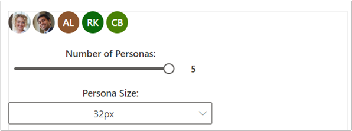
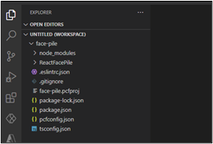
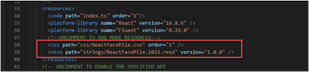
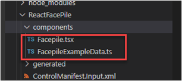
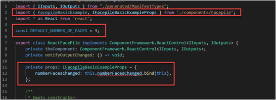
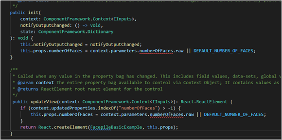
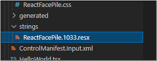
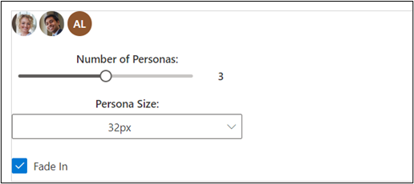
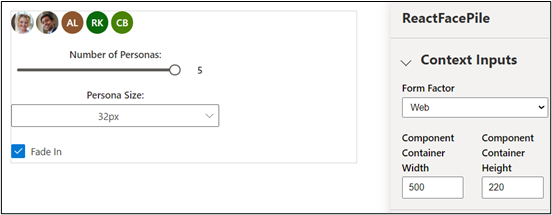

React is a standardized client framework for building user interfaces. It provides a declarative way to create interactive UIs and a mechanism to encapsulate components to make complex UIs that manage component states and have high interactivity. Because React is written in JavaScript, you can use this framework within a Power Apps component.

If you're new to React, go to [React](https://reactjs.org/?azure-portal=true), which provides a wealth of tutorials and resources on how to build React components.

## Prepare your computer for code components

To prepare your computer to build code components, follow these steps:

1. Install [npm](https://www.npmjs.com/get-npm/?azure-portal=true) (comes with Node.js) or [Node.js](https://nodejs.org/en/?azure-portal=true) (comes with npm). We recommend that you use a Long-Term Support (LTS) version.

1. Install [Visual Studio Code](https://code.visualstudio.com/Download/?azure-portal=true).

1. Install [Power Platform Tools extension](https://marketplace.visualstudio.com/items/?azure-portal=true&itemName=microsoft-IsvExpTools.powerplatform-vscode).

1. Install the Build Tools for Visual Studio from [Visual Studio Downloads](https://visualstudio.microsoft.com/downloads?azure-portal=true#build-tools-for-visual-studio-2022).

## Fluent UI

One of the many great developments from Microsoft has been its implementation of Fluent UI, a collection of UX frameworks that you can use to build fluent experiences that fit seamlessly into a broad range of Microsoft products. Using Fluent UI within your Power Apps code component is as simple as referencing its libraries, and it provides a React-specific version that you can use. For more information, see [Fluent UI](https://www.microsoft.com/design/fluent/?azure-portal=true).

## Implement a sample FacePile component

> [!IMPORTANT]
> Download the [FacePileComponent.zip](https://github.com/MicrosoftDocs/mslearn-developer-tools-power-platform/raw/master/power-apps-component-framework/FacePileComponent.zip) zip file to use with this exercise. Extract the zip file.

In this example, you build a component that uses the FacePile Fluent UI component. The FacePile shows a list of faces or initials in a horizontal lookup, each circle representing a person.

A practical example of when you might use this lookup is to list contributors to an article or record, such as what you would see in Microsoft Learn, as shown in the following image.

> [!div class="mx-imgBorder"]
> 

## Create a new component project

To create a component project, follow these steps:

1. Create a directory where you build your component. In this sample, you place the component in **C:\\users\\username\\source\\face-pile**; however, you can create your own directory. To create your own directory, you use Visual Studio Code.

1. Start Visual Studio Code.

1. Select **Terminal**, select **New Terminal**, and switch the Terminal shell to the **Command Prompt**.

   > [!NOTE]
   > If you are not familiar with the Terminal in Visual Studio Code, go to [Terminal Basics](https://code.visualstudio.com/docs/terminal/basics/?azure-portal=true) to learn more.

1. Create your source folder.

    ```console
    md \source
    ```

1. Change the directory to your source folder.

    ```console
    cd \source
    ```

1. From your source directory, create a directory named **face-pile**.

    ```console
    md face-pile
    ```

1. Change to the directory you created.

    ```console
     cd face-pile
    ```

1. You should now be in the new directory you created.

1. Initialize your component project by using Power Platform CLI with the following command.

    ```console
    pac pcf init --namespace Learn --name ReactFacePile --template field --framework React
    ```

1. Install the project build tools by using the command `npm install`. You might see some warnings displayed; however, you can safely ignore them.

    ```console
    npm install
    ```

1. Run the following command to open the project in Visual Studio Code.

    ```console
    code -a .
    ```

1. The project should look like the following image.

   > [!div class="mx-imgBorder"]
   > 

## Implement your code component's logic

To implement your code component's logic, follow these steps:

1. Expand the **ReactFacePile** folder and open the **ControlManifest.Input.xml** file.

1. Locate the **property** node and replace it with the following XML.

    ```xml
    <property name="numberOfFaces" display-name-key="numberOfFaces_Display_Key" description-key="numberOfFaces_Desc_Key" of-type="Whole.None" usage="bound" required="false" />
    ```

1. Locate the **resources** and uncomment the css and resx.

   > [!div class="mx-imgBorder"]
   > 

1. Make sure you still have the ControlManifest.Input.xml file selected and then select **New Folder**.

1. Name the new folder **components**.

1. Go to the folder where you extracted the downloaded FacePileComponent.zip file and open the **FacePileComponent** folder.

1. Drag the files inside the FacePileComponents folder and drop them in the **components folder** you created.

1. The components folder should now have two files.

   > [!div class="mx-imgBorder"]
   > 

1. Open the **Index.ts** file.

1. Replace import { HelloWorld, IHelloWorldProps } from "./HelloWorld"; with this snippet.

    ```typescript
    import { FacepileBasicExample, IFacepileBasicExampleProps } from "./components/Facepile" ;
    ```

1. After the imports, add the following constant.

    ```typescript
    const DEFAULT_NUMBER_OF_FACES = 3;
    ```

1. Add the snippet before the **constructor**.

    ```typescript
    private props: IFacepileBasicExampleProps = {
        numberFacesChanged: this.numberFacesChanged.bind(this),
    };
    ```

1. The changes you made should look like the following image.

   > [!div class="mx-imgBorder"]
   > 

1. Locate the **init** method and add the following snippet after this.notifyOutputChanged = notifyOutputChanged; line

    ```typescript
    this.props.numberOfFaces = context.parameters.numberOfFaces.raw || DEFAULT_NUMBER_OF_FACES;
    ```

1. Replace the **updateView** method with the following method.

    ```typescript
    public updateView(context: ComponentFramework.Context<IInputs>): React.ReactElement {
        if (context.updatedProperties.indexOf("numberOfFaces") > -1) {
            this.props.numberOfFaces = context.parameters.numberOfFaces.raw || DEFAULT_NUMBER_OF_FACES;
        }
        return React.createElement(FacepileBasicExample, this.props);
    }
    ```

1. The **init** and **updateView** methods should now look like the following image.

   > [!div class="mx-imgBorder"]
   > 

1. Replace the **getOutputs** method with the following method.

    ```typescript
    public getOutputs(): IOutputs {
        return {
            numberOfFaces: this.props.numberOfFaces,
        };
    }
    ```

1. Add the following method after the destroy method.

    ```typescript
    private numberFacesChanged(newValue: number) {
        if (this.props.numberOfFaces !== newValue) {
            this.props.numberOfFaces = newValue;
            this.notifyOutputChanged();
        }
    }
    ```

1. Select **File** and **Save All** your changes.

## Add styling to your code component

To add styling to your code component, follow these steps:

1. Select the **ControlManifest.Input.xml** file and then select **New Folder**.

1. Name the new folder **css**.

1. Select the **css** folder you created and select **New File**.

1. Name the new file **ReactFacePile.css**.

1. Open the **ReactFacePile.css** file you created, and paste the following CSS snippet.

    ```css
    msFacepileExample {
    max-width: 300px;
    }
    .msFacepileExample .control {
     padding-top: 20px;
    }
    .msFacepileExample .ms-Dropdown-container, .msFacepileExample.ms-Slider {
    margin: 10px 0 10px 0;
    }
    .msFacepileExample .ms-Dropdown-container .ms-Label {
    padding-top: 0;
    }
    .msFacepileExample .ms-Checkbox {
    padding-top: 15px;
    }
    .exampleCheckbox {
    margin: 10px 0;
    }
    .exampleLabel {
    margin: 10px 0;
    }
    ```

1. Select **File** and **Save** your changes.

1. Select the **ControlManifest.Input.xml** file and select **New Folder**.

1. Name the new folder **strings**.

1. Go to the folder where you extracted the downloaded FacePileComponent.zip file and open the **FacePileStrings** folder.

1. Drag the **ReactFacePile.1033.resx** file and drop it in the **strings** folder you created.

1. The strings folder should now have the resx file.

   > [!div class="mx-imgBorder"]
   > 

1. Select **File** and **Save** your changes.

1. Go to the terminal and run this build command.

    ```console
    npm run build
    ```

    > [!NOTE]
    > If you receive an error that JSX is not defined, open the file **.eslintrc.json**. On line 11: `"ComponentFramework": true`, add a comma and then a new line with `"JSX": true`. On line 41: change `JSX.Element` to `React.JSX.Element`. Save changes and repeat the npm run build command.

1. The build should complete successfully.

1. Test the components by running the following command.

    ```console
    npm start
    ```

1. The test harness should open a new browser window.

1. The component should look like the following image.

   > [!div class="mx-imgBorder"]
   > 

1. Change the size of the container to **500 x 220** and move the slider to **5**.

1. The component should now look like the following image. Close the test harness browser window.

   > [!div class="mx-imgBorder"]
   > 

1. Close the test harness browser window.

1. Go back to the terminal and stop the watcher by pressing **[CONTROL] + C**.

1. Type **Y** and then press **[ENTER]**.

For more information, go to [Implementing the FacePile component](/power-apps/developer/component-framework/sample-controls/react-facepile-control).
