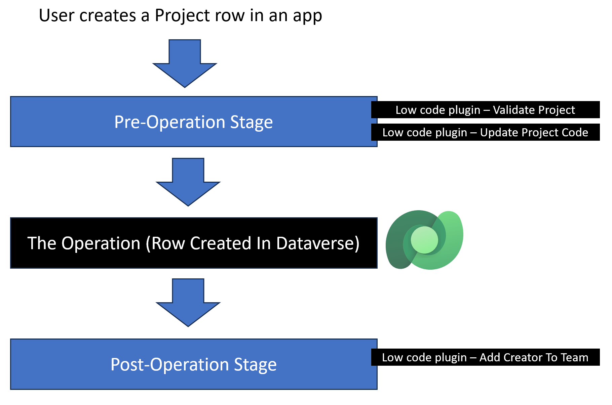

Automated low-code plug-ins help your Power Fx logic run in response to Microsoft Dataverse table events. When creating your plug-in, you can choose a Dataverse table and the event that you want to handle.

You can choose to have your plug-in logic run on one or more of the following events:

- **Created** - When someone creates a Dataverse table row.

- **Updated** - When someone modifies a Dataverse table row, including columns.

- **Deleted** - When someone deletes a Dataverse table row.

If you want the same logic to run on multiple tables, you need to create separate plug-ins for each table.

## When your plug-in runs

By default, your plug-in logic runs after the event occurs as post-operation. For example, if you choose the **Created** event, the logic runs after you create the row in Dataverse. This event is useful if you want to create related data rows in your plug-in. For example, if your plug-in runs on the creation of rows in the Project table, your logic might automatically add the user who created the row as a Project team member.

If you run the plug-in after you create the row, you can't check if the row is valid and then stop the creation from happening. In the **Advanced options** section, you can modify the **When should this run** option to be pre-operation instead of post-operation. This setting causes your plug-in logic to run before you create the row so that you can stop the creation by returning an Error(). In the following example, you want to disallow the deletion of a row from the Contact table if the **Status** is **Active**. To accomplish that task, you would register your plug-in on pre-operation of the **Deleted** event on the Contact table. The logic would check if the data row is inactive, and if not, tell the user that they must deactivate the row first. The following example shows the expression for the plug-in:

```powerappsf1
If (ThisRecord.Status = 'Status (Contacts)'.Active,Error("You must deactivate the row first"))
```

Another use case for setting up your plug-in to run pre-operation is if your plug-in logic needs to modify the row before you create it. By selecting to update a row before you create it, you can avoid the overhead of an extra update because the system updates the row before you save it in Dataverse. For example, you want to mark any Contact row that you create with (Test Data) as a suffix to the Last Name column. You can accomplish this task by setting up a plug-in on the Contact table for the **Created** event and pre-operation stage. The formula would resemble the following sample logic.

```powerappsf1
Set('Last Name',Concatenate(ThisRecord.'Last Name',"(Test Data)"))
```

Consider another example of using automated plug-ins to implement business logic, where you want to build the following automated logic on a Project table.

-	Validate specific columns on the Project row before it's created.

-	Derive a Project Code from other data on the row and then store the Project Code on the row at the creation of the row.

-	Create a Project Team row automatically that the logic associates with the created Project row, adding the creating user as the initial team member.

> [!div class="mx-imgBorder"]
> [](../media/plugin-pipeline.png#lightbox)
The preceding visual proposes that you implement three low-code plug-ins to fulfill the requirements. All three plug-ins run on the **Created** event of the Project table. The following list describes why each plug-in is set up for the specific stage.

- **Validate Project** - This plug-in runs pre-operation because you want to stop the creation of the Project row if invalid data exists.

- **Update Project Code** - This plug-in runs pre-operation so that it can modify the Project row to add the Project Code before someone creates the data row in Dataverse. While you could combine this logic into the Validate Project plug-in, keeping them separate might be more manageable.

- **Add creator to Project team table** - This plug-in must run post-operation because it needs the Project row to be in Dataverse so that it can associate that row with the new Project Team row that it creates.

## Multiple automations on the same event

When you're creating low-code plug-ins to run on an event, make sure that you consider other automation that also triggers on the same event for the same table. Dataverse makes it possible for Power Automate flows and traditional code plug-ins to run on the same events. You could have a low-code plug-in, a traditional code plug-in, and a Power Automate flow running simultaneously on the same table/event combination. Before adding automation, you should always evaluate what existing automation is happening and then make sure that you don't have conflicts.

You also need to consider the impact of the logic that you put into your plug-ins that can cause other plug-ins or flows to run. For example, if you update the data row in the post-operation in your plug-in logic, it can trigger other automations. Ensure that you only specify the columns that you need to change the values on.

## Avoid infinite loops

Low-code plug-ins run on the **Updated** event trigger if values on the data row change. If your plug-in runs post-operation, and the logic updates the same row that triggered the plug-in, you cause an infinite loop, and the operation fails. If you need to update the row that started the event, use a plug-in on the pre-operation stage instead.
