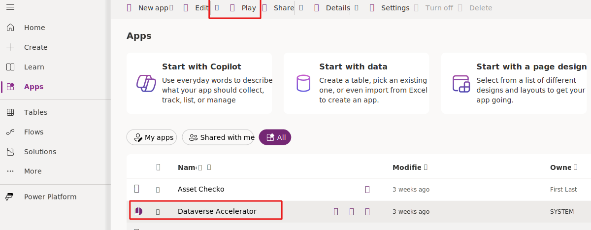
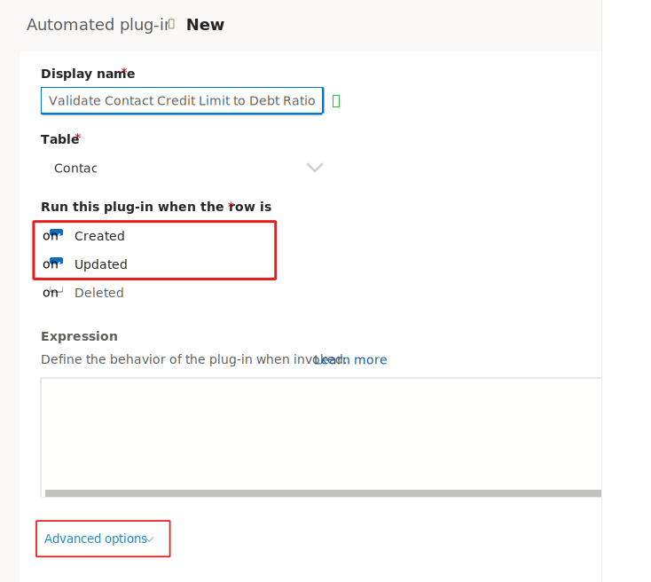
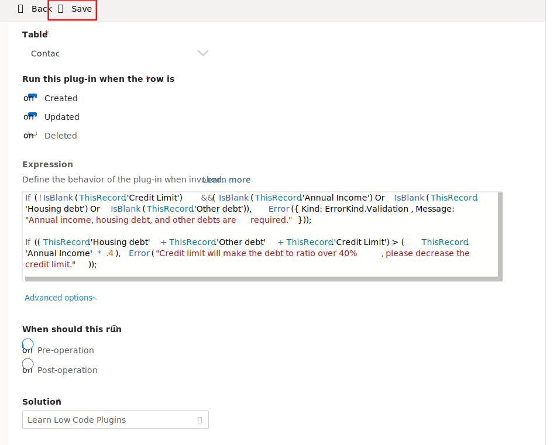
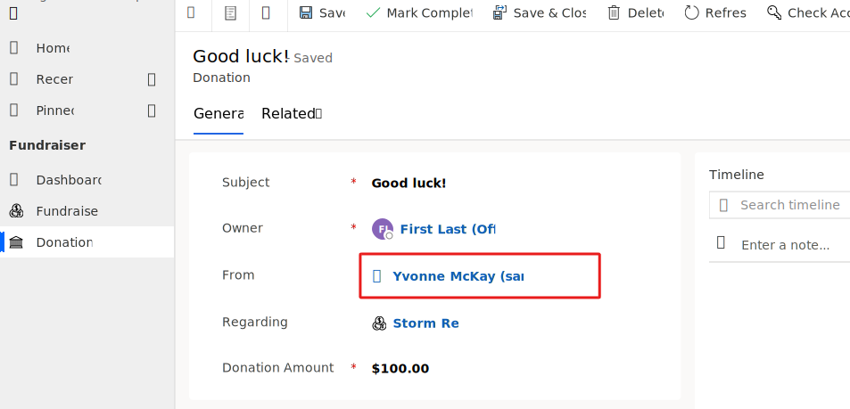

In this exercise, you build an automated plug-in to ensure that the specified credit limit value for a contact doesn't cause their debt-to-income ratio to exceed 40%. You also check that the income and debt amounts are available if the credit limit is specified. If problems occur, then the user should receive notification with an error that indicates the problem.

> [!IMPORTANT]
> Use a test environment with Microsoft Dataverse provisioned and with sample apps. If you don't have one, you can sign up for the [Power Apps Developer Plan](https://powerapps.microsoft.com/communityplan/?azure-portal=true).
## Create automated plug-in
In this first task, you create an automated plug-in by following these steps:

1. Go to [Power Apps maker portal](https://make.powerapps.com/?azure-portal=true).

1. Select the correct environment and then select **Apps**.

1. Select the **All** tab, select **Dataverse Accelerator App**, and then select the **Play** button.

    > [!div class="mx-imgBorder"]
    > [](../media/play-app-button.svg#lightbox)
1. Select **Create automated plug-in**.

    > [!div class="mx-imgBorder"]
    > [](../media/create-automated-plugin.svg#lightbox)
1. Enter **Validate Contact Credit Limit to Debt Ratio** for the **Display name**, select **Contact** for **Table**, select **Created** and **Updated**, and then expand the **Advanced options** section.

    > [!div class="mx-imgBorder"]
    > [](../media/plugin-config.svg#lightbox)
1. Select **Pre-operation** for when the plug-in should run, and then select the **Learn Low Code Plugins** solution that you created.

    > [!div class="mx-imgBorder"]
    > [](../media/plugin-run-config.svg#lightbox)
1. Paste the following expression in the **Expression** field. This expression makes the annual income, housing debt, and other debts required if credit limit is provided.

   ```powerappf1
   If(!IsBlank(ThisRecord.'Credit Limit') && (IsBlank(ThisRecord.'Annual Income') Or IsBlank(ThisRecord.'Housing Debt') Or IsBlank(ThisRecord.'Other Debt')), Error({ Kind: ErrorKind.Validation , Message: "Annual income, housing debt, and other debts are required." }));
   ```

1. Paste the following expression after the previous expression. This expression shows an error if all debts plus the credit limit increase the debt to ratio over 40%.

   ```powerappf1
   If((ThisRecord.'Housing Debt' + ThisRecord.'Other Debt' + ThisRecord.'Credit Limit') > (ThisRecord.'Annual Income' * .4), Error("Credit limit will make the debt to ratio over 40%, please decrease the credit limit."));
   ```

   > [!NOTE]
   > If you encounter errors on the expressions, first check that the casing in the formulas matches the casing that you had when creating the new columns.
1. Your plug-in should now resemble the following image. Select **Save** and then wait for the plug-in to save.

    > [!div class="mx-imgBorder"]
    > [](../media/complete-plugin.svg#lightbox)
The plug-in should save successfully.

## Test the plug-in

For this task, use the Fundraiser application that comes as a sample app to test your plug-in.

1. Go to [Power Apps maker portal](https://make.powerapps.com/?azure-portal=true).

1. Select the correct environment and then select **Apps**.

1. Launch the **Fundraiser** application.

1. Select **Donations** and then open the **Yvonne McKay (sample)** donation record.

1. Open the **Yvonne McKay (sample)** contact record.

    > [!div class="mx-imgBorder"]
    > [](../media/contact-lookup.svg#lightbox)
1. The contact form should open. Change the **Business Phone** to **555-0201** and then select **Save**.

   The contact should save without an error. If you don't provide a credit limit, you're not required to provide income or debt values.

1. Select the **Details** tab.

1. Enter **10000** for the **Credit Limit** and then select **Save**.

1. You should see an error that shows the annual income, housing debt, and other debt requirement. Select **OK**.

    > [!div class="mx-imgBorder"]
    > [](../media/debt-income-requirement-error.svg#lightbox)
1. Enter **120000** for **Annual income** and then select **Save**.

   The same error should occur again because housing debt and other debt are also required.

1. Enter **20000** for **Housing debt**, enter **20000** for **Other debt**, and then select **Save**.

1. You should see the debt-to-income ratio error because the sum of all debts and the credit limit makes the debt-to-income ratio over 40%. Select **OK**.

    > [!div class="mx-imgBorder"]
    > [](../media/debt-income-ratio-error.svg#lightbox)
1. Change the **Credit Limit** to **8000** and then select **Save**.

   Your changes should now save without error.

1. Change the **Credit Limit** to **8001** and then select **Save**.

   The debt-to-income ratio should display again.

1. Change the **Credit Limit** to **8000** again and then select **Save**.

Your changes should now save without error.
