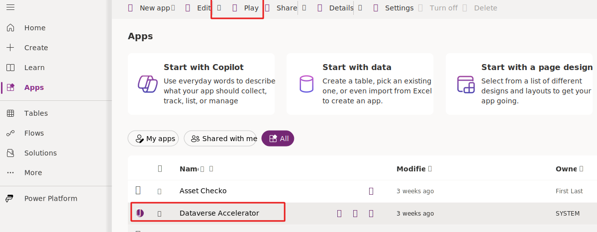
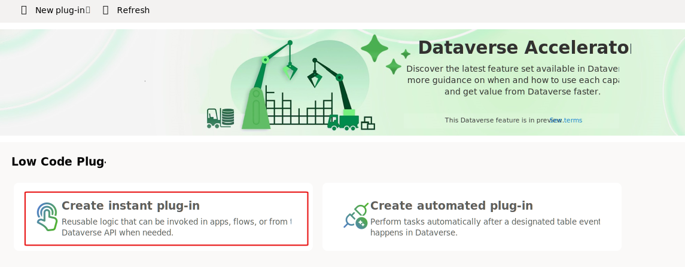
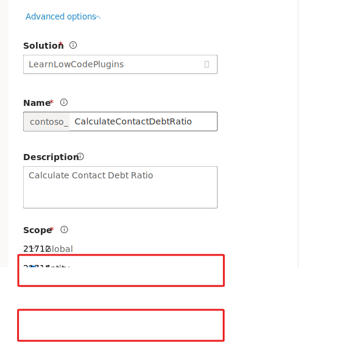

In this exercise, you'll build an instant plug-in to calculate the debt ratio. This plug-in is reusable from Power Apps or Power Automate and isn't tied to any Dataverse table row. You'll also build an instant plug-in that does the same calculation but uses the data from a Dataverse row.

> [!IMPORTANT]
> Use a test environment with Microsoft Dataverse provisioned and with sample apps. If you don't have one, you can sign up for the [Power Apps Developer Plan](https://powerapps.microsoft.com/communityplan/?azure-portal=true).

## Task - Prepare your environment
To prepare your environment, follow these steps:

1. Go to [Power Apps maker portal](https://make.powerapps.com/?azure-portal=true).

1. Select the correct environment and then select **Solutions**.

1. Select **New solution**.

    > [!div class="mx-imgBorder"]
    > [](../media/new-solution-button.svg#lightbox)

1. Enter **Learn Low Code Plugins** for the **Display name**, enter **LearnLowCodePlugins** for the **Name**, and then select the **+ New publisher** button.

1. Enter **Contoso** for the **Display name**, enter **Contoso** for the **Name**, enter **contoso** for the **Prefix**, and then select **Save**.

1. Select the **Contoso** publisher that you created and then select **Create**.

    > [!div class="mx-imgBorder"]
    > [](../media/create-new-solution-dialog.svg#lightbox)

## Build a plug-in to calculate debt ratio

1. Go to [Power Apps maker portal](https://make.powerapps.com/?azure-portal=true).

1. Select the correct environment and then select **Apps**.

1. Select the **All** tab, select **Dataverse Accelerator App**, and then select the **Play** button.

    > [!div class="mx-imgBorder"]
    > [](../media/play-app-button.svg#lightbox)

1. Select **Create instant plug-in**.

1. Enter **Calculate Debt Ratio** for the **Display name** and then select **+ New input parameter**.

1. Enter **Income** for the **Label**, select **Decimal** for the **Data type**, and then select **+ New input parameter**.

1. Enter **HousingDebt** for the **Label**, select **Decimal** for the **Data type**, and then select **+ New input parameter**.

1. Enter **OtherDebt** for the **Label** and select **Decimal** for the **Data type**.

1. You should now have three input parameters. Select **+ out parameter**.

1. Enter **TotalDebtRatio** for the **Label**, select **Decimal** for the **Data type**, and then select **+ New out parameter**.

1. Enter **HousingDebtRatio** for the **Label** and then select **Decimal** for the **Data type**.

   Your input and output parameters should resemble the following image.

    > [!div class="mx-imgBorder"]
    > [](../media/input-output-parameters.svg#lightbox)

1. The following formula calculates housing debt ratio and total debt ratio. Paste the following Power Fx formula in the **Expression** field and then expand the **Advanced options** section.

   ```powerappsfl
    {TotalDebtRatio: ((HousingDebt + OtherDebt)/Income) * 100, HousingDebtRatio: (HousingDebt/Income) * 100};
   ```

1. Select the **LearnLowCodePlugins** solution that you created for **Solution** and then select **Global**.

    > [!div class="mx-imgBorder"]
    > [](../media/solution-scope.svg#lightbox)

1. Select **Save** and wait for the plug-in to be saved.

1. Select the **Test** button. The test button appears after the plug-in is saved successfully.

1. Enter **12000** for Income, **4000** for HousingDebt, **4000** for OtherDebt, and then select **Run**.

    > [!div class="mx-imgBorder"]
    > [](../media/run-test-button.svg#lightbox)

1. You should get a success response with the calculated TotalDebtRatio and HousingDebtRatio.

    > [!div class="mx-imgBorder"]
    > [](../media/response.svg#lightbox)

1. You can close the Dataverse Accelerator App browser window or tab.

## Task - Build plug-in to calculate contact debt ratio

1. Navigate to [Power Apps maker portal](https://make.powerapps.com/?azure-portal=true).

1. Select the correct environment and then select **Solutions**.

1. Open the **Learn Low Code Plugins** solution you created.

1. Select **Add exiting** and then select **Table**

1. Select the **Contact** table and then select **Next**.

    > [!div class="mx-imgBorder"]
    > [](../media/add-existing-table.svg#lightbox)

1. Choose the **Select objects** link button.

1. Select the **Forms** tab.

1. Select the **Contact Main** form and then select **Add**.

1. Select **Add** again.

1. Open the **Contact** table you just added to the solution.

    > [!div class="mx-imgBorder"]
    > [](../media/contact-table.svg#lightbox)

1. Select **New** and then select **Column**.

1. Enter **Housing Debt** for Display name, select **Currency** for Data type, and then select **Save**.

1. Select **+ New** and then select **Column** again.

1. Enter **Other Debt** for Display name, select **Currency** for Data type, and then select **Save**.

1. The columns you added should look like the following image. Select **Forms**.

    > [!div class="mx-imgBorder"]
    > [](../media/added-columns.svg#lightbox)

1. Open the **Contact** form you added to the solution.

1. Select the **Details** tab.

1. Add the **Annual income**, **Housing debt**, and **Other debt** columns below the Credit limit column.

1. Select **Save and publish** and wait for the publishing to complete.

1. Select the **<- Back** button.

1. Select the **Contact** table.

1. Select the **Edit** button

    > [!div class="mx-imgBorder"]
    > [](../media/edit-button.svg#lightbox)

1. Select the chevron button next to the **New row** button and then select **New row using form**.

    > [!div class="mx-imgBorder"]
    > [](../media/new-row-using-form.svg#lightbox)

1. Enter **John** for First name, **Doe** for Last name, and then select the **Details** tab.

1. Enter **120000** for Annual income, **40000** for Housing debt, **40000** for Other debt, and then select **Save**.

    > [!div class="mx-imgBorder"]
    > [](../media/new-contact.svg#lightbox)

1. Copy the contact ID from the URL and keep it in a notepad, you use this ID to test the plugin. The ID is the GUID at the end of the URL ID=`xxxxxxxx-xxxx-xxxx-xxxx-xxxxxxxxxxxx`.

1. Select **Save and Close**.

1. Select **Done**.

1. Select the **Back** button.

1. Select the **Back to solutions** button.

1. Select **Apps**, select the **All** tab, and launch the **Dataverse Accelerator App**.

1. Select **Create instant plug-in**.

    > [!div class="mx-imgBorder"]
    > [](../media/create-instant-plugin-card.svg#lightbox)

1. Enter **Calculate Contact Debt Ratio** for Display name and then select **New out parameter**.

1. Enter **HousingDebtRatio** for Label and select **Decimal** for Data type.

1. Select **New out parameter** again.

1. Enter **TotalDebtRatio** for Label and select **Decimal** for Data type.

1. Expand the **Advanced options** section.

1. In order to have "this record" available in the expression, first we need to set scope.  Select **LearnLowCodePlugins** for solution, select **Entity** for Scope, and select **Contact** for Table.

    > [!div class="mx-imgBorder"]
    > [](../media/plugin-solution-scope.svg#lightbox)

1. Paste the following expression in the **Expression** field. This expression shows an error if the total debt-to-income ratio is higher than 40%.

   ```powerappsfl
    {TotalDebtRatio: ((ThisRecord.'Housing Debt' + ThisRecord.'Other Debt')/ThisRecord.'Annual Income') * 100, HousingDebtRatio: (ThisRecord.'Other Debt'/ThisRecord.'Annual Income') * 100}
   ```

1. Select **Save** and wait for the plugin to be saved.

1. Select the **Test** button.

1. Paste the contact ID you copied earlier and then select **Run**.

    > [!div class="mx-imgBorder"]
    > [](../media/run-test.svg#lightbox)

1. You should get a success response and the calculated total debt and housing debt values.

    > [!div class="mx-imgBorder"]
    > [](../media/test-response.svg#lightbox)
