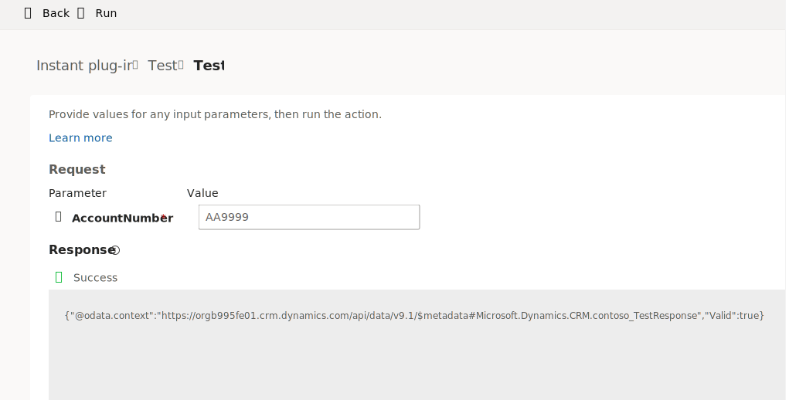

Using instant plug-ins is an excellent way to make your Power Fx logic reusable by multiple apps and flows. The following sections describe how to set up instant-plug-ins and provide some important considerations.

## Choose good plug-in names

When you create an instant plug-in, one choice that you need to make is the display name. The maker uses the display name when they invoke your plug-in from their app or flow. While the display name can be 100 characters long, you shouldn't use it as a description. Instead, you should make it informative enough so that the maker can understand what it does and differentiate it from other plug-ins. You can't change the display name after you save the plug-in.

When the maker uses the plug-in, the display name shows in a list alongside all other low-code instant plug-ins and custom API actions that code developers create. The display name has the prefix of your solution publisher. For example, if your display name is **CalculateRiskScore**, it would show as **contoso_CalculateRiskScore**.

The following examples describe names that need improvement:

- **Validate** - This name doesn't clarify what you're validating. Instead, a better name would be **ValidateAccountNumber**.

- **Schedule** - While it's clear that this name refers to schedules, it's unclear what you're scheduling. A better name would be **ScheduleOfficeVisit**. Using this more descriptive name means that you can add other schedule-like plug-ins in the future as needed.

A good practice is to consider what other actions you or others might add in the future. Additionally, make sure that you consider whether the name that you chose is flexible enough to allow you to create other similar yet meaningful names.

## Set up input and output parameters

Parameters help you pass data into and from an instant plug-in. Parameters can be any of the following data types:

- **Integer** - Use this data type for whole numbers, such as 9999.

- **Decimal** - Use decimals for financial and precise calculations.

- **Float** - Use floating points for scientific and large-range calculations.

- **Boolean** - Use this data type to indicate true or false.

- **String** - Use this data type for alphanumeric data.

- **EntityReference** - Use this data type to pass an identifier to a Dataverse table row. When you choose this type, you also need to pick one Dataverse table that indicates what this reference points to.

You can set up any number of input and output parameters to handle your scenario. When you use your instant plug-in, all input parameters that you define must have values passed. Currently, the system has no way for you to mark them as optional.

Similar to the display name, the name that you choose for your parameters should be meaningful. While you could name them A, B, or C, it would make your logic more difficult to read. Names must be alphanumeric and not contain spaces. If you want to break up two words, use the underscore (**_**) character instead of a space. For example, **AccountNumber** or **Account_Number** is acceptable.

Make sure that you use unique names for all input and output parameters. While you can use the same name for input and output parameters, we don't recommend it.

You can add and remove parameters after you publish your plug-in and then make it available for makers to use. These changes can break the apps and flows that use your plug-in. Instead of changing your existing plug-in, you can create a new version with the new parameters. This approach ensures that you don't affect existing users' apps and flows.

## Use input parameters in your logic

After you define your input parameters, you can use them in your logic by starting to type their name and then picking them from the list. The following example has three input parameters: FirstName, MiddleName, and LastName.

```powerappsfl
Concatenate(FirstName," ",MiddleName," ",LastName)
```

Instead of creating three separate parameters, you could use one EntityReference parameter for a Dataverse table with all three columns. In that case, you would receive access to the table row that's referenced and all its columns. If your EntityReference column is named MyContact, your expression would now resemble the following logic.

```powerappsfl
Concatenate(MyContact.'First Name'," ",MyContact.'Middle Name',MyContact.'Last Name')
```

## Use output parameters in your logic

You can set output properties by creating an inline record. Create the inline record by using braces **{}** that contain named field values that match the output parameter names. Continuing from the previous example, you would define a FullName output parameter to hold the concatenated name.

```powerappsfl
{FullName: Concatenate(FirstName," ",MiddleName," ",LastName) }
```

You can also have multiple output parameters. For example, if FullName is the input parameter, and FirstName, MiddleName, and LastName are the output parameters, your plug-in expression would resemble the following logic.

```powerappsfl
{FirstName:<First Name Expression> , MiddleName:<Middle Name Expression>, LastName:<Last Name Expression>}
```

While an actual implementation of the expressions could get complicated in handling all possible variations, the following simple implementation would display the separate parts of FullName.

```powerappsfl
{
     FirstName:First(Split(FullName, " ")).Value,
     MiddleName:If(CountRows(Split(FullName, " ")) > 2, Last(FirstN(Split(FullName, " "), 2)).Value, ""),
     LastName:Last(Split(FullName, " ")).Value
}
```

## Set up scope

In the **Advanced options** section, when you create an instant plug-in, an option is available to set up scope. You have two options to set scope: global and entity. The default for new plug-ins is global.

You can use global scope when the instant plug-in that you create isn't specific to a Dataverse table. For example, if you're creating an instant plug-in to build a generic error message, global scope would be appropriate because it has nothing to do with a Dataverse table. It would be appropriate to use entity scope if you made an instant plug-in to provide a list of columns on the Contact row that are missing data.

The main difference is that you select a Dataverse table when setting up entity scope. Then, when a maker invokes your plug-in, they must pass a reference to a row from that Dataverse table. Your plug-in logic has access to the row that the caller specifies and all columns of data. Your plug-in logic references this row by using the ThisRecord identifier, and you don't need to set up a separate input parameter for it. The following example shows the concatenated name expression for a plug-in that's built with the scope entity on the Contact Dataverse table.

```powerappsfl
{FullName: Concatenate(ThisRecord.'First Name'," ",ThisRecord.'Middle Name',ThisRecord.'Last Name') }
```

## Test instant plug-ins

After you successfully save your instant plug-in, you can test it. A list of input parameters display on the test screen in the **Request** section. Provide values for your input parameters. If any parameters are of the EntityReference type, you need to look up or obtain a GUID for one of the table rows. After you provide values for each parameter, you can select **Run** in the command bar to start the test. The following image is an example of testing a plug-in.

> [!div class="mx-imgBorder"]
> [](../media/test-plugin.svg#lightbox)

The **Response** section shows the results of running the test. If the test is successful, the text box contains the output from your plug-in

You can also test instant plug-ins from the home screen in the Data Accelerator app.
