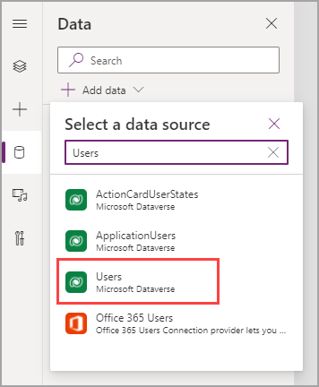

When building an app, you will first create a data model and then build that model in Microsoft Dataverse. To ensure that your solution meets the needs of your user, you need to interact with the data. This module continues with the scenario where you are building the expense report app.

>[!NOTE]	
>If you didn't complete the previous modules, you can download the files by going to the [packaging files](https://github.com/MicrosoftDocs/mslearn-developer-tools-power-platform/tree/master/power-apps/expense-report-app-module-4). The files contain the completed work on the Travel Expense Report app thus far. If you would like to create the data module expense report yourself go to this [training module](/training/modules/create-data-model-expense-report/?azure-portal=true).

1. Select the **Data** button to the left of the tree view. In the **Data** pane, select the **+ Add data** dropdown menu.

   > [!div class="mx-imgBorder"]
   > 

1. When the dropdown menu opens, a few tables from Dataverse will appear. Search for and select **Users** to add that table as a data source in your app.

   > [!div class="mx-imgBorder"]
   > 

1. Repeat this process to add your **Expense Reports** and **Expense Report Details** tables. Dataverse gives you the plural names for your tables so that you can ensure that your plural name is a logical extension of the table name when you're creating custom tables in Dataverse. Additionally, you can view other data sources. To view all possible connectors for Microsoft Power Apps, go to [Connector reference overview](/connectors/connector-reference/?azure-portal=true). You can also select any data source in the link to learn more.

    You can add more data sources later, but this information is everything that you will need for this module.

1. Return to the **Tree view** to continue building.
