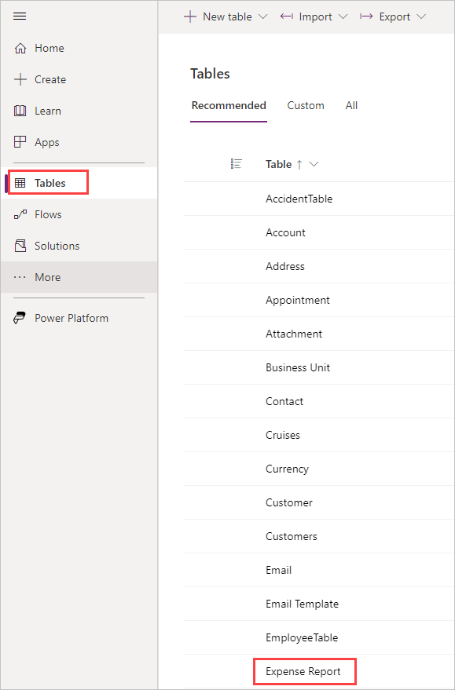
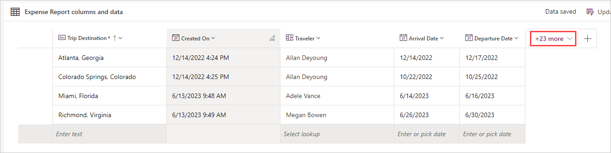

To add Dataverse data to your app, follow these steps:

1. In a new browser tab, go to [make.powerapps.com](https://make.powerapps.com/?azure-portal=true).

1. Select **Tables** from the left-side menu. Then find and select your **Expense Report** table.

   > [!TIP]
   > You can use the **Search** box at the top right of your window if you have a lot of tables to look through.
   > [!div class="mx-imgBorder"]
   > 

1. In the **Expense Report** table, select the **Add data** button.

1. Here you can add, edit and remove rows and columns of your table. Add the **Destination**, **Created On**, **Traveler**, **Arrival Date** and **Departure Date** columns by selecting the **+[number] more** button (refer to the image below to help you locate it) in the **columns and data** section of your table.

1. It's always good practice to have some "dummy data" so you have some data to display in your app. You can always come back to your table and delete any test data. Let's add several rows of test data by using the entry line at the bottom of the list. This works just like adding data to a spreadsheet. Once you have a few lines of data, we can go back to our app where we're able to see this data and interact with it.

   > [!div class="mx-imgBorder"]
   > 
