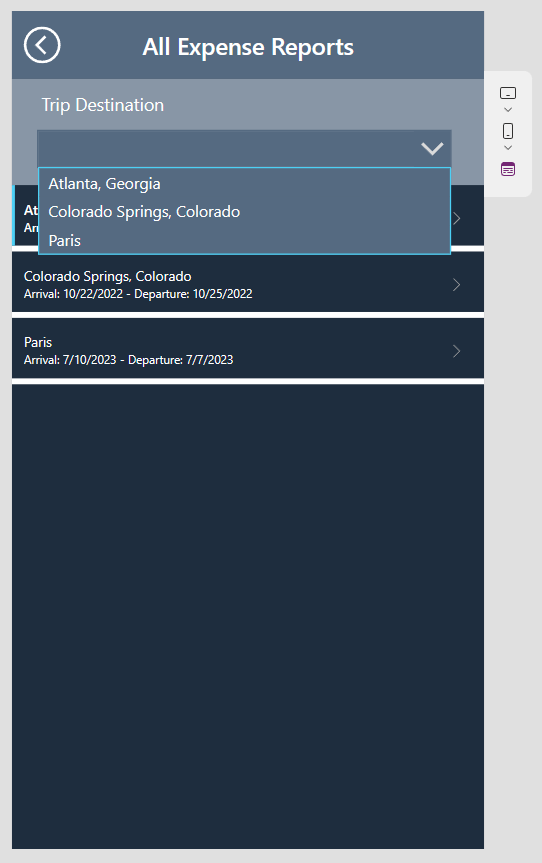

> [!VIDEO https://www.microsoft.com/videoplayer/embed/RWQA7j]

Now that you've added the data source to Power Apps, added a gallery, and populated your table, you should be ready to display data. Return to your canvas app and go to the **Scr_AllExpenses** screen. If you had this screen open in another tab, notice that the gallery hasn't populated yet. Power Apps caches your data source and doesn't always have the most up-to-date version if you're making changes.

To fix this issue, follow these steps:

1. Select the **Data** button on the left menu and then locate **Expense Reports**.

1. Select the **More actions** ellipsis (**...**) menu to the right of the Dataverse table **Expense Reports** and then select **Refresh**. The Expense Report data should populate in the Gallery.

1. Return to the **Tree view**, where you can select various controls and see a menu of your app screens. (The **Tree view** icon is in the upper right of the side menu, and it resembles stacked papers.)

1. Drag your Gallery to occupy the bottom portion of the screen, leaving some room at the top. Using the **Properties** tab in the panel on the right side of the screen, in the **Position** area, set the **Y** property to **236**, and in the **Size** area, set the **Height** property to **900**. The gallery should start at Y-coordinate 236 and stretch all the way to the bottom of the screen.

    Next, you need to display more useful information. The location is useful, but you only have one date showing in your gallery, and it's unclear whether this date is the departure date or arrival date.

1. Select **Subtitle2** and then review the **Text** property in the **Properties** tab. Your gallery might have assigned a different field, but this one is displaying **ThisItem.'Created On'**. All information from your table in your gallery starts with **ThisItem**, which specifies the row. For this reason, you can only manipulate the first line and must use logic to get lines to perform differently. This topic is explained later; for now, change this field to the departure date.

1. In the **Text** property, enter **ThisItem.'Arrival Date'**.

    We're going to work on two items regarding this date. First, the time is displaying, which isn't necessary for this exercise. Second, your users won't be able to discern which date (departure or arrival) is displayed. We're going to do some text manipulation to fix this. Often, the **Text** function is what you need when attempting to format.

1. Let's update the **Text** property to remove the time from our arrival date by making the formula as follows:

    ```powerappsfl
    Text(ThisItem.'Arrival Date', DateTimeFormat.ShortDate)
    ```

    Now, you should have the same information as before but in the format that you want (without the time). To add strings of text together, use an ampersand (**&**), and to define text in your formula bar use quotation marks (as you might have noticed when you built the first screen). We combine these principles to create the arrival and departure dates appear as a date range.

1. Update your formula to the following code.

    ```powerappsfl
    Text(ThisItem.'Arrival Date', DateTimeFormat.ShortDate) & " - " & Text(ThisItem.'Departure Date', DateTimeFormat.ShortDate)
    ```

    The **DateTimeFormat** part of the formula disappears when you click out of the formula bar. This situation happens for some functions and won't negatively affect your code. When you click back into the formula bar, the entire formula appears.

1. Let's take another step and update our formula once more to show you how you can add additional text to adjust the user experience. We add in "Arrival" and "Departure" so there's no confusion about what each date represents. You can update your Text formula with the following:

    ```powerappsfl
    "Arrival: " & Text(ThisItem.'Arrival Date', DateTimeFormat.ShortDate) & " - Departure: " & Text(ThisItem.'Departure Date', DateTimeFormat.ShortDate)
    ```

    Now that you have the gallery looking the way that you want, let's work on a filter so that travelers can only view their own records. Currently, users can view everyone's data in our gallery. To filter the data, let's alter the **Items** property of the gallery. First, you need to capture the information for the signed-in user.

1. The **App** control is above the first screen in the **Tree view**. Select **App**, and in the property dropdown menu, select **OnStart**.

    The **OnStart** property allows you to enter one or more functions that run when the app is started. In this case, you collect the signed-in user's information. You could call this data source at any instance in the app, but it's best to call it only once and then store it for future use in the app. Whenever you call a data source (in this case, from your Microsoft Entra ID), it creates a performance burden in your app and uses resources. For this reason, it's better to call as few times as possible, especially with something that won't change for the entire app instance, such as the current user data.

    To store information for later use throughout the app, we can set a **variable**. Essentially, a variable is information in different formats such as text, date, number, or even a record (or a row of data). In traditional coding, you would often need to define the type of variable that you're using. However, Power Apps figures out that variable type for you. Make sure that, when you set a variable, you always use the same type (or definition) for that variable in the future.

1. Define the variable by entering the following formula in your **OnStart** property: **Set(VarUser, User())**.

    **VarUser** is the name of this variable and **User()** is the definition, which in this case, is a function gathering information from Microsoft Entra ID. You can use any name for your variables; however, similar to the controls, it's best to start variables with **var** or some other nomenclature that will help you recall them later.

    Your users won't have to prompt the **OnStart** property to trigger, but when you change the property while building, you have to trigger it.

1. Trigger the variable by selecting the ellipsis (**...**) next to **App** and then select **Run OnStart** from the options. Now that your variable is populated, you can use it to filter your gallery.

1. Select **Gal_ExpenseReports_AllExpenses** in the **Tree view** and then make sure that the **Items** property is visible in the dropdown menu.

1. Replace **Expense Reports** with: `Filter('Expense Reports', Traveler.'Primary Email'=VarUser.Email)`  

    Your data is now filtered down to items where you're listed as the traveler.

    As you enter formulas, Power Apps will prompt you with the correct language and will offer suggestions as you go. This feature helps you learn formulas and how to write expressions. Additionally, notice that you needed to drill down on your traveler information to find the email. Because it's a lookup column, it contains all information in the *Users* table. Consider the period as being similar to a shovel that helps you to dig deeper into whatever you're referencing. You had to do the same for **VarUser** because it contains all information from the **User()** function that has full name, email, and photo.

    Now, your gallery has the exact appearance that you want. However, you still need to add a few items to the page to make it more useful and to improve user experience (UX). Your next task is to add a title so that users know that they are on the correct screen.

1. Click in the empty space above your gallery and then select **Insert**.

1. Select **Text label** to add a new label to your screen.

1. Change the following properties of your **Text label** control by using the **Properties** pane or the **Advanced** pane. Some properties are also available in the command bar.

    - **Text**: `All Expense Reports`

    - **Size**: 24

    - **FontWeight**: Semibold

    - **Text Alignment**: Center

    - **X**: 0

    - **Y**: 0

    - **Width**: 640

    - **Height**: 92

    - **Fill**: `RGBA(85, 106, 129, 1)`

    When you're finished setting those label properties, rename your label to follow the nomenclature that you've learned: `Lbl_Header_AllExpenses`

    Next, let's make a way to return to the home screen. You can perform actions with a button, but you can also use many controls for actions. One of these controls is an icon.

1. Select **Insert** and then **Icons** dropdown menu. You can scroll through to add the icon that you need, or you can select one and then change the icon in the properties. Some developers prefer this method because it allows them to search through the icons rather than scrolling to find the one that they want.

1. For this exercise, use the **Back arrow** icon to indicate that pressing this icon returns you to the homepage. To find it quickly, enter "back" in the **Insert** search field. (Ensure you choose the *icon* vs. the shape.)

1. Change the following properties of your **Back arrow** icon:

    - **X**: 9

    - **Y**: 21

    - **Width**: 64

    - **Height**: 50

    - **Color**: `RGBA(255, 255, 255, 1)`

    - **OnSelect**: `Back()`

    While you could have used the **Navigate()** function, you're using the **Back()** function, which takes the user to the screen that they were on immediately before the current screen. You can use either function, but you're using **Back()** in this exercise so that you can become familiar with another useful function.

1. Rename your icon to: `Icn_Back_AllExpense`

    Another component that you can add to enhance the user experience is a destination filter so that users can quickly find the expense report that they're looking for.

1. Add another **Text label** to the screen and then set the following properties:

    - **Text**: `Trip Destination`

    - **Size**: 18

    - **X**: 0

    - **Y**: 92

    - **Width**: 640

    - **Height**: 144

    - **Fill**: `ColorFade(Lbl_Header_AllExpenses.Fill, 30%)`

    - **PaddingTop**: 20

    - **PaddingLeft**: 40

    - **VerticalAlign**: VerticalAlign.Top

1. Rename your label: `Lbl_TripDestination_AllExpenses`

    We used the **ColorFade** function for the **Fill** property, referencing the **Fill** property of the first label that you created. Referencing other controls is common throughout canvas apps, which is why the names of your controls are so important. The **ColorFade()** function makes a color lighter or darker by a certain percentage. Positive percentages display a lighter color and negative percentages display a darker color. This function can be useful when you're designing apps.

    > [!TIP]
    > When defining custom colors, you can create a global variable vs. referring to another control. This is particularly useful if you want to create a color to use throughout your app. You can use the OnStart property of the app, as we did for *VarUser* to define variables that you want to use throughout the app.

    You might notice that this label has an odd appearance. The reason is because we're going to overlay a dropdown menu. You could include a rectangle behind the label and dropdown menu, but the more controls that you have, the longer it takes to load your screen. For this reason, try to use as few controls as possible, combining where you can.

1. Now let's add a control to select a destination. Select **Insert**, **Input** and  then select the **Drop down** control, or you can enter "drop" in the **Insert** search box and select **Drop down**.

1. Change the following properties of your **Drop Down** control by using the **Properties** pane or **Advanced** pane.

    - **X**: 35

    - **Y**: 162

    - **Width**: 560

    - **Height**: 50

    - **Fill**: `Lbl_Header_AllExpenses.Fill`

    - **ChevronBackground**: `Lbl_Header_AllExpenses.Fill`

    - **Size**: 16

    - **AllowEmptySelection**: true

    - **Items**: `Distinct(Filter('Expense Reports', Traveler.'Primary Email' = VarUser.Email), 'Trip Destination')`

    **Drop down** controls have different properties than other controls. You realize this factor as you become familiar with more controls. Additionally, our formula uses the **Distinct** function, which returns fields from a table, removing any duplicates. As a result, if you visited the same location multiple times, that location appears only once in the dropdown menu.

1. Rename your **Drop down** control to: `Ddn_Destination_AllExpenses`

    Your final task on this screen is to ensure that the gallery filters according to the selection from the dropdown control.

1. Select your gallery and change the **Items** property to:

    ```powerappsfl
    If(
        IsBlank(Ddn_Destination_AllExpenses.Selected.Value),
        Filter(
            'Expense Reports',
            Traveler.'Primary Email' = VarUser.Email
        ),
        Filter(
            'Expense Reports',
            Traveler.'Primary Email' = VarUser.Email,
            'Trip Destination' = Ddn_Destination_AllExpenses.Selected.Value
        ) 
    )
    ```

    You can expand your formula bar so that you have more room to type. Select **Format text** when you've finished the formula to make it cleaner and simpler to read.

    This formula has become complex, so let's explain what's happening. You've wrapped your initial items property in an **If()** statement, which allows you to specify different outcomes depending on one or more conditions. In this case, the logical test (or condition) is whether the dropdown control is blank or not. If the dropdown control is blank (true value), the items for the gallery will only be filtered by the user. Alternatively, if the dropdown control isn't blank (false value), then the items for the gallery will be filtered by the user and the destination.

    > [!NOTE]
    > Occasionally, when you reset the **Items** property of a gallery, certain labels switch to looking at different fields. If any of your data appears as if it has disappeared, make sure that the **Text** property of your labels is correct.

To test the gallery filter, put your app in preview mode by selecting the **Play** icon in the upper-right corner or by selecting the F5 key.

You have completed setting up your screen to view and filter trip data by the logged in user. Your screen should resemble the image below.

   > [!div class="mx-imgBorder"]
   > [](../media/all-expense-reports.svg#lightbox)
