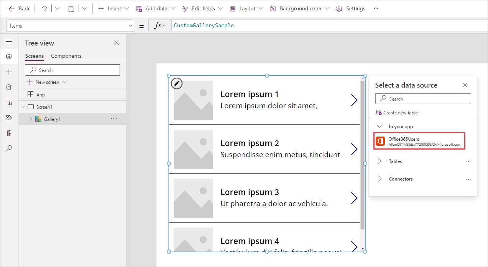
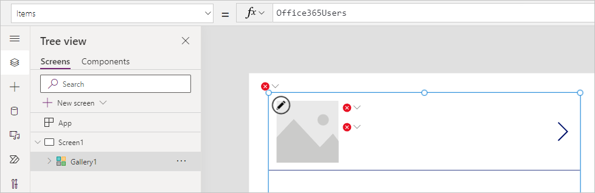
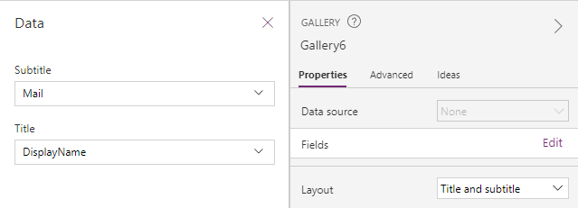

Action-based data sources differ from the more popular tabular data sources. You use functions to interact with the data source instead of just reading and writing data. One important difference to note between tabular and action-based data sources is action-based data sources can't be used with the Forms control. Forms only work with tabular data sources. This doesn't mean action-based data sources can only read data. Most action-based data sources provide functions for updating the data as appropriate. An action-based data source can also be for things like sending emails or other notifications, not necessarily only for reading and writing data.

In the following examples, you'll learn how to

- Add the Office 365 Users connector to your app.

- Query for users.

- Find the logged-in user's manager.

- Update the logged in user's profile.

## Add the Office 365 Users data source

In this example, you'll add the Office 365 Users data source, an
action-based data source, to an app. The process is the same as adding a
tabular data source.

1. In the Power Apps Studio, select **Add data** from the top menu ribbon.

1. In the search box, type "Office 365".

1. The list of options will filter, select **Office 365 Users**, then select the account connection you wish to use.

1. Confirm that the data source has been added by selecting the **Add data** button once more. Under **In your app** you should see the **Office365Users** connection you just added.

You've now added the Office 365 Users data source to your
app.

## Display a list of users in a gallery

Now that you have the data source added to your app, you can display a list of the Office 365 users in a gallery.

1. On the menu ribbon, select **Insert**.

1. Select **Gallery**.

1. From the drop-down menu, select **Vertical gallery**.

1. With your new gallery selected, you can **Select a data source**, select **Office365Users**.

   > [!div class="mx-imgBorder"]
   > [](../media/select-users.png#lightbox)

Notice that your Office 365 users data doesn't show up in your gallery and there are some error fields that display. It's
because the gallery only shows tabular data sources. You
can still use your action-based connecting with a gallery, it just takes
some modification of the data.

1. In the formula bar, there's an **Items** property that currently says `Office365Users`.

   > [!div class="mx-imgBorder"]
   > [](../media/items-property.png#lightbox)

1. Now make the following addition to your items property:

   ```powerappsfl
   Office365Users.SearchUser()
   ```

   Notice that when you do so, one of the errors in your gallery disappears because we have given the gallery a table of data. So now we just need to modify what data from our table is being portrayed in the gallery.

1. In the gallery panel on the right of your screen, change the **Layout** to **Title** and **Subtitle**. Notice how the errors go away and you're beginning to show data in your gallery, although it's not quite what we want.

1. Now select the **Edit** in the **Fields** from the panel, and set the **Title** label to **DisplayName**.

1. Set the **Subtitle** label to **Mail**.

   > [!div class="mx-imgBorder"]
   > 

Now your gallery shows your Microsoft 365 users' DisplayNames and Mail properties just like you were using a tabular data source. This is because that function of the Office365Users data connection returns tabular data. You could use the output of this data with any function, like SortByColumns or Sum, that accepts a table of data as an input.

## Find the email address of the logged in user's manager

Another common use of the Office 365 data source is to query the user's
manager. With tabular data sources, you would use the LookUp function to
find this type of information. With this action-based data source, you
use a function to directly query the information as shown in the following example.

1. Select an area outside of your gallery from the previous example.

1. Select the **Insert** button from the top ribbon.

1. Select **Text label**.

1. In the formula bar, delete "Text" and type the following formula:

    ```powerappsfl
    Office365Users.ManagerV2(User().Email).mail
    ```

> [!NOTE]
> If you receive an error after entering this formula then the user does not have a manager assigned in Office 365.

In the label, you'll now see the current user's manager email address.
The following table shows a breakdown of the formula.

| **Formula argument** | **Formula input**    | **Notes**       |
|--------------------- |--------------------- |-----------------|
| id                   | User().Email         | User() is a built-in function that returns information about the current logged in user including FullName, Email, and Image. |
| .property            | .mail                | The function returns the whole user record for the manager. To display only the email address in a Label, use the dot (.) notation. |

## Update the logged-in user's profile info

Another way you might use an action-based connector is to update data.
With a tabular data source, you could update directly using a Form or a
Patch function. Those capabilities don't work with action-based data
sources. Instead, for each action-based data source, you depend
on the functions provided by that connector for your options. The
following example shows how to update your Microsoft User Profile
by using the provided function.

1. Let's insert a button on your canvas app screen. Select **+ Insert** from the top ribbon, and select **Button**.

1. For the **OnSelect** property of the button, set the formula to

   ```powerappsfl
   Office365Users.UpdateMyProfile({aboutMe: "Project manager with 5 years of technical project management experience."})
   ```

That process will update your Microsoft 365 Profile. The following table shows a breakdown of the formula.

| **Formula argument** | **Formula input**    | **Notes**       |
| -------------------- | -------------------- |-----------------|
| Optional  | `{aboutMe: " Project manager with 5 years of technical project management experience."}` | Other optional parameters: birthday, interests, mySite, pastProjects, schools, skills |

Another example would be to update the profile by referencing a **text input**
control on the screen.  If you had a text input control on the
screen named textinput1, the formula would update to:

```powerappsfl
Office365Users.UpdateMyProfile({aboutMe: TextInput1.Text})
```

The Office 365 Users action-based data source is a rich data source and
commonly used in many apps. Take some time to get more
familiar with this data source. For more information, see [Connectors](/connectors/?azure-portal=true).

These examples demonstrate how to integrate an action-based data source
into your app. The concepts can be similar to tabular data sources, like when displaying users in a gallery. But they can also
be different, like when writing back to a user's profile.

In the next unit, you'll learn more about Power Automate and how to
integrate it with Power Apps.
